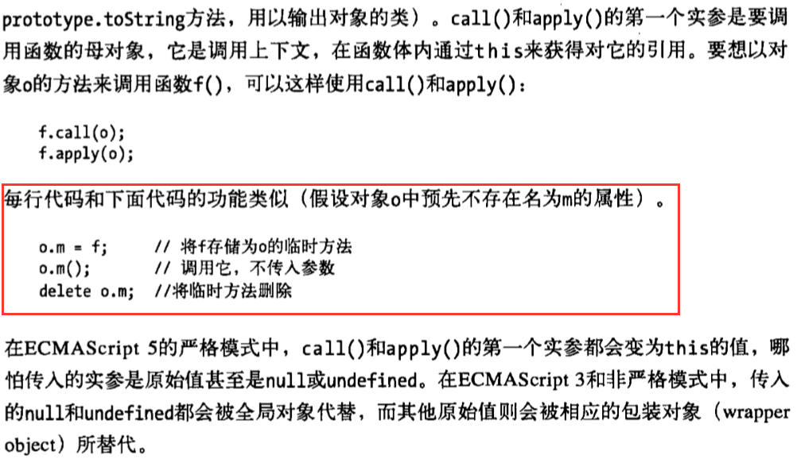

# 深入call、apply、bind实现原理
[https://www.jianshu.com/p/6a1bc149b598](https://www.jianshu.com/p/6a1bc149b598)

简单粗暴地来说，call，apply，bind是用于绑定this指向的。

## 什么是call和apply方法
我们单独看看ECMAScript规范对apply的定义，看个大概就行：                 

通过定义简单说一下call和apply方法，他们就是参数不同，作用基本相同。                      

1、每个函数都包含两个非继承而来的方法：apply()和call()。                     
2、他们的用途相同，都是在特定的作用域中调用函数。                       
3、接收参数方面不同，apply()接收两个参数，一个是函数运行的作用域(this)，另一个是参数数组。                        
4、call()方法第一个参数与apply()方法相同，但传递给函数的参数必须列举出来。                        


一个简单的demo:              
```javascript
let yanle = {
    name: 'yanle',
    sayHello: function (age) {
        console.log(`hello, i am ${this.name} and ${age} years old`);
    }
};
let lele = {
    name: 'lele'
};
yanle.sayHello(26);          // hello, i am yanle and 26 years old

yanle.sayHello.call(lele, 20);          // hello, i am lele and 20 years old
yanle.sayHello.apply(lele, [21]);       // hello, i am lele and 21 years old
```
[请看demo1](./demo1.js)

结果都相同。从写法上我们就能看出二者之间的异同。
相同之处在于，第一个参数都是要绑定的上下文，后面的参数是要传递给调用该方法的函数的。
不同之处在于，call方法传递给调用函数的参数是逐个列出的，而apply则是要写在数组中。

总结一句话介绍call和apply                           
call()方法在使用一个指定的this值和若干个指定的参数值的前提下调用某个函数或方法。                           
apply()方法在使用一个指定的this值和参数值必须是数组类型的前提下调用某个函数或方法  


### 分析call和apply的原理
上面代码，我们注意到了两点：                  
1、call和apply改变了this的指向，指向到lulin                 
2、sayHello函数执行了                 

这里默认大家都对this有一个基本的了解，知道什么时候this该指向谁，
我们结合这两句话来分析这个通用函数：f.apply(o),我们直接看一本书对其中原理的解读，
具体什么书，我也不知道，参数我们先不管，先了解其中的大致原理。

                          

知道了这个基本原来我们再来看看刚才jawil.sayHello.call(lulin, 24)执行的过程：                       
```javascript
// 第一步
lulin.fn = jawil.sayHello
// 第二步
lulin.fn()
// 第三步
delete lulin.fn
```

上面的说的是原理，可能你看的还有点抽象，下面我们用代码模拟实现apply一下。

### 实现aplly方法

#### 模拟实现第一步
根据这个思路，我们可以尝试着去写第一版的 applyOne 函数：
```javascript
Function.prototype.applyOne = function (context) {
    context.fn = this;
    context.fn();
    delete context.fn;
};
let yanle = {
    name: 'yanle',
    sayHello: function (age) {
        console.log(`hello, i am ${this.name} and ${age} years old`);
    }
};
let lele = {
    name: 'lele'
};
yanle.sayHello.applyOne(lele);              // hello, i am lele and undefined years old
```
正好可以打印lulin而不是之前的jawil了。
[请看demo2](./demo2.js)


#### 模拟实现第二步
最一开始也讲了，apply函数还能给定参数执行函数。                  
注意：传入的参数就是一个数组，很简单，我们可以从Arguments对象中取值，
Arguments不知道是何物，赶紧补习，此文也不太适合初学者，第二个参数就是数组对象，
但是执行的时候要把数组数值传递给函数当参数，然后执行，这就需要一点小技巧。

参数问题其实很简单，我们先偷个懒，我们接着要把这个参数数组放到要执行的函数的参数里面去。
```javascript
Function.prototype.applyTwo = function(context) {
    context.fn = this;
    let args = arguments[1];
    context.fn(args.join(','));
    delete context.fn;
}
```
很简单是不是，那你就错了，数组join方法返回的是啥？                 
`typeof [1,2,3,4].join(',')//string`                        
最后是一个 "1,2,3,4" 的字符串，其实就是一个参数，肯定不行啦。

也许有人会想到用ES6的一些奇淫方法，不过apply是ES3的方法，
我们为了模拟实现一个ES3的方法，要用到ES6的方法，反正面试官也没说不准这样。
但是我们这次用eval方法拼成一个函数，类似于这样：
`eval('context.fn(' + args +')')`                   

先简单了解一下eval函数吧
定义和用法:                          
eval() 函数可计算某个字符串，并执行其中的的 JavaScript 代码。                        

语法：`eval(string)`                       
string必需。要计算的字符串，其中含有要计算的 JavaScript 表达式或要执行的语句。
该方法只接受原始字符串作为参数，如果 string 参数不是原始字符串，那么该方法将不作任何改变地返回。
因此请不要为 eval() 函数传递 String 对象来作为参数。

简单来说吧，就是用JavaScript的解析引擎来解析这一堆字符串里面的内容，这么说吧，你可以这么理解，**你把eval看成是<script>标签**。

`eval('function Test(a,b,c,d){console.log(a,b,c,d)};Test(1,2,3,4)')`就是相当于这样：                    
```html
<script>
function Test(a,b,c,d){
    console.log(a,b,c,d)
};
Test(1,2,3,4)
</script>
```

第二版代码大致如下：                  
```javascript
Function.prototype.applyTwo = function(context) {
    var args = arguments[1]; //获取传入的数组参数
    context.fn = this; //假想context对象预先不存在名为fn的属性
    var fnStr = 'context.fn(';
    for (var i = 0; i < args.length; i++) {
        fnStr += i == args.length - 1 ? args[i] : args[i] + ',';
    }
    fnStr += ')';//得到"context.fn(arg1,arg2,arg3...)"这个字符串在，最后用eval执行
    eval(fnStr); //还是eval强大
    delete context.fn; //执行完毕之后删除这个属性
}
//测试一下
var jawil = {
    name: "jawil",
    sayHello: function (age) {
         console.log(this.name,age);
     }
};

var  lulin = {
    name: "lulin",
};

jawil.sayHello.applyTwo(lulin,[24])//lulin 24
```
[请看demo3](./demo3.js)

好像就行了是不是，其实这只是最粗糙的版本，能用，但是不完善，完成了大约百分之六七十了。


#### 模拟实现第三步
1.this参数可以传null或者不传，当为null的时候，视为指向window             

demo1:
```javascript
var name = 'jawil';
function sayHello() {
    console.log(this.name);
}
sayHello.apply(null); // 'jawil'
```
demo2:                                  
```javascript
var name = 'jawil';
function sayHello() {
    console.log(this.name);
}
sayHello.apply(); // 'jawil'
```

2.函数是可以有返回值的         
```javascript
var obj = {
    name: 'jawil'
}

function sayHello(age) {
    return {
        name: this.name,
        age: age
    }
}

console.log(sayHello.apply(obj,[24]));// {name: "jawil", age: 24}
```

这些都是小问题，想到了，就很好解决。我们来看看此时的第三版apply模拟方法。
```javascript
//原生JavaScript封装apply方法，第三版
Function.prototype.applyThree = function(context) {
    var context = context || window
    var args = arguments[1] //获取传入的数组参数
    context.fn = this //假想context对象预先不存在名为fn的属性
    if (args == void 0) { //没有传入参数直接执行
        return context.fn()
    }
    var fnStr = 'context.fn('
    for (var i = 0; i < args.length; i++) {
        //得到"context.fn(arg1,arg2,arg3...)"这个字符串在，最后用eval执行
        fnStr += i == args.length - 1 ? args[i] : args[i] + ','
    }
    fnStr += ')'
    var returnValue = eval(fnStr) //还是eval强大
    delete context.fn //执行完毕之后删除这个属性
    return returnValue
}
```
[demo4](./demo4.js)                                 


#### 模拟实现第四步
其实一开始就埋下了一个隐患，我们看看这段代码：                     
```javascript
Function.prototype.applyThree = function(context) {
    var context = context || window
    var args = arguments[1] //获取传入的数组参数
    context.fn = this //假想context对象预先不存在名为fn的属性
    ......
}
```
就是这句话， `context.fn = this //假想context对象预先不存在名为fn的属性` ,这就是一开始的隐患,
我们只是假设，但是并不能防止contenx对象一开始就没有这个属性，要想做到完美，就要保证这个context.fn中的fn的唯一性。

于是我自然而然的想到了强大的ES6,这玩意还是好用啊，幸好早就了解并一直在使用ES6,还没有学习过ES6的童鞋赶紧学习一下，没有坏处的。

重新复习下新知识：                       
基本数据类型有6种：Undefined、Null、布尔值（Boolean）、字符串（String）、数值（Number）、对象（Object）。

ES5对象属性名都是字符串容易造成属性名的冲突。
```javascript
var a = { name: 'jawil'};
a.name = 'lulin';
//这样就会重写属性
```

ES6引入了一种新的原始数据类型Symbol，表示独一无二的值。                
注意，Symbol函数前不能使用new命令，否则会报错。这是因为生成的Symbol是一个原始类型的值，不是对象                     
Symbol函数可以接受一个字符串作为参数，表示对Symbol实例的描述，主要是为了在控制台显示，或者转为字符串时，比较容易区分。                       

```javascript
// 没有参数的情况
var s1 = Symbol();
var s2 = Symbol();
s1 === s2 // false

// 有参数的情况
var s1 = Symbol("foo");
var s2 = Symbol("foo");
s1 === s2 // false
```
注意：Symbol值不能与其他类型的值进行运算。                    

作为属性名的Symbol
```javascript
var mySymbol = Symbol();

// 第一种写法
var a = {};
a[mySymbol] = 'Hello!';

// 第二种写法
var a = {
  [mySymbol]: 'Hello!'
};

// 第三种写法
var a = {};
Object.defineProperty(a, mySymbol, { value: 'Hello!' });

// 以上写法都得到同样结果
a[mySymbol] // "Hello!"
```
注意，Symbol值作为对象属性名时，不能用点运算符。

继续看下面这个例子：
```javascript
var a = {};
var name = Symbol();
a.name = 'jawil';
a[name] = 'lulin';
console.log(a.name,a[name]);             //jawil,lulin
```
Symbol值作为属性名时，该属性还是公开属性，不是私有属性。                                                 
这个有点类似于java中的protected属性
（protected和private的区别：在类的外部都是不可以访问的，在类内的子类可以继承protected不可以继承private）                            
但是这里的Symbol在类外部也是可以访问的，只是不会出现在for...in、for...of循环中，
也不会被Object.keys()、Object.getOwnPropertyNames()返回。
但有一个 `Object.getOwnPropertySymbols` 方法，可以获取指定对象的所有Symbol属性名。                            

看看第四版的实现demo，想必大家了解上面知识已经猜得到怎么写了，很简单。
直接加个var fn = Symbol()就行了
```javascript
//原生JavaScript封装apply方法，第四版
Function.prototype.applyFour = function(context) {
    var context = context || window
    var args = arguments[1] //获取传入的数组参数
    var fn = Symbol()
    context[fn] = this //假想context对象预先不存在名为fn的属性
    if (args == void 0) { //没有传入参数直接执行
        return context[fn]()
    }
    var fnStr = 'context[fn]('
    for (var i = 0; i < args.length; i++) {
        //得到"context.fn(arg1,arg2,arg3...)"这个字符串在，最后用eval执行
        fnStr += i == args.length - 1 ? args[i] : args[i] + ','
    }
    fnStr += ')'
    var returnValue = eval(fnStr) //还是eval强大
    delete context[fn] //执行完毕之后删除这个属性
    return returnValue
}
```
[请看demo5](./demo5.js)

#### 模拟实现第五步
呃呃呃额额，慢着，ES3就出现的方法，你用ES6来实现，你好意思么？
你可能会说，不管黑猫白猫，只要能抓住老鼠的猫就是好猫，面试官直说不准用call和apply方法但是没说不准用ES6语法啊。                           
反正公说公有理婆说婆有理，这里还是不用Symbol方法实现一下，我们知道，ES6其实都是语法糖，ES6能写的，
咋们ES5都能实现，这就导致了babel这类把ES6语法转化成ES5的代码了。                                 
至于babel把Symbol属性转换成啥代码了，我也没去看，有兴趣的可以看一下稍微研究一下，这里我说一下简单的模拟。                                      
ES5 没有 Sybmol，属性名称只可能是一个字符串，如果我们能做到这个字符串不可预料，
那么就基本达到目标。要达到不可预期，一个随机数基本上就解决了。                                 
```javascript
//简单模拟Symbol属性
function jawilSymbol(obj) {
    var unique_proper = "00" + Math.random();
    if (obj.hasOwnProperty(unique_proper)) {
        arguments.callee(obj)//如果obj已经有了这个属性，递归调用，直到没有这个属性
    } else {
        return unique_proper;
    }
}
//原生JavaScript封装apply方法，第五版
Function.prototype.applyFive = function(context) {
    var context = context || window
    var args = arguments[1] //获取传入的数组参数
    var fn = jawilSymbol(context);
    context[fn] = this //假想context对象预先不存在名为fn的属性
    if (args == void 0) { //没有传入参数直接执行
        return context[fn]()
    }
    var fnStr = 'context[fn]('
    for (var i = 0; i < args.length; i++) {
        //得到"context.fn(arg1,arg2,arg3...)"这个字符串在，最后用eval执行
        fnStr += i == args.length - 1 ? args[i] : args[i] + ','
    }
    fnStr += ')'
    var returnValue = eval(fnStr) //还是eval强大
    delete context[fn] //执行完毕之后删除这个属性
    return returnValue
};
var obj = {
    name: 'jawil'
}
function sayHello(age) {
    return {
        name: this.name,
        age: age
    }
}
console.log(sayHello.applyFive(obj,[24]));// 完美输出{name: "jawil", age: 24}
```
[请看demo6](./demo6.js)                   


### 实现Call方法
这个不需要讲了吧，道理都一样，就是参数一样，这里我给出我实现的一种方式，看不懂，自己写一个去。
```javascript
//原生JavaScript封装call方法
Function.prototype.callOne = function(context) {
    return this.applyFive(([].shift.applyFive(arguments), arguments);
    //巧妙地运用上面已经实现的applyFive函数
}
```
看不太明白也不能怪我咯，我就不细讲了，看个demo证明一下，这个写法没问题。
```javascript
Function.prototype.applyFive = function(context) {//刚才写的一大串}
Function.prototype.callOne = function(context) {
    return this.applyFive(([].shift.applyFive(arguments)), arguments)
    //巧妙地运用上面已经实现的applyFive函数
};
//测试一下
var obj = {
    name: 'jawil'
};

function sayHello(age) {
    return {
        name: this.name,
        age: age
    }
}
console.log(sayHello.callOne(obj,24));// 完美输出{name: "jawil", age: 24}
```


      


