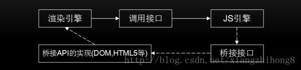

# V8引擎初步介绍

[https://blog.csdn.net/xiangzhihong8/article/details/74996757](https://blog.csdn.net/xiangzhihong8/article/details/74996757)

## 渲染引擎与网页渲染
### 编程分类
编程语言分为 **编译型语言和解释型语** 言两类。                              
编译型语言在执行之前要先进行完全编译，而 **解释型语言一边编译一边执行**，
很明显解释型语言的执行速度是慢于编译型语言的，而JavaScript就是一种解释型脚本语言，
支持动态类型、弱类型、基于原型的语言，内置支持类型。

### 渲染引擎
就是将HTML/CSS/JavaScript等文本或图片等信息转换成浏览器上可见的可视化图像结果的转换程序。              
WebKit，一个由苹果发起的一个开源项目，如今它在移动端占据着垄断地位，更有基于WebKit的web操作系统不断涌现(如：Chrome OS、Web OS)。                        

WebKit内部结构大体如下                      
                                 

上图中实线框内模块是所有移植的共有部分，虚线框内不同的厂商可以自己实现。由上图可知，WebKit主要有操作系统、WebCore 、WebKit嵌入式接口和第三方库组成。

**操作系统**: 是管理和控制计算机硬件与软件资源的计算机程序。                           
**WebCore**: JavaScriptCore是WebKit的默认引擎，在谷歌系列产品中被替换为V8引擎。                           
**WebKit嵌入式接口**: 该接口主要供浏览器调用，与移植密切相关，不同的移植有不同的接口规范。
**第三方库**: 主要是诸如图形库、网络库、视频库、数据存储库等第三方库。

### 网页渲染流程简析
首先，系统将网页输入到HTML解析器，HTML解析器解析，然后构建DOM树，在这期间如果遇到JavaScript代码则交给JavaScript引擎处理；
如果遇到CSS样式信息，则构建一个内部绘图模型。该模型由布局模块计算模型内部各个元素的位置和大小信息，最后由绘图模块完成从该模型到图像的绘制。 

对于网页的绘制过程，大体可以分为3个阶段：                               

**1、从输入URL到生成DOM树**                             
在这个阶段中，主要会经历一下几个步骤：                                                                                      
地址栏输入URL，WebKit调用资源加载器加载相应资源；                                                               
加载器依赖网络模块建立连接，发送请求并接收答复；                                                                
WebKit接收各种网页或者资源数据，其中某些资源可能同步或异步获取；                                                             
网页交给HTML解析器转变为词语；                                                               
解释器根据词语构建节点，形成DOM树；                                                             
如果节点是JavaScript代码，调用JavaScript引擎解释并执行；                                                              
JavaScript代码可能会修改DOM树结构；                                                                
如果节点依赖其他资源，如图片、视频等，调用资源加载器加载它们，但这些是异步加载的，不会阻碍当前DOM树继续创建；如果是JavaScript资源URL（没有标记异步方式），则需要停止当前DOM树创建，直到JavaScript加载并被JavaScript引擎执行后才继续DOM树的创建。

**2、从DOM树到构建WebKit绘图上下文**                                                             
CSS文件被CSS解释器解释成内部表示；                                                                                
CSS解释器完成工作后，在DOM树上附加样式信息，生成RenderObject树；                                                                                                       
RenderObject节点在创建的同时，WebKit会根据网页层次结构构建RenderLayer树，同时构建一个虚拟绘图上下文。                                                                                                            

**3、绘图上下文内容并呈现图像内容**                                    
绘图上下文是一个与平台无关的抽象类，它将每个绘图操作桥接到不同的具体实现类，也就是绘图具体实现类；                                       
绘图实现类也可能有简单的实现，也可能有复杂的实现，软件渲染、硬件渲染、合成渲染等；                                       
绘图实现类将2D图形库或者3D图形库绘制结果保存，交给浏览器界面进行展示。                                       

[这一部分内容还可以看这里：渲染机制](../../../book/05、基础知识点专题/02_01、进阶知识部分1-10.md#class02-01)                                        

## JavaScript引擎
JavaScript这种解释性语言来讲，如何提高解析速度就是当务之急。JavaScript引擎和渲染引擎的关系如下图所示                                                                  
                                         

为了提高性能，JavaScript引入了Java虚拟机和C++编译器中的众多技术。
而一个完整JavaScript引擎的执行过程大致流程如下：**源代码-→抽象语法树-→字节码-→JIT-→本地代码**。一个典型的抽象语法树如下图所示：                                    

题外话 关于 JIT:                 
JIT 编译 (JIT compilation)，运行时需要代码时。                      
JIT具体的做法是这样的:当载入一个类型时,CLR为该类型创建一个内部数据结构和相应的函数,当函数第一被调用时,JIT将该函数编译成机器语言.当再次遇到该函数时则直接从cache中执行已编译好的机器语言.                              

为了节约将抽象语法树通过JIT技术转换成本地代码的时间，V8放弃了生成字节码阶段的性能优化。而通过Profiler采集一些信息，来优化本地代码。                            
在2017年4月底，v8 发布了5.9 版本，在此版本中新增了一个 Ignition 字节码解释器，并默认开启。
做出这一改变的原因为：（主要动机）减轻机器码占用的内存空间，即牺牲时间换空间；
提高代码的启动速度；对 v8 的代码进行重构，降低 v8 的代码复杂度（[详细介绍请查阅：JS 引擎与字节码的不解之缘](https://cnodejs.org/topic/59084a9cbbaf2f3f569be482)）

## V8引擎
前面，我们介绍了V8引擎的一些历史，下面我们重点来看看V8项目一些知识。首先，V8项目的结构如下：                       
                         

### 数据解析
JavaScript作为一种无类型的语言，在编译时并不能准确知道变量的类型，只可以在运行时确定。因而JavaScript运行效率比C++或Java低。                                         
而对于JavaScript 来说，并不能像C++那样在执行时已经知道变量的类型和地址，所以在代码解析过程中，会产生很多的临时变量，而变量的存取是非常普遍和频繁的。                                       
在JavaScript中，除boolean，number，string，null，undefined这个五个简单变量外，其他的数据都是对象，V8使用一种特殊的方式来表示它们，进而优化JavaScript的内部表示问题。                                           

JavaScript对象在V8中的实现包含三个部分：隐藏类指针，这是v8为JavaScript对象创建的隐藏类；属性值表指针，指向该对象包含的属性值；元素表指针，指向该对象包含的属性。                                

在V8中，数据的内部表示由数据的实际内容和数据的句柄构成。数据的实际内容是变长的，类型也是不同的；句柄固定大小，包含指向数据的指针。
这种设计可以方便V8进行垃圾回收和移动数据内容，如果直接使用指针的话就会出问题或者需要更大的开销，
使用句柄的话，只需修改句柄中的指针即可，使用者使用的还是句柄，指针改动是对使用者透明的。

除少数数据(如整型数据)由handle本身存储外，其他内容限于句柄大小和变长等原因，都存储在堆中。
整数直接从value中取值，然后使用一个指针指向它，可以减少内存的占用并提高访问速度。
一个句柄对象的大小是4字节(32位设备)或者8字节(64位设备)，而在JavaScriptCore中，使用的8个字节表示句柄。
在堆中存放的对象都是4字节对齐的，所以它们指针的后两位是不需要的，V8用这两位表示数据的类型，00为整数，01为其他。

### V8引擎渲染过程
V8引擎在执行JavaScript的过程中，主要有两个阶段：编译和运行。                                        
在V8引擎中，源代码先被解析器转变为抽象语法树(AST)，然后使用JIT编译器的全代码生成器从AST直接生成本地可执行代码。                                      
但由于缺少了转换为字节码这一中间过程，也就减少了优化代码的机会。                                        

V8引擎编译本地代码时使用的主要类如下所示：                                              
**Script**：表示JavaScript代码，即包含源代码，又包含编译之后生成的本地代码，即是编译入口，又是运行入口；                                                          
**Compiler**：编译器类，辅组Script类来编译生成代码，调用解释器(Parser)来生成AST和全代码生成器，将AST转变为本地代码；                                                          
**AstNode**：抽象语法树节点类，是其他所有节点的基类，包含非常多的子类，后面会针对不同的子类生成不同的本地代码；                                                           
**FullCodeGenerator**：AstVisitor类的子类，通过遍历AST来为JavaScript生成本地可执行代码。                                                          