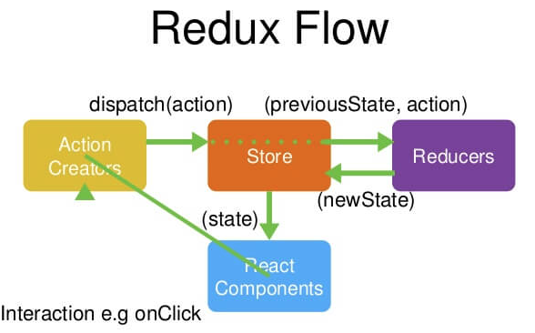

# 深入Redux架构

[http://www.cnblogs.com/MuYunyun/p/6530715.html](http://www.cnblogs.com/MuYunyun/p/6530715.html)

## 1、关于redux

### 1.1、什么情况需要用redux？
- 用户的使用方式复杂
- 不同身份的用户有不同的使用方式（比如普通用户和管理员）
- 多个用户之间可以协作
- 与服务器大量交互，或者使用了WebSocket
- View要从多个来源获取数据

简单说，如果你的UI层非常简单，没有很多互动，Redux 就是不必要的，用了反而增加复杂性。多交互、多数据源场景就比较适合使用Redux。

### 1.2、设计思想
- Web 应用是一个状态机，视图与状态是一一对应的。
- 所有的状态，保存在一个对象里面。

### 1.3、Redux工作流程

                              

首先，用户发出 Action。                         
`store.dispatch(action);`                               

然后，Store 自动调用 Reducer，并且传入两个参数：当前 State 和收到的 Action。 Reducer 会返回新的 State 。                                                    
`let nextState = todoApp(previousState, action);`


State 一旦有变化，Store 就会调用监听函数。                                 
// 设置监听函数                       
`store.subscribe(listener);`

listener可以通过store.getState()得到当前状态。如果使用的是 React，这时可以触发重新渲染 View。                                
```javascript
function listerner() {
  let newState = store.getState();
  component.setState(newState);   
}
```

如果现在没理解以上流程，不要急，看完以下API就差不多能懂得Redux的核心机制了。

## 2、API                                

### Store
Store 就是保存数据的地方，你可以把它看成一个容器。整个应用只能有一个 Store。

Redux 提供createStore这个函数，用来生成 Store。                     
下面代码中，createStore函数接受另一个函数作为参数，返回新生成的 Store 对象。                         
```javascript
import { createStore } from 'redux';
const store = createStore(fn);
```

### State
Store对象包含所有数据。如果想得到某个时点的数据，就要对 Store 生成快照。这种时点的数据集合，就叫做 State。                          
当前时刻的 State，可以通过store.getState()拿到。
```javascript
import { createStore } from 'redux';
const store = createStore(fn);

const state = store.getState();
```
Redux 规定， 一个 State 对应一个 View。只要 State 相同，View 就相同。你知道 State，就知道 View 是什么样，反之亦然。


### Action
State 的变化，会导致 View 的变化。但是，用户接触不到 State，只能接触到 View。所以，State 的变化必须是 View 导致的。Action 就是 View 发出的通知，表示 State 应该要发生变化了。                          
Action 是一个对象。其中的type属性是必须的，表示 Action 的名称。其他属性可以自由设置，社区有一个规范可以参考。                                
```javascript
const action = {
  type: 'ADD_TODO',
  payload: 'Learn Redux'
};
```
上面代码中，Action 的名称是ADD_TODO，它携带的信息是字符串Learn Redux。                        
可以这样理解，Action 描述当前发生的事情。改变 State 的唯一办法，就是使用 Action。它会运送数据到 Store。


### Action Creator
View 要发送多少种消息，就会有多少种 Action。如果都手写，会很麻烦。可以定义一个函数来生成 Action，这个函数就叫 Action Creator。                    
```javascript
const ADD_TODO = '添加 TODO';

function addTodo(text) {
  return {
    type: ADD_TODO,
    text
  }
}
const action = addTodo('Learn Redux');
```

### store.dispatch()
store.dispatch()是 View 发出 Action 的唯一方法。                     
```javascript
import { createStore } from 'redux';
const store = createStore(fn);

store.dispatch({
  type: 'ADD_TODO',
  payload: 'Learn Redux'
});
```
上面代码中，store.dispatch接受一个 Action 对象作为参数，将它发送出去。                          
结合 Action Creator，这段代码可以改写如下。
```javascript
store.dispatch(addTodo('Learn Redux'));
```

### Reducer
Store 收到 Action 以后，必须给出一个新的 State，这样 View 才会发生变化。这种 State 的计算过程就叫做 Reducer。                             
Reducer 是一个函数，它接受 Action 和当前 State 作为参数，返回一个新的 State。下面是一个实际的例子
```javascript
const defaultState = 0;
const reducer = (state = defaultState, action) => {
  switch (action.type) {
    case 'ADD':
      return state + action.payload;
    default: 
      return state;
  }
};

const state = reducer(1, {
  type: 'ADD',
  payload: 2
});
```
上面代码中，reducer函数收到名为ADD的 Action 以后，就返回一个新的 State，作为加法的计算结果。
其他运算的逻辑（比如减法），也可以根据 Action 的不同来实现。                                        
实际应用中，Reducer 函数不用像上面这样手动调用，store.dispatch方法会触发 Reducer 的自动执行。
为此，Store 需要知道 Reducer 函数，做法就是在生成 Store 的时候，将 Reducer 传入createStore方法。                           
```javascript
import { createStore } from 'redux';
const store = createStore(reducer);
```
上面代码中，createStore接受 Reducer 作为参数，生成一个新的 Store。
以后每当store.dispatch发送过来一个新的 Action，就会自动调用 Reducer，得到新的 State。


### store.subscribe()
Store 允许使用store.subscribe方法设置监听函数，一旦 State 发生变化，就自动执行这个函数。                      
```javascript
import { createStore } from 'redux';
const store = createStore(reducer);

store.subscribe(listener);
```
显然，只要把 View 的更新函数（对于 React 项目，就是组件的render方法或setState方法）放入listen，就会实现 View 的自动渲染。                        
store.subscribe方法返回一个函数，调用这个函数就可以解除监听。                      
```javascript
let unsubscribe = store.subscribe(() =>
  console.log(store.getState())
);
unsubscribe();
```


## 3、中间件与异步操作
一个关键问题没有解决：异步操作怎么办？Action 发出以后，Reducer 立即算出 State，这叫做同步；Action 发出以后，过一段时间再执行 Reducer，这就是异步。                             
怎么才能 Reducer 在异步操作结束后自动执行呢？这就要用到新的工具：中间件（middleware）。

为了理解中间件，让我们站在框架作者的角度思考问题：如果要添加功能，你会在哪个环节添加？                         
（1）Reducer：纯函数，只承担计算 State 的功能，不合适承担其他功能，也承担不了，因为理论上，纯函数不能进行读写操作。                       
（2）View：与 State 一一对应，可以看作 State 的视觉层，也不合适承担其他功能。                        
（3）Action：存放数据的对象，即消息的载体，只能被别人操作，自己不能进行任何操作。                        
想来想去，只有发送 Action 的这个步骤，即store.dispatch()方法，可以添加功能。                              

### 中间件的用法
本文不涉及如何编写中间件，因为常用的中间件都有现成的，只要引用别人写好的模块即可。                       
```javascript
import { applyMiddleware, createStore } from 'redux';
import createLogger from 'redux-logger';
const logger = createLogger();

const store = createStore(
  reducer,
  applyMiddleware(logger)
);
```

上面代码中，redux-logger提供一个生成器createLogger，可以生成日志中间件logger。
然后，将它放在applyMiddleware方法之中，传入createStore方法，就完成了store.dispatch()的功能增强。

这里有两点需要注意：
（1）createStore方法可以接受整个应用的初始状态作为参数，那样的话，applyMiddleware就是第三个参数了。
```javascript
const store = createStore(
  reducer,
  initial_state,
  applyMiddleware(logger)
);
```

（2）中间件的次序有讲究。
```javascript
const store = createStore(
  reducer,
  applyMiddleware(thunk, promise, logger)
);
```
上面代码中，applyMiddleware方法的三个参数，就是三个中间件。有的中间件有次序要求，使用前要查一下文档。比如，logger就一定要放在最后，否则输出结果会不正确。


