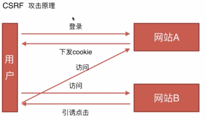
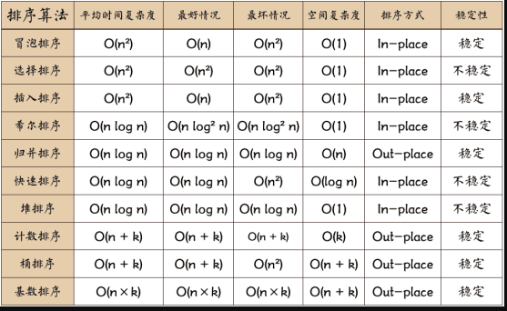

## 基础知识部分

目录
- [01、高度已知：左右各300px,中间自适应](#class01-01)
- [02、上下居中方案](#class01-02)
- [03、css盒模型](#class01-03)
- [04、DOM事件类](#class01-04)
- [05、Http协议类](#class01-05)
- [06、原型链](#class01-06)
- [07、面向对象](#class01-07)
- [08、通信类](#class01-08)
- [09、安全](#class01-09)
- [10、算法类](#class01-10)

### <div id="class01-01">01、高度已知：左右各300px,中间自适应</div>     

浮动、绝对定位、flexBox（display：flex）、table标签 、网格布局（display:Grid）、display: table-cell;           
延伸：每个解决方案的优缺点，之间的比较；如果去掉高度已知，什么方案不适用了；兼容性，业务中最实用的；              
浮动：需要清除浮动，兼容性比较好；           
绝对定位：快捷、因为已经脱离文档流了，所以子元素都也要脱离文档流，可实用性非常差；           
flex:就是为了以上连个布局的不足的；            
display:table:兼容性非常好，三栏布局，如果某一个高度超出的时候，另外另个也都是会一起增高的；           
网格布局：新技术；           

### <div id="class01-02">02、上下居中方案</div>

### <div id="class01-03">03、css盒模型</div>                 

**标准和模型+IE盒模型：**        
区别：标准模型的宽高是不计算padding和border的，IE是需要计算的      
css如何设置这两种模型：       
默认是： `box-sizing:content-box;box-sizing:border-box;`    
JS如何设置获取盒模型对应的宽高：       

```javascript
dom.style.width/height;     
dom.currentStyle.width/height;      
window.getComputedStyle(dom).width/height;
```      

**解释边距重叠：**         
BFC边距重叠的解决方案        

### <div id="class01-04">04、DOM事件类</div>     
DOM事件级别、DOM事件模型、DOM事件流、DOM事件捕获的具体流程、Event对象的常见应用、自动以事件

**事件级别:**                       
DOM0:element.onclick=function(){};    // 签内写onclick事件              
DOM2:elemeng.addEventListener("click",function(){},false);// 二是在JS写onlicke=function（）{}函数;  第三个指定捕获或者冒泡;  为false表示在冒泡阶段调用                       
DOM3:elemeng.addEventListener("keyup",function(){},false);// 定义了自定义事件; 第三个指定捕获或者冒泡                                 

1级DOM--(为什么没有1级DOM):                    
DOM级别1于1998年10月1日成为W3C推荐标准。1级DOM标准中并没有定义事件相关的内容，所以没有所谓的1级DOM事件模型。
在2级DOM中除了定义了一些DOM相关的操作之外还定义了一个事件模型 ，这个标准下的事件模型就是我们所说的2级DOM事件模型。 


**事件模型：** 捕获（从上到下）、冒泡（从下到上）；

**事件流：** 用户和浏览器做交互的过程中，事件的传递，比如点击左键，怎么传递到页面上的。
捕获->目标阶段->冒泡

**DOM事件具体流程：**  
window->document->html->body->.....普通html一步一步下传...->目标元素

**Event对象：**  
event.keyCode;  
event.preventDefault();//阻止默认时间     
event.stopPropatation();//阻止冒泡      
event.stopImmediatePropagation();//处理事件响应优先级        
event.currentTarget();//当前绑定的事件     
event.target();//获取当前点击元素对象     

**自定义事件：**
```javascript
var eve=new Event('custome');
ev.addEventListener('custome',function(){//ev就是一个简单的元素对象
console.log('custome');
});
ev.dispatchEvent(eve);//触发事件

//需要制定参数的自定义事件    CustomeEvent
var eve = new CustomeEvent('custome',obj);
```
    
### <dvi id="class01-05">05、Http协议类</div>      
**特点：** 简单快速，灵活、无连接、无状态   
每一个资源对应一个URI，请求只要输入资源地址uri就可以了；     
在每一个http头部协议中都有一个数据类型，通过一个http协议就可以完成不同类型数据的传输；     
链接一次就会断开；       
每一次链接不会记住链接状态的，服务器不区分两次链接的身份；       

**http报文组成部分，建立在TCP之上的:**             
    请求报文：请求行、请求头、空行、请求体     
    请求行：HTTP请求方法、页面地址、协议版本等         
    请求头：key,value值，告诉服务端我要什么内容、要什么数据类型                      
    空行：分割请求头和请求体的，遇到空行，服务器就知道，请求头结束了，接下来是请求体了           
    请求体：就是给服务端的一些入参数据；          
    我所了解的请求体有两种格式，Content-Type: application/x-www-form-urlencoded  和  payload  和 json             

**响应报文：** 状态行、响应头、空行、响应体     
状态行：协议版本  状态码   状态      
其他的一样的      

**HTTP方法：** GET请求资源、post传输资源、put更新资源、delete删除资源、head获取报文首部           
get和post区别：     
get只能url 编码、post支持多种编码方式            
get在传输参数有长度限制的，而post是没有长度限制的        
get通过url传递，post放在request body中      
get不安全，post是一种安全的传输协议方式     
get会把参数保存到浏览器记录里，而post中的参数不会保存          
get 会被浏览器缓存         

**http状态码：**        

**1.XX**:指示信息-表示请求已经接受，继续处理
         
**2.XX:成功**         
    200：请求成功            
    206：客户端发送一个range头的get请求，服务器完成了他         
    
**3.XX：重定向**        
    301：请求的页面转移到新的url;      
    302:临时转移到新的url          
    304：客户端缓存的文件并发出了一个条件性的请求，服务器告诉客户，原来缓冲的文档还可以继续使用         
    
**4.XX：客户端错误**             
    400：语法错误        
    401：请求未授权       
    403：请求禁止访问      
    404：请求资源不存在     
    
**5.XX：服务端错误**     
    500：服务器发生不可预期的错误        
    503：服务器请求未完成        
    
**HTTP持久链接：**                       
http采用的是 "请求-应答" 模式                         
当使用keep-Alive 模式（又称持久链接、链接重用）时、http1.1版本才支持的                        
    Connection: keep-alive                      
            
**管线化：**                                
持久链接下：链接传递消息类似于请求1->响应1->请求2->响应2->请求3->响应3                             
管线化：请求1-》请求2-》请求3-》响应1-》响应2-》响应3                            
需要通过持久链接完成，所以仅HTTP1.1版本支持                       
只有get和head请求支持管线化，post请求是有所限制的          


### <div id="class01-06">06、原型链</div>
内容：                 


创建对象的几种方式、原型、构造函数、实例、原型链、instanceof原理、new 运算符

#### 创建对象的几种方法
```javascript
// 面向字面量
var o1={name:'01'};
var o11=new Object({name:'o11'});

// 使用显示的构造函数：
var M=function(){this.name='02'};
var o2=new M();

// 通过Object.create()创建
var P={name:'o3'};
var o3=Object.create(P)
```


#### 原型、构造函、实例、原型链：                             
                   
        
1、基础           
       
构造函数可以通过new来生成一个实例、构造函数也是函数；                
函数都有一个prototype属性，这个就是原型对象；         
原型对象可以通过构造器constructor来指向它的构造函数；             
实例的__proto__属性，指向的是其构造函数的原型对象；                          


原型链：从一个实例对象，向上找构造这个实例相关联的对象，相关联的对象又向上找，找到创造它的一个实例对象，
一直到Object.prototype截止。原型链是通过prototype和__proto__向上找的。构造函数通过prototype创建了很多方法，
被其所有实例所公用，存放在原型对象上；                      

例子：
```javascript
var M=function(name){this.name=name};
var o3=new M('o3');
```

当我们需要扩展实例的时候，我们可以对构造函数添加方法，但是这样会创建每一个实例都拷贝一份它自己的添加的方法，
占用内存，而且也没有必要，这个时候就可以新添加的方法写进原型里面去，添加到原型链中去，
在实例的原型链中我们可以在原型对象上找到添加的方法；

```javascript
var M=function(name){this.name=name};
var o3=new M('o3');
M.prototype.say=function(){
Console.log('say hi');
};
var o5=new M('o5');
```
通过这种方式o3和o5都有say方法；原型链的优势是原型对象的方法是被所有实例共有的；

当访问一个实例方法的时候，首先在实例本身找这个方法，如果没有找到就会到其构建函数的原型对象去找，如果还是没有找到，
那么它会继续通过原型链在原型对象的更上一级查找，一直到object.prototype;

一定要记住只有函数才有proptotype,对象是没有的；

只有实例对象又__proto__ , 因为函数也是对象，所以函数也有__proto__ , 但是和实例对象的__proto__是有区别的，函数的__proto__是function这个对象的构造实例；


2、instanceof原理

实例对象上面有一个__proto__ ，这个是引用的它构造函数的原型对象；

instanceof是用来判断实例是不是由某个构造函数实例化出来的对象，其原理是判断实例对象是否指向构造函数的原型；
只要是在原型链上的函数，都会被instanceof看做是实例对象的一个构造函数，所以都会返回true;

```
m1.__proto__===m1.prototype;返回true
m1.prototype.__proto===Object.prototype;返回true

o3.__proto__.constructor===Object;//返回false
所以我们判断一个实例对象的构造函数，用constructor;
```

3、new 运算符		后面跟着的是一个构造函数

一个新对象被创建。它继承自foo.prototype->                            
构造函数foo会被执行，执行的时候，相应的传参会被传入，同时上下文（this）会被指定为这个新实例。	new foo等同于new foo(),只能在不传递任何参数的情况->                     
如果构造函数返回了一个‘对象’，那么这个对象会取代整个new 出来的结果。如果构造函数没有返回值，	那么new出来的结果为步骤1创建的对象

4、Object.create()；创建的实例对象是指向的对象原型，实例对象本身是不具备创建对象的属性和方法的，是通过原型链来链接的。


### <div id="class01-07">07、面向对象</div>

#### 类与实例：类的申明、生成实例

类与实例：
```javascript
/*类的申明*/
function Animal(){
    //通过this来表明这是一个构造函数
    this.name='name';
}

//ES6的申明方式
class Animal2{
    constructor(){//构造函数
        this.name=name
    }
}
```

实例化：
```javascript
/*实例化*/
console.log(new Animal(),new Animal2())
```

#### 继承：                    

**7.1、借助构造函数实现继承**

call和apply改变的是JS运行的上下文:             
```javascript
/*借助构造函数实现继承*/
function Parent(name) {
    this.name = name;
    this.getName = function () {
        console.log(this.name);
    }
}

function Child(name) {
    Parent.call(this, name);
    this.type = 'child1'
}

let child = new Child('yanle');
child.getName();
console.log(child.type);
```
父类的this指向到了子类上面去，改变了实例化的this 指向，导致了父类执行的属性和方法，都会挂在到	子类实例上去；                     
缺点：父类原型链上的东西并没有被继承；


**7.2、通过原型链实现继承**                   
```javascript
/*通过原型链实现继承*/
function Parent2(){
    this.name='parent2'
}

function Child2(){
    this.type='child2'
}

Child2.prototype=new Parent2();
console.log(new Child2());
```

Child2.prototype是Child2构造函数的一个属性，这个时候prototype被赋值了parent2的一个实例，实例化了新的对象Child2()的时候，
会有一个__proto__属性，这个属性就等于起构造函数的原型对象，但是原型对象被赋值为了parent2的一个实例，
所以new Child2的原型链就会一直向上找parent2的原型

var s1=new Child2();                
var s2=new Child2();                    
s1.__proto__===s2.__proto__;//返回true                        

缺点：通过子类构造函数实例化了两个对象，当一个实例对象改变其构造函数的属性的时候，
那么另外一个实例对象上的属性也会跟着改变（期望的是两个对象是隔离的赛）；原因是构造函数的原型对象是公用的；


**7.3、组合方式**
```javascript
/*组合方式*/
function Parent3(){
    this.name='parent3';
    this.arr=[1,2,3];
}

function Child3(){
    Parent3.call(this);
    this.type='child';
}

Child3.prototype=new Parent3();
var s3=new Child3();
var s4=new Child3();
s3.arr.push(4);
console.log(s3,s4);
```

优点:这是最通用的使用方法，集合了上面构造函数继承，原型链继承两种的优点。                      
缺点:父类的构造函数执行了2次，这是没有必要的，                            
constructor指向了parent了


**7.4、组合继承的优化1**
```javascript
/*组合继承的优化1*/
function Parent4(){
    this.name='parent3';
    this.arr=[1,2,3];
}

function Child4(){
    Parent4.call(this);
    this.type='child5';
}

Child4.prototype=Parent4.prototype;
var s5=new Child4();
var s6=new Child4()
```

缺点：s5 instaceof child4//true, s5 instanceof Parent4//true                                
我们无法区分一个实例对象是由其构造函数实例化，还是又其构造函数的父类实例化的                              
s5.constructor  指向的是Parent4;//原因是子类原型对象的constructor 被赋值为了父类原型对象的	constructor,所以我们使用constructor的时候，肯定是指向父类的                           
Child3.constructor 也有这种情况                               

**7.5、组合继承的优化2**
```javascript
function Parent5() {
    this.name = 'parent5';
    this.play = [1, 2, 3];
}

function Child5() {
    Parent5.call(this);
    this.type = 'child5'
}

Child5.prototype = Object.create(Parent5.prototype);
//这个时候虽然隔离了，但是constructor还是只想的Parent5的，因为constructor会一直向上找
Child5.prototype.constructor=Child5;

var s7=new Child5();
console.log(s7 instanceof Child5,s7 instanceof Parent5);
console.log(s7.constructor);
```

通过Object.create来创建原型中间对象，那么这么来的话，chiild5的对象prototype获得的是parent5	父类的原型对象；                    
Object.create创建的对象，原型对象就是参数；                            
    
    
**7.6、ES 中的继承**
后面自信该补充...


### <div id="class01-08">08、通信类</div>

#### 同源策略与限制：
同源策略限制从一个源加载的文档或者脚本如何与来自另一个源的资源进行交互。
这是一个用于隔离潜在恶意文件的关键安全机制。（源：协议、域名、端口；不是一个源的文档资源，是操作不了另外一个源的文档资源的）；
比如：Cookie、LocalStorage和indexDB无法读取、DOM无法获得、ajax无法发送


前后端如何通信：**Ajax(同源通信)、webSocket(不限制同源策略)、CORS(支持跨域，也支持同源)**                  

创建Ajax:工作流程、兼容处理、出发条件、触发顺序                      
示例1：通过promise来创建一个ajax                              
```javascript
var getJSON = function (url) {
    var promise = new Promise(function (resolve, reject) {
        var client = new XMLHttpRequest();
        //如果是IE的内核ActiveXObject('Microsoft.XMLHTTP');
        client.open("GET", url);
        client.onreadystatechange = handler;
        client.responseType = "json";
        client.setRequestHeader("Accept", "application/json");
        //如果是post请求：client.setRequestHeader('Content-Type','application/X-WWW-form-urlencoded')
        client.send();

        function handler() {
            if (this.readyState !== 4) {
                return;
            }
            if (this.status === 200) {
                resolve(this.response);
            } else {
                reject(new Error(this.statusText));
            }
        }
    });
    return promise;
};

getJSON("/posts.json").then(function (json) {
    console.log('Contents: ' + json);
}, function (error) {
    console.error(' 出错了 ', error);
});
```

示例2：
```javascript
/* 封装一个高级的ajax工具*/
extend = function (dst, obj) {
    for (var i in obj) {
        if (obj.hasOwnProperty(i)) {
            dst[i] = obj[i];
        }
    }
};

json = function (options) {
    var opt = {
        url: '',
        type: 'get',
        data: {},
        success: function () {
        },
        error: function () {
        },
    };
    extend(opt, options);
    if (opt.url) {
        var xhr = XMLHttpRequest
            ? new XMLHttpRequest()
            : new ActiveXObject('Microsoft.XMLHTTP');
        var data = opt.data,
            url = opt.url,
            type = opt.type.toUpperCase(),
            dataArr = [];
        for (var k in data) {
            dataArr.push(k + '=' + data[k]);
        }
        if (type === 'GET') {
            url = url + '?' + dataArr.join('&');
            xhr.open(type, url.replace(/\?$/g, ''), true);
            xhr.send();
        }
        if (type === 'POST') {
            xhr.open(type, url, true);
            xhr.setRequestHeader('Content-type', 'application/x-www-form-urlencoded');
            xhr.send(dataArr.join('&'));
        }
        xhr.onload = function () {
            if (xhr.status === 200 || xhr.status === 304) {
                var res;
                if (opt.success && opt.success instanceof Function) {
                    res = xhr.responseText;
                    if (typeof res === 'string') {
                        res = JSON.parse(res);
                        opt.success.call(xhr, res);
                    }
                }
            } else {
                if (opt.error && opt.error instanceof Function) {
                    opt.error.call(xhr, res);
                }
            }
        };
    }
};
```

#### 跨域通信的几种方式：JSONP、Hash、postMessage、WebSocket、CORS(支持跨域通信的ajax)

**jsonp:通过script标签异步加载来实现的**

第一步需要给服务端传递一个回调的名，回调的名表示：我用一个加载script 标签的形式发送一个请求出去，	服务器要给我返回一个内容，这个内容是一个JS代码块，这个代码块中有我的回到名+代码，就可以运行了。
比如：`<script src="http://www.yanlele.com/?data=name&calback=jsonp"></script>`
服务器给我下发一个这样的内容
```html
<script>
    jsonp({
        data:{
            
        }
    })
</script>
```
一定要告诉服务端函数名称，以这个函数名称，在window上注册一个全局的函数，然后动态创建一个script标签，然后监听脚本加载事件，
然后判断onload是否成功，是否能拿到数据，最后在window上删除函数变量，最后 向html 中增加script标签，是为了正常让这个请求发送出去，
如果不加入这个script标签，请求是发布出去的。
```javascript
util.jsonp = function (url, onsuccess, onerror, charset) {
    var callbackName = util.getName('tt_player');
    window[callbackName] = function () {
        if (onsuccess && util.isFunction(onsuccess)) {
            onsuccess(arguments[0]);
        }
    };
    var script = util.createScript(url + '&callback=' + callbackName, charset);
    script.onload = script.onreadystatechange = function () {
        if (!script.readyState || /loaded|complete/.test(script.readyState)) {
            script.onload = script.onreadystatechange = null;
            // 移除该script的 DOM 对象
            if (script.parentNode) {
                script.parentNode.removeChild(script);
            }
            // 删除函数或变量
            window[callbackName] = null;
        }
    };
    script.onerror = function () {
        if (onerror && util.isFunction(onerror)) {
            onerror();
        }
    };
    document.getElementsByTagName('head')[0].appendChild(script);
};
```

**hash 方式：**
```javascript
// 利用hash，场景是当前页面 A 通过iframe或frame嵌入了跨域的页面 B
// 在A中伪代码如下：
var B = document.getElementsByTagName('iframe');
B.src = B.src + '#' + 'data';
// 在B中的伪代码如下
window.onhashchange = function () {
    var data = window.location.hash;
};
```

**postMessage方式：**
```javascript
// postMessage
// 窗口A(http:A.com)向跨域的窗口B(http:B.com)发送信息
Bwindow.postMessage('data', 'http://B.com');
// 在窗口B中监听
Awindow.addEventListener('message', function (event) {
    console.log(event.origin);
    console.log(event.source);
    console.log(event.data);
}, false);
```

**webSocket方式:**
```javascript
// Websocket【参考资料】http://www.ruanyifeng.com/blog/2017/05/websocket.html
var ws = new WebSocket('wss://echo.websocket.org');

ws.onopen = function (evt) {
    console.log('Connection open ...');
    ws.send('Hello WebSockets!');
};

ws.onmessage = function (evt) {
    console.log('Received Message: ', evt.data);
    ws.close();
};

ws.onclose = function (evt) {
    console.log('Connection closed.');
};
```


**CORS方式：** IE浏览器不能低于IE10。

下面是一个例子，浏览器发现这次跨源AJAX请求是简单请求，就自动在头信息之中，添加一个Origin字段。
览器发现，这个回应的头信息没有包含Access-Control-Allow-Origin字段（详见下文），就知道出错了，从而抛出一个错误，被XMLHttpRequest的onerror回调函数捕获。
[【参考资料】http://www.ruanyifeng.com/blog/2016/04/cors.html](http://www.ruanyifeng.com/blog/2016/04/cors.html)
```javascript
// url（必选），options（可选）
fetch('/some/url/', {
    method: 'get',
}).then(function (response) {

}).catch(function (err) {
  // 出错了，等价于 then 的第二个参数，但这样更好用更直观
});
```

### <div id="class01-09">09、安全</div>

#### scrf
基本概念：跨站请求伪造                             
原理：             
                       
当用户访问登录A网站的时候，登录成功之后，就会下发cookie，当用户访问B网站的时候，B网站就乘机下发资源的时候，下发了一个A网站的url接口，
如果用户点击了引诱攻击点，这个时候，就会跳转到A网站，跳转到A网站的时候自动上传Cookie身份认证，然后用户拿到身份认证了之后，
服务器就执行响应接口的一些列操作。                         

防御：                     

加入Token验证：这个token是服务器下发Cookie的时候一起下发的数据，当用户过来的时候，不仅需要Cookie身份验证，还需要在请求头中添加token验证。              
Referer验证：指的是页面来源，服务器判断页面来源是不是我这个站点下面的页面，如果不是的话，一律拦截                
隐藏令牌：跟Token相似的，只是放在http	请求头中，做的比较隐蔽                 

#### XSS：cross-site-scripting 跨域脚本攻击                        
原理：向页面注入脚本(通过合法的渠道注入script标签，比如评论区注入JS脚本，执行什么方法之类的)                     

防御：

反射型XSS                  
反射性XSS，也就是非持久性XSS。用户点击攻击链接，服务器解析后响应，在返回的响应内容中出现攻击者的XSS代码，被浏览器执行。一来一去，XSS攻击脚本被web server反射回来给浏览器执行，所以称为反射型XSS。
特点：也就是没有保存在web server中，而是出现在URL地址中；
一般是攻击者通过邮件，聊天软件等等方式发送攻击URL，然后用户点击来达到攻击的；

持久型XSS                  
区别就是XSS恶意代码存储在web server中，这样，每一个访问特定网页的用户，都会被攻击。                
特点：XSS攻击代码存储于web server上；                   
一般是通过网站的留言、评论、博客、日志等等功能(所有能够向web server输入内容的地方)，将攻击代码存储到web server上的；               
SS防御的总体思路是：对输入(和URL参数)进行过滤，对输出进行编码。                 


### <div id="class01-10">10、算法类</div>
                       

#### 快速排序：
先从数列中取出一个数作为“基准”。

分区过程：将比这个“基准”大的数全放到“基准”的右边，小于或等于“基准”的数全放到“基准”的左边。
再对左右区间重复第二步，直到各区间只有一个数。
```javascript
var quickSort = function(arr) {
    if (arr.length <= 1) { return arr; }
    var pivotIndex = Math.floor(arr.length / 2);   //基准位置（理论上可任意选取）
    var pivot = arr.splice(pivotIndex, 1)[0];  //基准数
    var left = [];
    var right = [];
    for (var i = 0; i < arr.length; i++){
        if (arr[i] < pivot) {
            left.push(arr[i]);
        } else {
            right.push(arr[i]);
        }
    }
    return quickSort(left).concat([pivot], quickSort(right));  //链接左数组、基准数构成的数组、右数组
};
```


#### 选择排序：
首先在未排序序列中找到最小（大）元素，存放到排序序列的起始位置                     
再从剩余未排序元素中继续寻找最小（大）元素，然后放到已排序序列的末尾。                     
重复第二步，直到所有元素均排序完毕。                      
```javascript
function selectionSort(arr) {
    var len = arr.length;
    var minIndex, temp;
    for (var i = 0; i < len - 1; i++) {
        minIndex = i;
        for (var j = i + 1; j < len; j++) {
            if (arr[j] < arr[minIndex]) {     // 寻找最小的数
                minIndex = j;                 // 将最小数的索引保存
            }
        }
        temp = arr[i];
        arr[i] = arr[minIndex];
        arr[minIndex] = temp;
    }
    return arr;
}
```

#### 插入排序：
将第一待排序序列第一个元素看做一个有序序列，把第二个元素到最后一个元素当成是未排序序列。                    
从头到尾依次扫描未排序序列，将扫描到的每个元素插入有序序列的适当位置。（如果待插入的元素与有序序列中的某个元素相等，则将待插入元素插入到相等元素的后面。）                           
```javascript
function insertionSort(arr) {
    var len = arr.length;
    var preIndex, current;
    for (var i = 1; i < len; i++) {
        preIndex = i - 1;
        current = arr[i];
        while(preIndex >= 0 && arr[preIndex] > current) {
            arr[preIndex+1] = arr[preIndex];
            preIndex--;
        }
        arr[preIndex+1] = current;
    }
    return arr;
}
```

#### 冒泡法排序：
比较相邻的元素。如果第一个比第二个大，就交换他们两个。             
对每一对相邻元素作同样的工作，从开始第一对到结尾的最后一对。这步做完后，最后的元素会是最大的数。                            
针对所有的元素重复以上的步骤，除了最后一个。                  
持续每次对越来越少的元素重复上面的步骤，直到没有任何一对数字需要比较。                     
```javascript
function bubbleSort(arr) {
    var len = arr.length;
    for (var i = 0; i < len - 1; i++) {
        for (var j = 0; j < len - 1 - i; j++) {
            if (arr[j] > arr[j+1]) {        // 相邻元素两两对比
                var temp = arr[j+1];        // 元素交换
                arr[j+1] = arr[j];
                arr[j] = temp;
            }
        }
    }
    return arr;
}
```

其他排序算法请见这里： [常见排序算法](../../18年/3月/01、常见排序算法/README.md)

