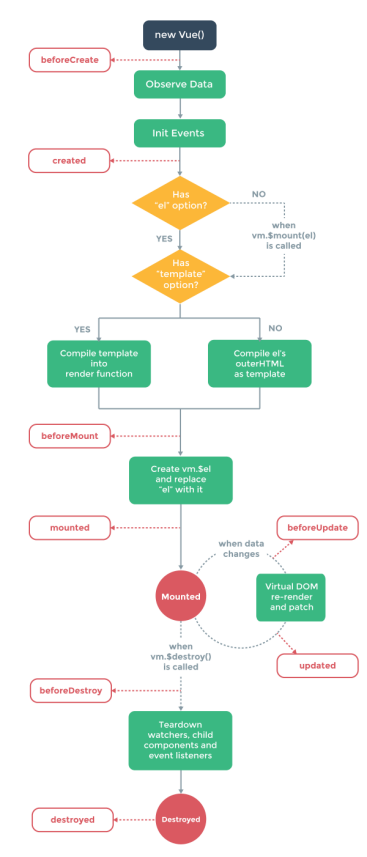

## 基础知识

- [11、let 和 const 与 var 的区别](#class01-11)
- [12、事件冒泡以及阻止事件冒泡](#class01-12)
- [13、跨域、css3、html5、安全](#class01-13)
- [14、call和apply的区别](#class01-14)
- [15、常见的ES6语法](#class01-15)
- [16、react/vue  生命周期](#class01-16)
- [17、redux过程](#class01-17)
- [18、关于闭包的研究](#class01-18)
- [19、关于this指针的研究](#class01-19)
- [20、浏览器出入一个url到呈现内容发生了什么](#class01-20)

### <dvi id="class01-11">11、let 和 const 与 var 的区别</div>                        
1、不存在变量提升                                                  
必须先定义后使用，否则报错                               

2、暂时性死区                     
在代码块内，使用let命令声明变量之前，该变量都是不可用的。这在语法上，称为“暂时性死区”（temporal dead zone，简称 TDZ）。

3、不允许重复申明/不允许在函数内部重新申明参数（也算重复申明）                            

4.1 SE5的作用域                     
1）、内层变量覆盖外层的变量                                  
2）、用来计数的循环变量会泄露为全局变量                                        
    
5、const是一个常量，一旦申明，就不能改变。而且在申明的时候必须初始化，不能留到后面赋值。                     

6、在ES5里面，未申明的全局变量会自动生为window的属性:                            
没法在编译过程爆出变量为申明的错误，语法上顶层对象有一个实体含义的对象这样肯定不合适。                             
用var定义的依然会升级为顶层对象(全局对象)window的属性；但是let,const申明则不会                               

### <div id="class01-12">12、事件冒泡以及阻止事件冒泡</div>
```javascript
event.preventDefault();//阻止默认时间
event.stopPropatation();//阻止冒泡
event.stopImmediatePropagation();//处理事件响应优先级
event.currentTarget();//当前绑定的事件
event.target();//获取当前点击元素对象
```

### <div id="class01-13">13、跨域、css3、html5、安全</div>
[可以看这个网站](http://blog.csdn.net/gane_cheng/article/details/52819118)


### <div id="class01-14">14、call和apply的区别</div>
apply：应用某一对象的一个方法，用另一个对象替换当前对象。例如：B.apply(A, arguments);即A对象应用B对象的方法。

apply：最多只能有两个参数——新this对象和一个数组argArray

call：调用一个对象的一个方法，以另一个对象替换当前对象。例如：B.call(A, args1,args2);即A对象调用B对象的方法。

call：它可以接受多个参数，第一个参数与apply一样，后面则是一串参数列表。

call 和 apply 都是为了改变某个函数运行时的 context 即上下文而存在的，换句话说，就是为了改变函数体内部 this 的指向。
二者的作用完全一样，只是接受参数的方式不太一样。

bind: MDN 的解释是 bind() 方法会创建一个 新函数，称为绑定函数，当调用这个绑定函数时，
绑定函数会以创建它时传入 bind() 方法的第一个参数 作为 this，传入 bind() 方法的 第二个以及以后的参
数加上绑定函数运行时本身的参数按照顺序作为原函数的参数来调用原函数。


### <div id="class01-15">15、常见的ES6语法</div>
#### 15.01、变量的解构赋值

#### 15.02、字符串的扩展
for...of循环遍历、搜索对应字符串includes()、startsWith()、endsWith()、
arr.repeat(number)、padStart()、padEnd()、arr.padStart(number,'xxxx')、模板字符串;


#### 15.03、数值的扩展
Number.isFinite()、Number.isNaN()、Number.parseInt()、Number.parseFloat()、Number.isInteger()、Math 对象的扩展；

#### 15.04、数组的扩展
**Array.from()、Array.of()**、Array.prototype.copyWithin(target, start = 0, end = this.length)、
数组实例的 **find() 和 findIndex()**、数组实例的 fill()、数组实例的 **entries() ， keys() 和 values()**、
Array.prototype.includes方法返回一个布尔值，表示某个数组是否包含给定的值，与字符串的includes方法类似。

#### 15.05、函数的扩展
函数参数的默认值，函数的 length 属性(将返回没有指定默认值的参数个数)、rest 参数（形式为 “... 变量名 ” ）、**Map 和 Set 结构， Generator 函数、箭头函数**、尾调优化、参数尾逗号；

#### 15.06、对象的扩展
属性的简洁表达方式、方法的 name 属性、Object.is()、Object.assign()、Object.setPrototypeOf()（写操作）、
Object.getPrototypeOf()（读操作）、Object.create()（生成操作）、Object.values()，Object.keys()，Object.entries()；

#### 15.07、Proxy 和 Reflect

1、**Proxy**:                  

Proxy(代理) 是 ES6 中新增的一个特性。Proxy 让我们能够以简洁易懂的方式控制外部对对象的访问。其功能非常类似于设计模式中的代理模式。

使用 Proxy 的好处是：对象只需关注于核心逻辑，一些非核心的逻辑
（如：读取或设置对象的某些属性前记录日志；设置对象的某些属性值前，需要验证；某些属性的访问控制等）可以让 Proxy 来做。
从而达到关注点分离，降级对象复杂度的目的。

**使用方法**                    
`var p = new Proxy(target, handler);`                   
其中，target 为被代理对象。handler 是一个对象，其声明了代理 target 的一些操作。p 是代理后的对象。                           
当外界每次对 p 进行操作时，就会执行 handler 对象上的一些方法。handler 能代理的一些常用的方法如下：                         
get：读取                      
set：修改                      
has：判断对象是否有该属性                      
construct：构造函数                      
...                     

看如下的 demo
```javascript
var target = {
   name: 'obj'
 };
 var logHandler = {
   get: function(target, key) {
     console.log(`${key} 被读取`);
     return target[key];
   },
   set: function(target, key, value) {
     console.log(`${key} 被设置为 ${value}`);
     target[key] = value;
   }
 };
var targetWithLog = new Proxy(target, logHandler);
targetWithLog.name; // 控制台输出：name 被读取
targetWithLog.name = 'others'; // 控制台输出：name 被设置为 others
console.log(target.name); // 控制台输出: others
```
在上面的 demo 中，                    
targetWithLog 读取属性的值时，实际上执行的是 logHandler.get ：在控制台输出信息，并且读取被代理对象 target 的属性。                    
在 targetWithLog 设置属性值时，实际上执行的是 logHandler.set ：在控制台输出信息，并且设置被代理对象 target 的属性的值。                 


**实现虚拟属性**                  
```javascript
var person = {
  fisrsName: '张',
  lastName: '小白'
};
var proxyedPerson = new Proxy(person, {
  get: function (target, key) {
    if(key === 'fullName'){
      return [target.fisrsName, target.lastName].join(' ');
    }
    return target[key];
  },
  set: function (target, key, value) {
    if(key === 'fullName'){
      var fullNameInfo = value.split(' ');
      target.fisrsName = fullNameInfo[0];
      target.lastName = fullNameInfo[1];
    } else {
      target[key] = value;
    }
  }
});

console.log('姓:%s, 名:%s, 全名: %s', proxyedPerson.fisrsName, proxyedPerson.lastName, proxyedPerson.fullName);// 姓:张, 名:小白, 全名: 张 小白
proxyedPerson.fullName = '李 小露';
console.log('姓:%s, 名:%s, 全名: %s', proxyedPerson.fisrsName, proxyedPerson.lastName, proxyedPerson.fullName);// 姓:李, 名:小露, 全名: 李 小露
console.log('**********');
```

**实现私有变量**                  
下面的 demo 实现了真正的私有变量。代理中把以 _ 开头的变量都认为是私有的。                   
```javascript
var api = {
  _secret: 'xxxx',
  _otherSec: 'bbb',
  ver: 'v0.0.1'
};

api = new Proxy(api, {
  get: function(target, key) {
    // 以 _ 下划线开头的都认为是 私有的
    if (key.startsWith('_')) {
      console.log('私有变量不能被访问');
      return false;
    }
    return target[key];
  },
  set: function(target, key, value) {
    if (key.startsWith('_')) {
      console.log('私有变量不能被修改');
      return false;
    }
    target[key] = value;
  },
  has: function(target, key) {
    return key.startsWith('_') ? false : (key in target);
  }
});

api._secret; // 私有变量不能被访问
console.log(api.ver); // v0.0.1
api._otherSec = 3; // 私有变量不能被修改
console.log('_secret' in api); //false
console.log('ver' in api); //true
```

**抽离校验模块**                  
下面的 demo 实现了在代理中实现设置属性值前做验证。                    
感觉用的很少哟。
```javascript
function Animal() {
  return createValidator(this, animalValidator);
}
var animalValidator = {
  name: function(name) {
    // 动物的名字必须是字符串类型的
    return typeof name === 'string';
  }
};

function createValidator(target, validator) {
  return new Proxy(target, {
    set: function(target, key, value) {
      if (validator[key]) {
        // 符合验证条件
        if (validator[key](value)) {
          target[key] = value;
        } else {
          throw Error(`Cannot set ${key} to ${value}. Invalid.`);
        }
      } else {
        target[key] = value
      }
    }
  });
}

var dog = new Animal();
dog.name = 'dog';
console.log(dog.name);
dog.name = 123; // Uncaught Error: Cannot set name to 123. Invalid.
```

**2、Reflect**                           
Reflect是ES6为操作对象而提供的新API,而这个API设计的目的只要有：                    
- 将Object对象的一些属于语言内部的方法放到Reflect对象上，从Reflect上能拿到语言内部的方法。如：Object.defineProperty                       
- 修改某些object方法返回的结果。如：Object.defineProperty(obj, name, desc)在无法定义属性的时候会报错，而Reflect.defineProperty(obj, name, desc)则会返回false                               
- 让Object的操作都变成函数行为。如object的命令式：name in obj和delete obj[name] 则与 Reflect.has(obj, name)、Reflect.deleteProperty(obj, name)相等                        
- Reflect对象的方法与Proxy对象的方法一一对应，只要proxy对象上有的方法reflect也能找到。                          


#### 15.08、Set 和 Map 数据结构
**Set**: 成员的值都是唯一的，没有重复的值、Set 实例的方法分为两大类：操作方法（用于操作数据）和遍历方法（用于遍历成员）.

操作方法：               
add(value)：添加某个值，返回 Set 结构本身。                   
delete(value)：删除某个值，返回一个布尔值，表示删除是否成功。                       
has(value)：返回一个布尔值，表示该值是否为Set的成员。                   
clear()：清除所有成员，没有返回值。                           

遍历方法：                       
keys()：返回键名的遍历器                     
values()：返回键值的遍历器                   
entries()：返回键值对的遍历器                     
forEach()：使用回调函数遍历每个成员               

           
**WeakSet**: WeakSet 结构与 Set 类似，也是不重复的值的集合。                             
但是，它与 Set 有两个区别。                        
首先， WeakSet 的成员只能是对象，而不能是其他类型的值。                                
其次， WeakSet 中的对象都是弱引用，即垃圾回收机制不考虑 WeakSet 对该对象的引用，
也就是说，如果其他对象都不再引用该对象，那么垃圾回收机制会自动回收该对象所占用的内存，不考虑该对象还存在于 WeakSet 之中。
这个特点意味着，无法引用 WeakSet 的成员，因此 WeakSet 是不可遍历的。

操作方法：               
WeakSet.prototype.add(value) ：向 WeakSet 实例添加一个新成员。              
WeakSet.prototype.delete(value) ：清除 WeakSet 实例的指定成员。                    
WeakSet.prototype.has(value) ：返回一个布尔值，表示某个值是否在 WeakSet 实例之中。                            

**Map**：传统上只能用字符串当作键、它类似于对象，也是键值对的集合，但是 “ 键 ” 的范围不限于字符串，各种类型的值（包括对象）都可以当作键。

#### 15.09、Generator

#### 15.10、Promise 对象
关于promise 的只是点看下面这两个链接                          
[多个promise嵌套实例](../../18年/4月/03、多个promise嵌套实例/README.md)                        
[Promise](../02、ES6&7/12、Promise对象/README.md)

具体相关知识点儿可以看 [《ES6阮一峰》](../02、ES6&7)             


### <div id="class01-16">16、react/vue  生命周期</div>


**vue**：                    
beforeCreated、created、beforeMounted、mounted、beforeUpdated、updated、beforeDestroy、destroyed;

**react**:                      
constructor(props){props};组件初始化                 
componentWillMount(){};//组件马上就要加载了                  
render(){};//组件正在加载                 
componentDidMount(){};//组件加载完毕                  
componentWillReceiveProps(){};//组件要接收父组件的信息了                        
shouldComponentUpdate(){return true};//判断组件是不是需要更新组件(一定要返回true)                     
componentWillUpdate(){};//组件马上就要更新组件了                   
componentDidUpdate(){};//组件已经更新数据完毕                 
componentWillUnmount();//组件卸载了                      


### <div id="class01-17">17、redux过程</div>
首先，用户发出 Action（store.dispatch(action)）。然后，Store 自动调用 Reducer，并且传入两个参数：当前 State 和收到的 Action。 
Reducer 会返回新的 State 。State一旦有变化，Store就会调用监听函数（监听函数是subscribe）。listener可以通过store.getState()得到当前状态。
如果使用的是 React，这时可以触发重新渲染 View。


### <div id="class01-18">18、关于闭包的研究</div>
[关于闭包的研究](../../18年/08月/02、关于闭包的研究/)

### <div id="class01-19">19、关于this指针的研究</div>
[关于this指针的研究](../../18年/11月/02、关于this指针的研究/README.md)

### <div id="class01-20">20、浏览器出入一个url到呈现内容发生了什么</div>
首先给浏览器下要通过DNS解析域名，获取到想对应的IP地址               
拿到IP地址之后通过http标准协议向服务器请求一些的数据                   
数据分为html、css、js、img等静态资源文件，这些资源都要交给浏览器的渲染机制来渲染                      


[基础知识部分21-30节](./01_03、基础知识部分21-30.md)


