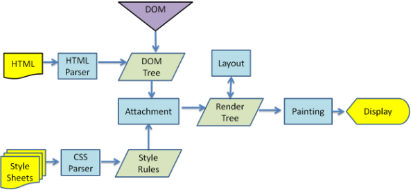
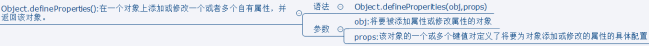

## 进阶知识部分

目录
- [01、渲染机制](#class02-01)
- [02、JS运行机制](#class02-02)
- [03、提升页面性能的方法](#class02-03)
- [04、错误监控](#class02-04)
- [05、TCP和UDP的区别](#class02-05)
- [06、express middleware](#class02-06)
- [07、vue双向绑定原理](#class02-07)
- [08、内存泄漏](#class02-08)
- [09、JavaScript中的对象-对象的结构](#class02-09)
- [10、深入异步](#class02-10)

### <div id="class02-01">01、渲染机制</div>

什么是DOCTYPE以及作用、浏览器渲染过程、重排Reflow、重绘Repaint、布局Layout

#### DOCTYPE:
DTD文档类型定义：是一些列的语法规则，用来定义XML或者(X)HTML的文档类型。浏览器会使用它来判断文档类型，决定使用何种协议来解析，以及切换浏览器的模式。                    
DOCTYPE是申明文档类型和DTD规范的，一个主要的用途就是文件的合法性验证。如果文档代码不合法，那么浏览器解析时候会出一些差错的。告诉浏览器下面是什么文档类型                       
html5:<!DOCTYPE html>               
html4：严格模式-包含所有html元素和属性，不包含展示型的和弃用的元素(比如font)                  
宽松模式-XXXXXXXXXXXXXXXXX,包含展示型的和弃用的元素                 

#### 浏览器渲染过程
Firefox、Chrome和Safari是基于两种渲染引擎构建的，**Firefox使用Geoko——Mozilla自主研发的渲染引擎，Safari和Chrome都使用webkit。**



**几个基本概念：**                     
**DOM Tree**：浏览器将HTML解析成树形的数据结构。                
**CSS Rule Tree**：浏览器将CSS解析成树形的数据结构。                    
**Render Tree**: DOM和CSSOM合并后生成Render Tree。                     
**layout**: 有了Render Tree，浏览器已经能知道网页中有哪些节点、各个节点的CSS定义以及他们的从属关系，从而去计算出每个节点在屏幕中的位置。                           
**painting**: 按照算出来的规则，通过显卡，把内容画到屏幕上。                       
**reflow（回流/重排）**：当浏览器发现某个部分发生了点变化影响了布局，需要倒回去重新渲染，内行称这个回退的过程叫 reflow。
reflow 会从 `<html>` 这个root frame开始递归往下，依次计算所有的结点几何尺寸和位置。reflow 几乎是无法避免的。
现在界面上流行的一些效果，比如树状目录的折叠、展开（实质上是元素的显 示与隐藏）等，
都将引起浏览器的 reflow。鼠标滑过、点击……只要这些行为引起了页面上某些元素的占位面积、定位方式、边距等属性的变化，
都会引起它内部、周围甚至整个页面的重新渲 染。通常我们都无法预估浏览器到底会 reflow 哪一部分的代码，它们都彼此相互影响着。
**repaint（重绘）**：改变某个元素的背景色、文字颜色、边框颜色等等不影响它周围或内部布局的属性时，屏幕的一部分要重画，但是元素的几何尺寸没有变。

**渲染过程：**                   
尽管Webkit与Gecko使用略微不同的术语，这个过程还是基本相同的，如下：                                   
1. 浏览器会将HTML解析成一个DOM树，DOM 树的构建过程是一个深度遍历过程：当前节点的所有子节点都构建好后才会去构建当前节点的下一个兄弟节点。                                            
2. 将CSS解析成 CSS Rule Tree 。                              
3. 根据DOM树和CSS DOM来构造 Rendering Tree。注意：Rendering Tree 渲染树并不等同于 DOM 树，因为一些像Header或display:none的东西就没必要放在渲染树中了。                        
4. 有了Render Tree，浏览器已经能知道网页中有哪些节点、各个节点的CSS定义以及他们的从属关系。下一步操作称之为layout，顾名思义就是计算出每个节点在屏幕中的位置。                      
5. 再下一步就是绘制，即遍历render树，并使用UI后端层绘制每个节点。                      

注意：上述这个过程是逐步完成的，为了更好的用户体验，渲染引擎将会尽可能早的将内容呈现到屏幕上，并不会等到所有的html都解析完成之后再去构建和布局render树。
它是解析完一部分内容就显示一部分内容，同时，可能还在通过网络下载其余内容。

**触发Reflow:**                                  
当增加、删除、修改DOM节点是，会导致Reflow和Repaint;                  
移动DOM 的位置，或者搞个动画的时候                 
修改CSS样式的时候                  
当Resize窗口的时候，或者滚动的时候（有可能）                   
当修改页面默认字体的时候                    

**触发Repaint:**                  
改变某个元素的背景色、文字颜色、边框颜色等等不影响它周围或内部布局的属性时，屏幕的一部分要重画，但是元素的几何尺寸没有变。                   
触发条件：               
DOM 改动              
CSS 改动                  

对于Reflow和Repaint最好的做法就是，当页面元素改变的时候，最好是一次性添加或者修改节点，多次添加或者修改。


### <div id="class02-02">02、JS运行机制</div>

#### 基本概念和几个有趣的例子分析
示例1：                
```javascript
console.log(1);
setTimeout(function(){
    console.log(2)
},0);
console.log(3);
```
运行结果：1,3,2//原因setTimeout是异步任务，console.log()是同步任务

概念：                 
JS是单线程的，同一时间只能做一件事情                  
任务队列：优先处理同步任务，最后才执行异步队列                 
    同步任务：               
    异步任务：               

示例2：
```javascript
console.log('A');
while (true) {

}
console.log('B')
```
这个输出为A。因为都是同步队列任务，while哪里是一个死循环

示例3：
```javascript
console.log('A');
setTimeout(function(){
    console.log('B')
},0)
while (true) {

}
```
依然只输出了A。原因是在同步任务执行完之前，任何异步队列都是不会被响应的。

示例4：
```javascript
for(var i =0 ;i<4;i++){
    setTimeout(function(){
        console.log(i)
    },1000)
}
```
输出为4个4，for循环是同步任务；
异步队列执行时间：setTimeout是有一个时间，到了时间，才会把语句放在异步队列中去；
异步队列的放入时间和执行时间：执行时间是同步任务执行完了就会执行异步任务，但是异步队列放入时间，
如果是settimeout的话，要等时间到了，才把具体执行语句放入for循环中去。

但是有一种特殊的情况：
```javascript
for(let i =0 ;i<4;i++){
    setTimeout(function(){
        console.log(i)
    },1000)
}
```
这样的话，就是输出的标准的1,2,3,4了。

#### 对上面示例4 原因的分析
```javascript
var a = [];
for (var i = 0; i < 10; i++) {
  a[i] = function () {
    console.log(i);
  };
}
a[6](); // 10
```
上面代码中，变量i是var命令声明的，在全局范围内都有效，所以全局只有一个变量i。
每一次循环，变量i的值都会发生改变，而循环内被赋给数组a的函数内部的console.log(i)，里面的i指向的就是全局的i。
也就是说，所有数组a的成员里面的i，指向的都是同一个i，导致运行时输出的是最后一轮的i的值，也就是 10。

如果使用let，声明的变量仅在块级作用域内有效，最后输出的是 6。
```javascript
var a = [];
for (let i = 0; i < 10; i++) {
  a[i] = function () {
    console.log(i);
  };
}
a[6](); // 6
```
上面代码中，变量i是let声明的，当前的i只在本轮循环有效，所以每一次循环的i其实都是一个新的变量，所以最后输出的是6。
你可能会问，如果每一轮循环的变量i都是重新声明的，那它怎么知道上一轮循环的值，从而计算出本轮循环的值？
这是因为 JavaScript 引擎内部会记住上一轮循环的值，初始化本轮的变量i时，就在上一轮循环的基础上进行计算。

另外，for循环还有一个特别之处，就是设置循环变量的那部分是一个父作用域，而循环体内部是一个单独的子作用域。
```javascript
for (let i = 0; i < 3; i++) {
  let i = 'abc';
  console.log(i);
}
// abc
// abc
// abc
```
上面代码正确运行，输出了 3 次abc。这表明函数内部的变量i与循环变量i不在同一个作用域，有各自单独的作用域。


#### Event Loop:                     
运行栈是执行同步任务的，当执行同步任务的时候发现有异步任务，就会有一个timmer模块来把异步任务拿走，拿走之后也不是立马放入任务队列，
当同步任务执行完了之后，才会把异步任务放在任务队列中，其中settimeout是一个特殊的情况，只有当settimeout的时间到了之后，
浏览器才会把时间放到队列中去，浏览器最小的延时时间之前是10毫秒，现在是4毫秒。只有等时间到了，timmer模块才会把时间放在队列中去。

什么时候开启异步任务：setTimeout、setInterval、DOM事件、ES6的Promise;                        


### <div id="class02-03">03、提升页面性能的方法</div>
资源压缩合并、减少HTTP请求                     
非核心代码异步加载->异步加载的方式->异步加载的区别                         
利用浏览器缓存->缓存的分类->缓存的原理（这是最重要的一部分）                            
使用CND；                  
预解析NDS：                         
<mate http-equiv="x-dns-prefetch-control" content="on">                             
<link rel="dns-prefetch" href="//host_name_to_prefetch.com">                                    

#### 异步加载：
异步加载方式：动态脚本加载(创建动态script节点)、**defer、async**                     
异步加载的区别：                                
1）、defer是在html解析完成之后才会执行，如果是多个，按照加载的顺序依次执行                          
2）、async是在加载完成之后立即执行，如果是多个，那么执行顺序和加载顺序无关                            

**defer**是html4.0中定义的，该属性使得浏览器能延迟脚本的执行，等文档完成解析完成后会按照他们在文档出现顺序再去下载解析。
也就是说defer属性的<script>就类似于将<script>放在body的效果。

**async**是HTML5新增的属性，IE10和浏览器都是支持该属性的。该属性的作用是让脚本能异步加载，也就是说当浏览器遇到async属性的<script>时浏览器加载css一样是异步加载的。

对于这个问题的具体研究还可以看这一篇文章： [defer、async属性以及JS异步加载并执行解决方案](https://blog.csdn.net/q121516340/article/details/51436314)


#### 页面缓存：
分类：强缓存、协商缓存                     

**强缓存**：本地有这个东西，直接就拿过来用，不用向服务器重新请求资源了；                          
http头：                                  
Expires:时间（绝对时间，下发的是服务器的时间）                           
Cache-Control:max-age=3600;//单位秒，客户端相对时间（相对时间）-以这个时间为准                          

**协商缓存**：本地有这个东西之后，不确定到底用不用，所以要想服务器确认一下；                        
Last-Modified：上次修改时间                    
If-Modified-Since:这个是我想服务器请求的时间                 
Etag:哈希值（判断资源是否有修改）                     
If-None-Match:（判断资源是否可以用）                       


### <div id="class02-04">04、错误监控<div>
**错误分类**：即时运行错误（代码错误）、资源加载错误

#### 错误的捕获方式：
**即时运行错误:** 
try...catch                     	
window.onerror                     
 
**资源加载错误:**                                   
1)、object.onerror	                
2)、performance.getEntries()                     
3)、Error事件捕获                    
performance.getEntries()这个是可以获取到所有的家已经加载的资源                                

Error事件捕获使用方式:
```javascript
window.addEventListener('error',function(e){
    console.log('捕获',e)
},true)
```

跨域是可以捕获的:                            
1）、在script标签添加crossorigin属性                              
2)、在js响应头添加Access-Control-Allow-Origin:*;           

           
上报错误：ajax通信方式上报、通过Image对象上报,非常简单                    
(new Image()).src='http://baidu.com/test/sdflijsd?=sdlfkj';                         


### <div id="class02-05">05、TCP和UDP的区别</div>
#### TCP、UDP和HTTP关系
1、TCP/IP是个协议组，可分为三个层次：网络层、传输层和应用层。                              

在网络层有IP协议、ICMP协议、ARP协议、RARP协议和BOOTP协议。                          
在传输层中有TCP协议与UDP协议。                          
在应用层有FTP、HTTP、TELNET、SMTP、DNS等协议。                           
因此，HTTP本身就是一个协议，是从Web服务器传输超文本到本地浏览器的传送协议。                           

TCP 是基于 TCP 协议实现的网络文本协议,属于传输层。                              
UDP 是和TCP 对等的，属于传输层，UDP 和 TCP 有重要的区别。                               

2、HTTP协议是建立在请求/响应模型上的。                          

首先由客户建立一条与服务器的TCP链接，并发送一个请求到服务器，请求中包含请求方法、URI、协议版本以及相关的MIME样式的消息。
服务器响应一个状态行，包含消息的协议版本、一个成功和失败码以及相关的MIME式样的消息。                                
HTTP/1.0为每一次HTTP的请求/响应建立一条新的TCP链接，因此一个包含HTML内容和图片的页面将需要建立多次的短期的TCP链接。一次TCP链接的建立将需要3次握手。                         
另外，为了获得适当的传输速度，则需要TCP花费额外的回路链接时间（RTT）。
每一次链接的建立需要这种经常性的开销，而其并不带有实际有用的数据，只是保证链接的可靠性，
因此HTTP/1.1提出了可持续链接的实现方法。HTTP/1.1将只建立一次TCP的链接而重复地使用它传输一系列的请求/响应消息，因此减少了链接建立的次数和经常性的链接开销。                             

三次握手的过程:                        
第一次握手：建立连接时，客户端发送syn包（syn=j）到服务器，并进入SYN_SENT状态，等待服务器确认；SYN：同步序列编号（Synchronize Sequence Numbers）。                                
第二次握手：服务器收到syn包，必须确认客户的SYN（ack=j+1），同时自己也发送一个SYN包（syn=k），即SYN+ACK包，此时服务器进入SYN_RECV状态；ACK:确认字符(Acknowledgement)                              
第三次握手：客户端收到服务器的SYN+ACK包，向服务器发送确认包ACK(ack=k+1），此包发送完毕，客户端和服务器进入ESTABLISHED（TCP连接成功）状态，完成三次握手。                                            

3、结论：虽然HTTP本身是一个协议，但其最终还是基于TCP的。

Socket是应用层与TCP/IP协议族通信的中间软件抽象层，它是一组接口。在设计模式中，Socket其实就是一个门面模式，它把复杂的TCP/IP协议族隐藏在Socket接口后面，对用户来说，一组简单的接口就是全部，让Socket去组织数据，以符合指定的协议。

                         


HTTPS：（全称：Hypertext Transfer Protocol over Secure Socket Layer），是以安全为目标的HTTP通道，简单讲是HTTP的安全版。
即HTTP下加入SSL层，HTTPS的安全基础是SSL，因此加密的详细内容就需要SSL。

优点： **协议较成熟，应用广泛、基于TCP/IP，拥有TCP优点、研发成本很低，开发快速、开源软件较多**，nginx,apache,tomact等
缺点： **无状态、无连接**、只有PULL模式，不支持PUSH、数据报文较大
特性： **基于TCP/IP应用层协议、无状态，无连接**、支持C/S模式、适用于文本传输

#### TCP

TCP（Transmission Control Protocol，传输控制协议）是基于连接的协议，也就是说，在正式收发数据前，必须和对方建立可靠的连接。
一个TCP连接必须要经过三次“对话”才能建立起来，其中的过程非常复杂，我们这里只做简单、形象的介绍，你只要做到能够理解这个过程即可。
我们来看看这三次对话的简单过程：主机A向主机B发出连接请求数据包：“我想给你发数据，可以吗？”，
这是第一次对话；主机B向主机A发送同意连接和要求同步（同步就是两台主机一个在发送，一个在接收，协调工作）的数据包：“可以，你什么时候发？”，这是第二次对话；
主机A再发出一个数据包确认主机B的要求同步：“我现在就发，你接着吧！”，这是第三次对话。
三次“对话”的目的是使数据包的发送和接收同步，经过三次“对话”之后，主机A才向主机B正式发送数据。

TCP：（Transmission Control Protocol，传输控制协议）是面向连接的协议，也就是说，在收发数据前，必须和对方建立可靠的连接。
一个TCP连接必须要经过三次“对话”才能建立起来，其中的过程非常复杂。
建立一个连接需要三次握手，而终止一个连接要经过四次握手，这是由TCP的半关闭（half-close）造成的。

优点： **可靠性 、全双工协议、开源支持多、应用较广泛、面向连接**、研发成本低、报文内容不限制（IP层自动分包，重传，不大于1452bytes）                      
缺点： 操作系统：较耗内存，支持连接数有限、设计：协议较复杂，自定义应用层协议、网络：网络差情况下延迟较高、传输：效率低于UDP协议特性： 面向连接、可靠性、全双工协议、基于IP层、OSI参考模型位于传输层、适用于二进制传输

**三次握手 与 四次挥手**
当客户端和服务器通过三次握手建立了TCP连接以后，当数据传送完毕，肯定是要断开TCP连接的啊。那对于TCP的断开连接，这里就有了神秘的“四次挥手”。              
1.第一次挥手：主机1(可以使客户端，也可以是服务器端)，设置Sequence Number和Acknowledgment Number，向主机2发送一个FIN报文段;此时，主机1进入FIN_WAIT_1状态;这表示主机1没有数据要发送给主机2了;                    
2.第二次挥手：主机2收到了主机1发送的FIN报文段，向主机1回一个ACK报文段，Acknowledgment Number为Sequence Number加1;主机1进入FIN_WAIT_2状态;主机2告诉主机1，我也没有数据要发送了，可以进行关闭连接了;               
3.第三次挥手：主机2向主机1发送FIN报文段，请求关闭连接，同时主机2进入CLOSE_WAIT状态;                 
4.第四次挥手：主机1收到主机2发送的FIN报文段，向主机2发送ACK报文段，然后主机1进入TIME_WAIT状态;主机2收到主机1的ACK报文段以后，就关闭连接;此时，主机1等待2MSL后依然没有收到回复，则证明Server端已正常关闭，那好，主机1也可以关闭连接了。                 
至此，TCP的四次挥手就这么愉快的完成了。        

               
#### UDP                                    
UDP（User Data Protocol，用户数据报协议）是与TCP相对应的协议。它是面向非连接的协议，它不与对方建立连接，而是直接就把数据包发送过去！ 
UDP适用于一次只传送少量数据、对可靠性要求不高的应用环境。
比如，我们经常使用“ping”命令来测试两台主机之间TCP/IP通信是否正常，其实“ping”命令的原理就是向对方主机发送UDP数据包，
然后对方主机确认收到数据包，如果数据包是否到达的消息及时反馈回来，那么网络就是通的。
例如，在默认状态下，一次“ping”操作发送4个数据包（如图2所示）。大家可以看到，发送的数据包数量是4包，
收到的也是4包（因为对方主机收到后会发回一个确认收到的数据包）。这充分说明了UDP协议是面向非连接的协议，
没有建立连接的过程。正因为UDP协议没有连接的过程，所以它的通信效果高；但也正因为如此，它的可靠性不如TCP协议高。
QQ就使用UDP发消息，因此有时会出现收不到消息的情况。 

UDP：UDP是一个无连接协议，传输数据之前源端和终端不建立连接，当它想传送时就简单地去抓取来自应用程序的数据，
并尽可能快地把它扔到网络上。在发送端，UDP传送数据的速度仅仅是受应用程序生成数据的速度、计算机的能力和传输带宽的限制；
在接收端，UDP把每个消息段放在队列中，应用程序每次从队列中读一个消息段。                               
优点： 操作系统：并发高，内存消耗较低、传输：效率高，网络延迟低、传输模型简单，研发成本低                           
缺点： 协议不可靠、单向协议、开源支持少、报文内容有限，不能大于1464bytes、设计：协议设计较复杂、网络：网络差，而且丢数据报文                             
特性：无连接，不可靠，基于IP协议层，OSI参考模型位于传输层，最大努力交付，适用于二进制传输                             


#### 对比

场景  |    TCP   |    UDP 
:- | :- |:-
是否连接   |  面向连接  | 面向非连接 
传输可靠性 |    可靠   |   不可靠 
应用场合   | 传输大量数据  |少量数据 
速度      |    慢      |    快


### <div id="class02-06">06、express middleware</div>
express middleware原理：责任链模式

```javascript
function App() {
    if (!(this instanceof App))
        return new App();
    this.init();
}

App.prototype = {
    constructor: App,
    init: function () {
        this.request = { //模拟的request
            requestLine: 'POST /iven_ HTTP/1.1',
            headers: 'Host:www.baidu.com\r\nCookie:BAIDUID=E063E9B2690116090FE24E01ACDDF4AD:FG=1;BD_HOME=0',
            requestBody: 'key1=value1&key2=value2&key3=value3',
        };
        this.response = {}; //模拟的response
        this.chain = []; //存放中间件的一个数组
        this.index = 0; //当前执行的中间件在chain中的位置
    },
    use: function (handle) { //这里默认 handle 是函数，并且这里不做判断
        this.chain.push(handle);
    },
    next: function () { //当调用next时执行index所指向的中间件
        if (this.index >= this.chain.length)
            return;
        let middleware = this.chain[this.index];
        this.index++;
        middleware(this.request, this.response, this.next.bind(this));
    },
};
```

### <div id="class02-07">07、vue双向绑定原理</div>
[双向绑定原理研究与简单的双向绑定实现](../../18年/3月/06、双向绑定核心代码)


### <div id="class02-08">08、内存泄漏</div>
[关于内存泄漏的文章](https://github.com/zhansingsong/js-leakage-patterns)


### <div id="class02-09">09、JavaScript中的对象-对象的结构</div>
属性的特性：writable、enumerable、configurable、getter、setter    

对象的三个特性：对象的源型：proto   对象的类：class    是否扩展extensible

#### 属性特性

**Object.defineProperty()**:给对象添加/修改一个属性并指定该属性的配置                           


普通定义的情况:四个描述行为的特性：writable、Enumerable、configurable、value这四个属性特征都是默认true                             
通过defineProperty定义的writable、Enumerable、configurable、value这四个属性特征都是默认false                                          
如果configurable为TRUE说明是一个可以删除的属性！！！！
因为configurable是可配置的，所以当configurable为true的时候，其后可以对属性的修改和枚举重新定义权限。
```javascript
var obj={};
obj.x=1;
/*上面的就相当于下面的这些
 Object.defineProperty(obj,'x',{
   value:1,
   writable:true,
   enumerable:true,
   configurable:true
 });
 */
Object.defineProperty(obj,'y',{value:2});
/*上面的就相当于下面的这些
  Object.defineProperty(obj,'x',{
   value:2,
   writable:false,
   enumerable:false,
   configurable:false
 });
 */
```
如果属性不可配置，但是可以把writable的true变成false，但不能将false变为true                      


**Object.defineProperties()属性**                             


```javascript
var person={};
Object.defineProperties(person,{
    'username':{
        value:'king',
        writable:true,
        enumerable:true,
        configurable:true
    },
    age:{
        value:12,
        writable:false
    }
});
person.addr='北京';
console.log(person.username);
console.log(person['age']);
console.log(Object.getOwnPropertyDescriptor(person,'username'));
console.log(Object.getOwnPropertyDescriptor(person,'age'));
console.log(Object.getOwnPropertyDescriptor(person,'addr'));

person.age = 15;            
console.log(person.age);            // age 没有变化
for (let key in person) {
    console.log(person[key])        // 打印结果只有 king  北京
}
```
Object.getOwnPropertyDescriptor（对象，属性）；表示获得这个属性的描述                      
就是writable、Enumerable、configurable、value这四个属性的描述情况！！！                    


#### 对象原型：prototype    
检测一个对象是否是另外一个对象的原型**obj.isPrototypeOf(obj1)**;判断后者是不是为前者的原型
```javascript
//检测一个对象是否是另外一个对象的原型(或者处于原型链中)
var obj={x:1};
var obj1=Object.create(obj);
console.log(obj.isPrototypeOf(obj1));
console.log(Object.prototype.isPrototypeOf(obj1));
```


#### 对象的扩展标记
通过Object.preventExtensions();设置为不可扩展，但是依然可以通过对其原型添加新属性的方式来添加新属性                     
通过Object.isExtensible();检测对象是否扩展                        
Object.seal();不可扩展。而且不可配置，就是不能添加新的属性，但是对已有的属性可以配置                       
Object.freeze();不可扩展，所有属性全部只读。严格性最高。   


                     
### <div id="class02-10">10、深入异步</div>

#### 单线程
JS是基于单线程的程序，同一时间，只能处理一件事儿。                      
出现的问题，如果JS 逻辑极度耗时，那么后面的程序就会出现挂起的情况。还有就是如果某一段逻辑出现错误，整个程序，直接自执行的地方死掉。

单线程的原因： 避免DOM渲染冲突。
浏览器需要渲染dom, JS 修改也可以修改Dom, JS执行的时候，浏览器DOM 渲染会暂停，两段JS不能同时执行（同时修改一个dom那么就会导致冲突）；                      
WebWorker 支持多线程，但是不能访问DOM。

#### 异步
异步就是为了解决单线程而出现的。                

存在问题：
没有按照正常书写方式执行，可读性差。回调不容易模块化。


#### event-loop 实现循环
同步代码直接执行。异步函数先放在异步队列中。同步代码执行完了之后，在按照异步队列的顺序去执行异步代码。 


[进阶只是部分11-20](./02_02、进阶知识部分11-20.md)


