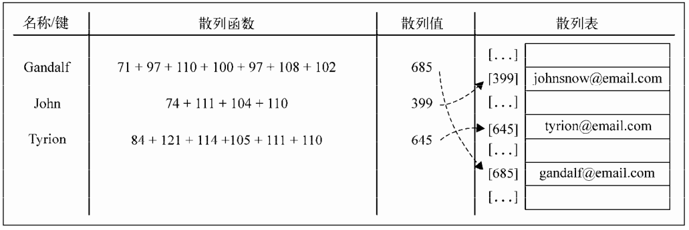
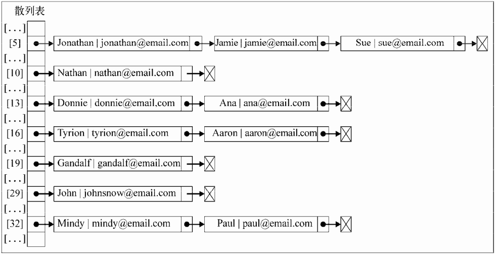
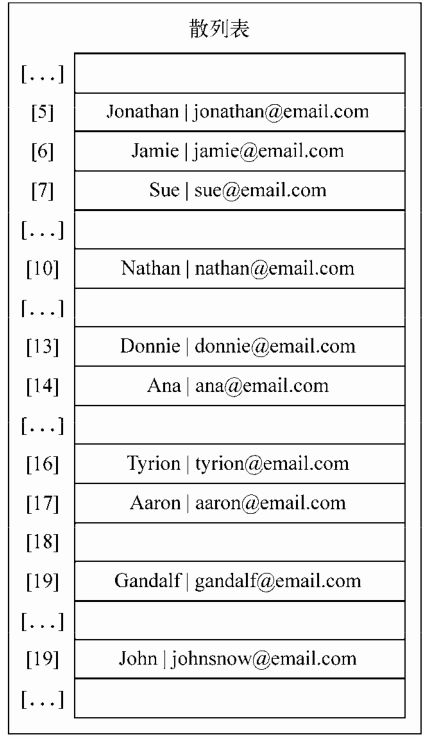
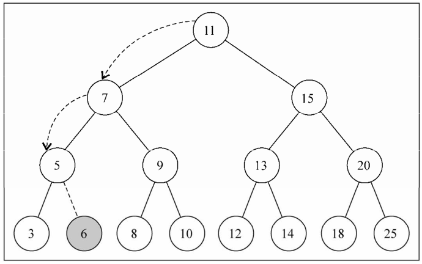
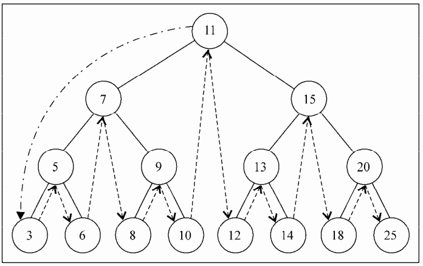
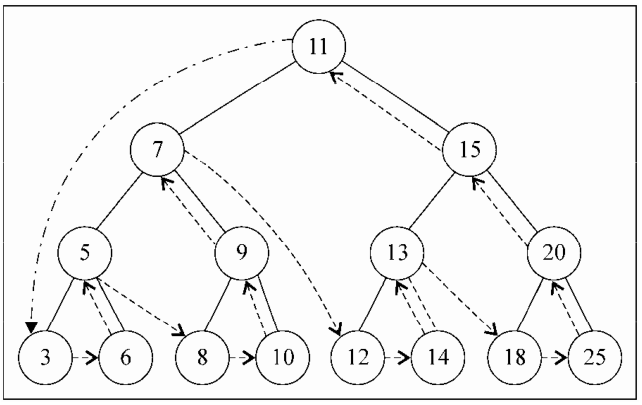

# 学习javascript数据结构与算法

## 学习javascript数据结构与算法 [巴西] Loiane Groner 著 孙晓博等译

目录结构
- [01章、javascript基础](#class01)
    - [1.5、面向对象编程](#class01-05)
- [03章、栈](#class03)
    - [3.1、栈的创建](#class03-01)
    - [3.2、从十进制到二进制](#class03-02)
- [04章、队列](#class04)
    - [4.1、创建队列](#class04-01)
    - [4.2、优先队列](#class04-02)


## <div id='class01'>01章、javascript基础</div>              
### <div id='class01-05'>1.5、面向对象编程</div>
一般来说创建对象有三种方式                        
方式1：            
```javascript
//方式1
let obj = new Object({});
```

方式2:                
```javascript
//方式2
let obj = {};
obj = {
    name: {
        first: 'Gandalf',
        last: 'the Grey'
    },
    address: 'Middle Earth'
};
```

方式3：                
```javascript
//方式3
function Book(title,pages, isbn) {
    this.title = title;
    this.pages = pages;
    this.isbn = isbn;
}
let book =new Book('title', 'page', 'isbn');
console.log(book.title); //输出书名
book.title = 'new title'; //修改书名
console.log(book.title); //输出新的书名
//使用原型扩展
Book.prototype.printTitle = function() {
    console.log(this.title)
};
console.log(book);
console.log(book.__proto__);
```

## <div id='class03'>03章、栈</div>
### <div id='class03-01'>3.1、栈的创建</div>
```javascript
/**
   push(element(s)) ：添加一个（或几个）新元素到栈顶。
   pop() ：移除栈顶的元素，同时返回被移除的元素。
   peek() ：返回栈顶的元素，不对栈做任何修改（这个方法不会移除栈顶的元素，仅仅返回它）。
   isEmpty() ：如果栈里没有任何元素就返回 true ，否则返回 false 。
   clear() ：移除栈里的所有元素。
   size() ：返回栈里的元素个数。这个方法和数组的 length 属性很类似。
 * @constructor
 */
let Stack = function() {
    let items = [];
    this.push = function (element) {
        items.push(element)
    };
    this.pop = function () {
        return items.pop();
    };
    this.peek = function () {
        return items[items.length - 1]
    };
    this.isEmpty = function() {
        return items.length === 0
    };
    this.clear = function() {
        items = [];
    };
    this.print = function() {
        console.log(items.toString());
    };
    this.size = function() {
        return items.length;
    }
};
```
[可以去看如下的示例代码](./03章、栈/01、栈的创建/index.js)
[堆栈的一个简单使用](./03章、栈/01、栈的创建/test.js)


### <div id='class03-02'>3.2、从十进制到二进制</div>
我们在十进制转为2进制的时候，就需要使用到上面的堆栈对象来实现，我们可以吧堆栈直接方封装为一个模块，然后通过module.exports = Stack这种方式抛出                    
```javascript
let Stack = require('../01、栈的创建/index');
//十进制转换为2进制
function divideBy2(decNumber) {
    let remStack = new Stack(), rem, binaryString = '';
    while (decNumber > 0) {
        rem = Math.floor(decNumber % 2);
        remStack.push(rem);
        decNumber = Math.floor(decNumber / 2);
    }
    while (!remStack.isEmpty()) {
        binaryString += remStack.pop().toString()
    }
    return binaryString;
}
```

还可以创建另外的一个方法，让我们的十进制可以转为其他进制数               
```javascript
//十进制转为其他进制
function baseConverter(decNumber, base) {
    let remStack = new Stack(), rem, baseString = '', digits = '0123456789ABCDEF';
    while (decNumber > 0) {
        rem = Math.floor(decNumber % base);
        remStack.push(rem);
        decNumber = Math.floor(decNumber / base)
    }
    while (!remStack.isEmpty()) {
        baseString += digits[remStack.pop()];
    }
    return baseString;
}
console.log(baseConverter(100345, 2)); //输出11000011111111001
console.log(baseConverter(100345, 8)); //输出303771
console.log(baseConverter(100345, 16)); //输出187F9
```


## <div id='class04'>04章、队列</div>                       
### <div id='class04-01'>4.1、创建队列</div>                           
```javascript
/**
   enqueue(element(s)) ：向队列尾部添加一个（或多个）新的项。
   dequeue() ：移除队列的第一（即排在队列最前面的）项，并返回被移除的元素。
   front() ：返回队列中第一个元素——最先被添加，也将是最先被移除的元素。队列不做任何变动（不移除元素，只返回元素信息——与 Stack 类的 peek 方法非常类似）。
   isEmpty() ：如果队列中不包含任何元素，返回 true ，否则返回 false 。
   size() ：返回队列包含的元素个数，与数组的 length 属性类似。
 * @constructor
 */
function Queue() {
    let items = [];
    this.enqueue = function(element) {
        items.push(element)
    };
    this.dequeue = function() {
        return items.shift()
    };
    this.front = function() {
        return items[0]
    };
    this.isEmpty = function() {
        return items.length === 0
    };
    this.clear = function() {
        items = [];
    };
    this.size = function() {
        return items.length
    };
    this.print = function() {
        console.log(items.toString())
    }
}
module.exports = Queue;
```
### <div id='class04-02'>4.2、优先队列</div>
实现一个优先队列，有两种选项：设置优先级，然后在正确的位置添加元素；或者用入列操作添加元素，然后按照优先级移除它们。在这个示例中，我们将会在正确的位置添加元素，因此可以对它们使用默认的出列操作                                    
```javascript
function PriorityQueue() {
    let items = [];

    function QueueElement(element, priority) { // {1}
        this.element = element;
        this.priority = priority;
    }

    this.enqueue = function (element, priority) {
        let queueElement = new QueueElement(element, priority);
        if (this.isEmpty()) {
            items.push(queueElement); // {2}
        } else {
            let added = false;
            for (let i = 0; i < items.length; i++) {
                if (queueElement.priority <
                    items[i].priority) {
                    items.splice(i, 0, queueElement); // {3}
                    added = true;
                    break; // {4}
                }
            }
            if (!added) { //{5}
                items.push(queueElement);
            }
        }
    };

    this.enqueue = function(element) {
        items.push(element)
    };

    this.dequeue = function() {
        return items.shift()
    };

    this.front = function() {
        return items[0]
    };

    this.isEmpty = function() {
        return items.length === 0
    };

    this.clear = function() {
        items = [];
    };

    this.size = function() {
        return items.length
    };

    this.print = function() {
        console.log(items.toString())
    }
}

module.exports = PriorityQueue
```

测试示例：           
```javascript
let PriorityQueue = require('./index');

let priorityQueue = new PriorityQueue();
priorityQueue.enqueue("John", 2);
priorityQueue.enqueue("Jack", 1);
priorityQueue.enqueue("Camila", 1);
priorityQueue.print();
```

[示例请见](./04章、队列/02、优先队列/index.js)

### <div id='class04-03'>4.3、循环队列</div>
还有另一个修改版的队列实现，就是循环队列。循环队列的一个例子就是击鼓传花游戏（HotPotato）。在这个游戏中，孩子们围成一个圆圈，把花尽快地传递给旁边的人。某一时刻传花停止，这个时候花在谁手里，谁就退出圆圈结束游戏。重复这个过程，直到只剩一个孩子（胜者）。                            
[在下面这个示例中，我们要实现一个模拟的击鼓传花游戏](./04章、队列/03、循环队列-击鼓传花/index.js)                     


## <div id='class05'>05章、链表</div>                         
要存储多个元素，数组（或列表）可能是最常用的数据结构。正如本书之前提到过的，每种
语言都实现了数组。这种数据结构非常方便，提供了一个便利的 [] 语法来访问它的元素。然而，
这种数据结构有一个缺点：（在大多数语言中）数组的大小是固定的，从数组的起点或中间插入
或移除项的成本很高，因为需要移动元素（尽管我们已经学过的JavaScript的 Array 类方法可以帮
我们做这些事，但背后的情况同样是这样）。

### <div id='class05-01'>5.1、创建一个链表</div>                   
以下是我们的 LinkedList类的骨架：              
```javascript
function LinkedList() {
var Node = function(element){ // {1}
this.element = element;
this.next = null;
};
var length = 0; // {2}
var head = null; // {3}
this.append = function(element){};
this.insert = function(position, element){};
this.removeAt = function(position){};
this.remove = function(element){};
this.indexOf = function(element){};
this.isEmpty = function() {};
this.size = function() {};
this.toString = function(){};
this.print = function(){};
}
```

具体实现如下：[请见1、创建一个链表](./05章、链表/01、创建一个链表/index.js)


### <div id='class05-02'>5.2、双向链表</div>
链表有多种不同的类型，这一节介绍双向链表。双向链表和普通链表的区别在于，在链表中，
一个节点只有链向下一个节点的链接，而在双向链表中，链接是双向的：一个链向下一个元素，
另一个链向前一个元素

略。。。。。。。。。。


## <div id='class06'>06章、集合</div>
迄今为止，我们已经学习了数组（列表）、栈、队列和链表（及其变种）等顺序数据结构。在这一章中，我们要学习集合这种数据结构。            
集合是由一组无序且唯一（即不能重复）的项组成的。这个数据结构使用了与有限集合相同的数学概念，但应用在计算机科学的数据结构中。              
在深入学习集合的计算机科学实现之前，我们先看看它的数学概念。在数学中，集合是一组不同的对象（的集）。              
比如说，一个由大于或等于0的整数组成的自然数集合：N = {0, 1, 2, 3, 4, 5, 6, …}。集合中的对象列表用“{}”（大括号）包围。                 

还有一个概念叫空集。空集就是不包含任何元素的集合。比如24和29之间的素数集合。由于24和29之间没有素数（除了1和自身，没有其他正因数的大于1的自然数），这个集合就是空集。空集用“{ }”表示。              

你也可以把集合想象成一个既没有重复元素，也没有顺序概念的数组。                 

在数学中，集合也有并集、交集、差集等基本操作。在这一章中我们也会介绍这些操作。                       

### <div id='class06-01'>6.1、创建一个集合</div>
目前的JavaScript实现是基于2011年6月发布的ECMAScript 5.1（现代浏览器均已支持），它包
括了我们在之前章节已经提到过的 Array 类的实现。ECMAScript 6（官方名称ECMAScript 2015，
2015年6月发布）包括了 Set 类的实现。

在这一章中，我们要实现的类就是以ECMAScript 6中 Set 类的实现为基础的。   
  add(value) ：向集合添加一个新的项。          
  remove(value) ：从集合移除一个值。             
  has(value) ：如果值在集合中，返回 true ，否则返回 false 。                
  clear() ：移除集合中的所有项。              
  size() ：返回集合所包含元素的数量。与数组的 length 属性类似。               
  values() ：返回一个包含集合中所有值的数组。                         

```javascript
class Set{
    constructor() {
        this.items = {};
    }

    has(value) {
        return this.items.hasOwnProperty(value);
    }

    add(value) {
        if(!this.has(value)) {
            this.items[value] = value;
            return true;
        }
        return false;
    }

    remove(value) {
        if(this.has(value)) {
            delete this.items[value];
            return true;
        }
        return false;
    }

    clear() {
        this.items = {};
    }

    size() {
        return Object.keys(this.items).length;
    }

    values() {
        return Object.keys(this.items);
    }
}

module.exports = Set;
```
完整示例请见：[01、创建一个集合](./06章、集合/01、创建一个集合/)


### <div id='class06-02'>6.2、集合操作</div>
对集合可以进行如下操作。                
  并集：对于给定的两个集合，返回一个包含两个集合中所有元素的新集合。            
  交集：对于给定的两个集合，返回一个包含两个集合中共有元素的新集合。                
  差集：对于给定的两个集合，返回一个包含所有存在于第一个集合且不存在于第二个集合的元素的新集合。                  
  子集：验证一个给定集合是否是另一集合的子集。               

**6.2.1、并集**                                   
并集的数学概念，集合A和B的并集，表示为A∪B，定义如下：           
`A∪B = { x | x ∈ A∨x ∈ B }`                            
意思是x（元素）存在于A中，或x存在于B中。          

现在来实现 Set 类的 union 方法：          
```javascript
union(otherSet) {
    let unionSet = new Set();
    let values = this.values();

    for (let i = 0; i < values.length; i++) {
        unionSet.add(values[i]);
    }

    values = otherSet.values();
    for (let i = 0; i < values.length; i++) {
        unionSet.add(values[i]);
    }

    return unionSet;
}
```

**6.2.2、交集**            
交集的数学概念，集合A和B的交集，表示为A∩B，定义如下：               
A∩B = { x | x ∈ A∧x ∈ B }                   
意思是x（元素）存在于A中，且x存在于B中。              

具体实现：   
```javascript
// 交集
intersection(otherSet) {
    let intersectionSet = new Set();
    let values = this.values();

    for(let i = 0; i < values.length; i++) {
        if(otherSet.has(values[i])) {
            intersectionSet.add(values[i]);
        }
    }
    return intersectionSet;
}
```


**6.2.3、差集**                
差集的数学概念，集合A和B的差集，表示为A - B，定义如下：             
`A-B = { x | x ∈ A ∧ x   B }`              
意思是x（元素）存在于A中，且x不存在于B中。                 

现在来实现 Set 类的 difference 方法：             
```javascript
difference(otherSet) {
    let difference = new Set();
    let values = this.values();

    for(let i = 0;i < values.length; i++) {
        if(!otherSet.has(values[i])) {
            difference.add(values[i]);
        }
    }
    return difference;
}
```

**6.2.4、子集**                                 
我们要介绍的最后一个集合操作是子集。子集的数学概念，集合A是B的子集（或集合B包含了A），表示为A⊆B，定义如下：               
`∀x { x ∈ A → x ∈ B }`                           
意思是集合A中的每一个x（元素），也需要存在于B中。                        

现在来实现 Set 类的 subset 方法：         
```javascript
// 检验是否为子集
subset(otherSet) {
    if (this.size() > otherSet.size()) {
        return false;
    } else {
        let values = this.values();
        for (let i = 0; i < values.length; i++) {
            if(!otherSet.has(values[i])) {
                return false;
            }
        }
        return true;
    }
}
```
完整示例请见：[02、集合操作](./06章、集合/02、集合操作/)


## <div id='class07'>07章、字典和散列表</div>
字典和散列表来存储唯一值（不重复的值）的数据结构。                              

集合、字典和散列表可以存储不重复的值。在集合中，我们感兴趣的是每个值本身，并把它当作主要元素。在字典中，我们用[键，值]的形式来存储数据。
在散列表中也是一样（也是以[键，值]对的形式来存储数据）。但是两种数据结构的实现方式略有不同，本章中将会介绍。

### <div id='class07-01'>7.1、字典</div>                   
集合表示一组互不相同的元素（不重复的元素）。在字典中，存储的是[键，值]对，其中键名是用来查询特定元素的。
字典和集合很相似，集合以[值，值]的形式存储元素，字典则是以[键，值]的形式来存储元素。字典也称作映射。            
            
在本章中，我们会介绍几个在现实问题上使用字典数据结构的例子：一个实际的字典（单词和它们的释义）以及一个地址簿。                 

**7.1.1 创建一个字典**                    
与 Set 类相似，ECMAScript 6同样包含了一个 Map 类的实现，即我们所说的字典。                    

这是我们的 Dictionary 类的骨架：
  set(key,value) ：向字典中添加新元素。           
  remove(key) ：通过使用键值来从字典中移除键值对应的数据值。              
  has(key) ：如果某个键值存在于这个字典中，则返回 true ，反之则返回 false 。             
  get(key) ：通过键值查找特定的数值并返回。                
  clear() ：将这个字典中的所有元素全部删除。                
  size() ：返回字典所包含元素的数量。与数组的 length 属性类似。               
  keys() ：将字典所包含的所有键名以数组形式返回。              
  values() ：将字典所包含的所有数值以数组形式返回。                

代码实现：   
```javascript
class Dictionary {
    constructor() {
        this.items = {};
    }

    has(key) {
        return key in this.items;
    }

    set(key, value) {
        this.items[key] = value;
    }

    remove(key) {
        if (this.has(key)) {
            delete this.items[key];
            return true;
        }
        return false;
    }

    get(key) {
        return this.has(key) ? this.items[key] : undefined;
    }

    values(key) {
        let values = [];
        for (let k in this.items) {
            if (this.has(k)) {
                values.push(this.items[k])
            }
        }
        return values;
    }

    clear() {
        this.items = {};
    }

    size() {
        return Object.keys(this.items).length;
    }

    keys() {
        return Object.keys(this.items);
    }

    getItems() {
        return this.items;
    }
}

module.exports = Dictionary;
```

完整示例请见：[01、字典](./07、字典和散列表/01、字典/)


### <div id='class07-02'>7.2、散列表</div>                   
在本节中，你将会学到 HashTable 类，也叫 HashMap 类，是 Dictionary 类的一种散列表实现方式。                             
散列算法的作用是尽可能快地在数据结构中找到一个值。在之前的章节中，你已经知道如果要在数据结构中获得一个值（使用 get 方法），
需要遍历整个数据结构来找到它。如果使用散列函数，就知道值的具体位置，因此能够快速检索到该值。散列函数的作用是给定一个键值，
然后返回值在表中的地址。                                  
举个例子，我们继续使用在前一节中使用的电子邮件地址簿。我们将要使用最常见的散列函数——“lose lose”散列函数，方法是简单地将每个键值中的每个字母的ASCII值相加。              


**7.2.1、创建一个散列表**                   
搭建类的骨架开始：               
  put(key,value) ：向散列表增加一个新的项（也能更新散列表）。
  remove(key) ：根据键值从散列表中移除值。
  get(key) ：返回根据键值检索到的特定的值。

具体实现：           
```javascript
class HashTable {
    constructor() {
        this.table = [];
    }

    loseloseHashCode(key) {
        let hash = 0;
        for(let i = 0; i < key.length; i++) {
            hash +=key.charCodeAt(i);
        }
        return hash % 37;
    }

    put(key, value) {
        let position = this.loseloseHashCode(key);
        console.log(position + ' - ' + key);
        this.table[position] = value;
    }
    
    get(key) {
        return this.table[this.loseloseHashCode(key)]
    }
    
    remove(key) {
        this.table[this.loseloseHashCode(key)] = undefined;
    }
}
```

完整示例和测试请见：[02、散列表](./07、字典和散列表/02、散列表/)


**7.2.2 散列表和散列集合:**                               
散列表和散列映射是一样的，我们已经在本章中介绍了这种数据结构。                 

在一些编程语言中，还有一种叫作散列集合的实现。散列集合由一个集合构成，但是插入、
移除或获取元素时，使用的是散列函数。我们可以重用本章中实现的所有代码来实现散列集合，
不同之处在于，不再添加键值对，而是只插入值而没有键。例如，可以使用散列集合来存储所有
的英语单词（不包括它们的定义）。和集合相似，散列集合只存储唯一的不重复的值。


**7.2.3 处理散列表中的冲突:**                    
有时候，一些键会有相同的散列值。不同的值在散列表中对应相同位置的时候，我们称其为冲突。             
例如，我们看看下面的代码会得到怎样的输出结果：             
```javascript
var hash = new HashTable();
hash.put('Gandalf', 'gandalf@email.com');
hash.put('John', 'johnsnow@email.com');
hash.put('Tyrion', 'tyrion@email.com');
hash.put('Aaron', 'aaron@email.com');
hash.put('Donnie', 'donnie@email.com');
hash.put('Ana', 'ana@email.com');
hash.put('Jonathan', 'jonathan@email.com');
hash.put('Jamie', 'jamie@email.com');
hash.put('Sue', 'sue@email.com');
hash.put('Mindy', 'mindy@email.com');
hash.put('Paul', 'paul@email.com');
hash.put('Nathan', 'nathan@email.com');
```
输出结果如下：
```
19 - Gandalf
29 - John
16 - Tyrion
16 - Aaron
13 - Donnie
13 - Ana
5 - Jonathan
5 - Jamie
5 - Sue
32 - Mindy
32 - Paul
10 – Nathan
```
Tyrion 和 Aaron 有相同的散列值（ 16 ）。 Donnie 和 Ana 有相同的散列值（ 13 ），Jonathan 、 Jamie 和 Sue 有相同的散列值（ 5 ）， Mindy 和 Paul 也有相同的散列值（ 32 ）。              

处理冲突有几种方法：**分离链接、线性探查和双散列法**。在本书中，我们会介绍前两种方法。                   

**7.2.3.1、分离链接**                    
分离链接法包括为散列表的每一个位置创建一个链表并将元素存储在里面。它是解决冲突的最简单的方法，但是它在 HashTable 实例之外还需要额外的存储空间。                              

在位置5上，将会有包含三个元素的 LinkedList 实例；在位置13、16和32上，将会有包含两个元素的 LinkedList 实例；在位置10、19和29上，将会有包含单个元素的 LinkedList 实例。                             

为了实现一个使用了分离链接的 HashTable 实例，我们需要一个新的辅助类来表示将要加入LinkedList 实例的元素。我们管它叫 ValuePair 类（在 HashTable 类内部定义）：                    
```javascript
class ValuePair {
    constructor(key, value) {
        this.key = key;
        this.value = value;
    }
    toString() {
        return `[ ${this.key} - ${this.value} ]`
    }
}
```
这个类只会将 key 和 value 存储在一个 Object 实例中。我们也重写了 toString 方法，以便之后在浏览器控制台中输出结果。                

完整代码请见：[index2](./07、字典和散列表/02、散列表/index2.js)               
完整测试代码请见：[test2](./07、字典和散列表/02、散列表/test2.js)               


**7.2.3.2、线性探查**                
另一种解决冲突的方法是线性探查。当想向表中某个位置加入一个新元素的时候，如果索引为index的位置已经被占据了，
就尝试index+1的位置。如果index+1的位置也被占据了，就尝试index+2的位置，以此类推。             
让我们继续实现需要重写的三个方法。               
第一个是 put 方法：                           
```javascript
put(key, value) {
    let position = this.loseloseHashCode(key);
    if(this.table[position] === undefined) {
        this.table[position] = new ValuePair(key ,value);
    } else {
        let index = ++position;
        while (this.table[index] !==undefined) {
            index ++;
        }
        this.table[index] = new ValuePair(key, value);
    }
}
```

如果再次执行 [test2](./07、字典和散列表/02、散列表/test2.js) 
```
linkedList.put('Gandalf', 'gandalf@email.com');
linkedList.put('John', 'johnsnow@email.com');
linkedList.put('Tyrion', 'tyrion@email.com');
linkedList.put('Aaron', 'aaron@email.com');
linkedList.put('Donnie', 'donnie@email.com');
linkedList.put('Ana', 'ana@email.com');
linkedList.put('Jonathan', 'jonathan@email.com');
linkedList.put('Jamie', 'jamie@email.com');
linkedList.put('Sue', 'sue@email.com');
linkedList.put('Mindy', 'mindy@email.com');
linkedList.put('Paul', 'paul@email.com');
linkedList.put('Nathan', 'nathan@email.com');
```
节中插入数据的代码，下图展示使用了线性探查的散列表的最终结果：             


让我们来模拟一下散列表中的插入操作。                           
(1) 试着插入Gandalf。它的散列值是19，由于散列表刚刚被创建，位置19还是空的——可以在这里插入数据。                            
(2) 试着在位置29插入John。它也是空的，所以可以插入这个姓名。                 
(3) 试着在位置16插入Tyrion。它是空的，所以可以插入这个姓名。                    
(4) 试着插入Aaron，它的散列值也是16。位置16已经被Tyrion占据了，所以需要检查索引值为position+1的位置（16+1）。位置17是空的，所以可以在位置17插入Aaron。                        
(5) 接着，试着在位置13插入Donnie。它是空的，所以可以插入这个姓名。                 
(6) 想在位置13插入Ana，但是这个位置被占据了。因此在位置14进行尝试，它是空的，所以可以在这里插入姓名。                    
(7) 然后，在位置5插入Jonathan，这个位置是空的，所以可以插入这个姓名。                       
(8) 试着在位置5插入Jamie，但是这个位置被占了。所以跳至位置6，这个位置是空的，因此可以在这个位置插入姓名。                      
(9) 试着在位置5插入Sue，但是位置被占据了。所以跳至位置6，但也被占了。接着跳至位置7，这里是空的，所以可以在这里插入姓名。                   


第二个 get 方法：         
```javascript
get(key) {
    let position = this.loseloseHashCode(key);
    if(this.table[position] !== undefined) {
        if(this.table[position].key === key) {
            return table[position].value;
        } else {
            let index = ++position;
            while (this.table[index] === undefined || this.table[index].key !== key) {
                index++
            }
            if(this.table[index].key === key) {
                return this.table[index].value;
            }
        }
    }
}
```

第三个方法 remove :          
```javascript
remove(key) {
    let position = this.loseloseHashCode(key);
    if(this.table[position] !== undefined) {
        if(this.table[position].key === key) {
            this.table[position] = undefined;
            return true
        } else {
            let index = ++position;
            while (this.table[index] === undefined || this.table[index].key !== key) {
                index++
            }
            if(this.table[index].key === key) {
                this.table[index] = undefined;
                return true;
            }
        }
    }
    return false;
}
```

具体代码实现请见：[index3.js](./07、字典和散列表/02、散列表/index3.js)              
测试请见：[test3.js](./07、字典和散列表/02、散列表/test3.js)                    


**7.2.4、创建更好的散列函数**
们实现的“lose lose”散列函数并不是一个表现良好的散列函数，因为它会产生太多的冲突。如果我们使用这个函数的话，会产生各种各样的冲突。
一个表现良好的散列函数是由几个方面构成的：插入和检索元素的时间（即性能），当然也包括较低的冲突可能性。
我们可以在网上找到一些不同的实现方法，或者也可以实现自己的散列函数。                      

```javascript
djb2(key) {
    let hash = 5381;
    for (let i = 0; i < key.length; i++) {
        hash = hash * 33 + key.charCodeAt(i);
    }
    return hash % 1013;
}
```

## <div id='class08'>08章、树</div>
树是一种分层数据的抽象模型。现实生活中最常见的树的例子是家谱，或是公司的组织架构图，如下图所示：                
           

### <div id='class08-01'>8.1、树的相关术语</div>
一个树结构包含一系列存在父子关系的节点。每个节点都有一个父节点（除了顶部的第一个节点）以及零个或多个子节点：              

位于树顶部的节点叫作根节点（11）。它没有父节点。树中的每个元素都叫作节点，节点分为内部节点和外部节点。
至少有一个子节点的节点称为内部节点（7、5、9、15、13和20是内部节点）。
没有子元素的节点称为外部节点或叶节点（3、6、8、10、12、14、18和25是叶节点）。                           

一个节点可以有祖先和后代。一个节点（除了根节点）的祖先包括父节点、祖父节点、曾祖父节点等。
一个节点的后代包括子节点、孙子节点、曾孙节点等。例如，节点5的祖先有节点7和节点11，后代有节点3和节点6。                               

有关树的另一个术语是子树。子树由节点和它的后代构成。例如，节点13、12和14构成了上图中树的一棵子树。                

节点的一个属性是深度，节点的深度取决于它的祖先节点的数量。比如，节点3有3个祖先节点（5、7和11），它的深度为3。              

树的高度取决于所有节点深度的最大值。一棵树也可以被分解成层级。根节点在第0层，它的子节点在第1层，以此类推。上图中的树的高度为3（最大高度已在图中表示——第3层）。              


### <div id='class08-02'>8.2、二叉树和二叉搜索树</div>
二叉树中的节点最多只能有两个子节点：一个是左侧子节点，另一个是右侧子节点。这些定义有助于我们写出更高效的向/从树中插入、查找和删除节点的算法。二叉树在计算机科学中的应用非常广泛。                   

二叉搜索树（BST）是二叉树的一种，但是它只允许你在左侧节点存储（比父节点）小的值，在右侧节点存储（比父节点）大（或者等于）的值。上一节的图中就展现了一棵二叉搜索树。                 

**8.2.1 创建 BinarySearchTree 类**                 
结构申明：               
```javascript
class Node {
    constructor(key) {
        this.key = key;
        this.left = null;
        this.right = null;
    }
}

class BinarySearchTree {
    constructor() {
        this.root = null;
    }
}
```
二叉搜索树数据结构的组织方式:             
               

具体实现的方法：
  insert(key) ：向树中插入一个新的键。             
  search(key) ：在树中查找一个键，如果节点存在，则返回 true ；如果不存在，则返回false 。              
  inOrderTraverse ：通过中序遍历方式遍历所有节点。             
  preOrderTraverse ：通过先序遍历方式遍历所有节点。                
  postOrderTraverse ：通过后序遍历方式遍历所有节点。               
  min ：返回树中最小的值/键。             
  max ：返回树中最大的值/键。             
  remove(key) ：从树中移除某个键。               


**8.2.2 向树中插入一个键**                  
第一步是创建用来表示新节点的 Node 类实例（行 {1} ）。只需要向构造函数传递我们想用来插入树的节点值，它的左指针和右指针的值会由构造函数自动设置为 null 。                
第二步要验证这个插入操作是否为一种特殊情况。这个特殊情况就是我们要插入的节点是树的第一个节点（行 {2} ）。如果是，就将根节点指向新节点。                  
第三步是将节点加在非根节点的其他位置。这种情况下，需要一个私有的辅助函数（行 {3} ），函数定义如下：                
```javascript
class Tool {
    static insertNode(node, newNode) {
        if(newNode.key < node.key) {
            if(node.left === null) {
                node.left = newNode;
            }else {
                this.insertNode(node.left, newNode);
            }
        } else {
            if(node.right === null) {
                node.right = newNode;
            } else {
                this.insertNode(node.right, newNode);
            }
        }
    }
}
```
下面是这个函数实现的步骤。               
  如果树非空，需要找到插入新节点的位置。因此，在调用 insertNode 方法时要通过参数
传入树的根节点和要插入的节点。                 
       
  如果新节点的键小于当前节点的键（现在，当前节点就是根节点）（行 {4} ），那么需要检
查当前节点的左侧子节点。如果它没有左侧子节点（行 {5} ），就在那里插入新的节点。
如果有左侧子节点，需要通过递归调用 insertNode 方法（行 {7} ）继续找到树的下一层。
在这里，下次将要比较的节点将会是当前节点的左侧子节点。                 

  如果节点的键比当前节点的键大，同时当前节点没有右侧子节点（行 {8} ），就在那里插
入新的节点（行 {9} ）。如果有右侧子节点，同样需要递归调用 insertNode 方法，但是要
用来和新节点比较的节点将会是右侧子节点。                

现在，来考虑下图所示树结构的情况：               
               

```javascript
let tree =new BinarySearchTree();
tree.insert(7);
tree.insert(15);
tree.insert(5);
tree.insert(3);
tree.insert(9);
tree.insert(8);
tree.insert(10);
tree.insert(13);
tree.insert(12);
tree.insert(14);
tree.insert(20);
tree.insert(18);
tree.insert(25);

// 同时我们想要插入一个值为 6 的键，执行下面的代码：
tree.insert(6);
```
下面的步骤将会被执行。                 
(1) 树不是空的，行 {3} 的代码将会执行。 insertNode 方法将会被调用（ root, key[6] ）。                    
(2) 算法将会检测行 {4} （ key[6] < root[11] 为真），并继续检测行 {5} （ node.left[7]不是 null ），
然后将到达行 {7} 并调用 insertNode （ node.left[7], key[6] ）。                  
(3) 将再次进入 insertNode 方法内部，但是使用了不同的参数。它会再次检测行 {4} （ key[6]< node[7] 为真），
然后再检测行 {5} （ node.left[5] 不是 null ），接着到达行 {7} ，调用insertNode （ node.left[5], key[6] ）。                           
(4) 将再一次进入 insertNode 方法内部。它会再次检测行 {4} （ key[6] < node[5] 为假），
然后到达行 {8} （ node.right 是 null ——节点5没有任何右侧的子节点），然后将会执行行 {9} ，在节点 5 的右侧子节点位置插入键 6 。                       
(5) 然后，方法调用会依次出栈，代码执行过程结束。                             

这是插入键6后的结果：         
               


### <div id='class08-03'>8.3 树的遍历</div>                 
遍历一棵树是指访问树的每个节点并对它们进行某种操作的过程。但是我们应该怎么去做呢？
应该从树的顶端还是底端开始呢？从左开始还是从右开始呢？访问树的所有节点有三种方式：**中序、先序和后序**。


**8.3.1 中序遍历**              
以从最小到最大的顺序访问所有节点。中序遍历的一种应用就是对树进行排序操作。                   
具体实现：           
```javascript
class BinarySearchTree{
    // ......
    inOrderTraverse(callback) {
        Tool.inOrderTraverseNode(this.root, callback);
    }
    //......
}

class Tool {
    //......
    static inOrderTraverseNode(node, callback) {
        if(node !== null) {
            this.inOrderTraverseNode(node.left, callback);
            callback(node.key);
            this.inOrderTraverseNode(node.right, callback);
        }
    }
}
```
inOrderTraverse 方法接收一个回调函数作为参数。回调函数用来定义我们对遍历到的每个节点进行的操作由于我们在BST中最常实现的算法是递归，
这里使用了一个私有的辅助函数，来接收一个节点和对应的回调函数作为参数。                                        

要通过中序遍历的方法遍历一棵树，首先要检查以参数形式传入的节点是否为 null                         

测试执行：               
```javascript
function printNode(value) {
    console.log(value)
}
tree.inOrderTraverse(printNode);
```

下面的图描绘了 inOrderTraverse 方法的访问路径：
               


**8.3.2 先序遍历**                  
先序遍历是以优先于后代节点的顺序访问每个节点的。先序遍历的一种应用是打印一个结构化的文档。                   
具体实现：           
```javascript
class BinarySearchTree{
    // ......
    // 中序遍历
    inOrderTraverse(callback) {
        Tool.inOrderTraverseNode(this.root, callback);
    }
    //......
}

class Tool {
    //......
    static preOrderTraverseNode(node, callback) {
        if(node !== null) {
            callback(node.key);
            this.preOrderTraverseNode(node.left, callback);
            this.preOrderTraverseNode(node.right, callback);
        }
    }
}
```

下面的图描绘了 preOrderTraverseNode 方法的访问路径：          
                   


**8.3.3 后序遍历**                      
后序遍历则是先访问节点的后代节点，再访问节点本身。后序遍历的一种应用是计算一个目录和它的子目录中所有文件所占空间的大小。                    
具体实现：           
```javascript
class BinarySearchTree{
    // ......
    // 后序遍历
    postOrderTraverse(callback) {
        Tool.postOrderTraverseNode(this.root, callback);
    }
    //......
}

class Tool {
    //......
    static postOrderTraverseNode(node, callback) {
        if(node !== null) {
            this.postOrderTraverseNode(node.left, callback);
            this.postOrderTraverseNode(node.right, callback);
            callback(node.key);
        }
    }
}
```

下面的图描绘了 postOrderTraverse 方法的访问路径：
               


### <div id='class08-04'>8.4 搜索树中的值</div>         
在树中，有三种经常执行的搜索类型：               
  最小值；             
  最大值；             
  搜索特定的值。                  


**8.4.1 搜索最小值和最大值**                 
我们使用下面的树作为示例：               
               
看一眼树最后一层最左侧的节点，会发现它的值为3，这是这棵树中最小的键。如果你再看一眼树最右端的节点（同样是树的最后一层），
会发现它的值为25，这是这棵树中最大的键。这条信息在我们实现搜索树节点的最小值和最大值的方法时能给予我们很大的帮助。                          
具体实现：           
```javascript
class BinarySearchTree{
    // ......
    // 获取最小键
    min() {
        return Tool.minNode(this.root);
    }
    
    // 获取最大键
    max() {
        return Tool.maxNode(this.root);
    }
    //......
}

class Tool {
    //......
    static minNode(node) {
        if(node) {
            while (node && node.left !== null) {
                node = node.left
            }
            return node.key;
        }
        return null;
    }
    
    static maxNode(node) {
        if(node) {
            while (node && node.right !== null) {
                node = node.right;
            }  
            return node.key;
        }
        return null
    }
}
```

**8.4.2 搜索一个特定的值**                  
在之前的章节中，我们同样实现了 find 、 search 或 get 方法来查找数据结构中的一个特定的值（和之前章节中实现的 has 方法相似）。我们将同样在BST中实现搜索的方法，来看它的实现：                 
具体实现：           
```javascript
class BinarySearchTree{
    // ......
    // 搜索一个特定的值
    search(key) {
        return Tool.searchNode(this.root, key);
    }
    //......
}

class Tool {
    //......
    static searchNode(node, key) {
        if(node === null) {
            return false;
        }
        if(key < node.key) {
            return this.searchNode(node.left, key);
        } else if(key > node.key) {
            return this.searchNode(node.right, key);
        } else {
            return true;
        }
    }
}
```


