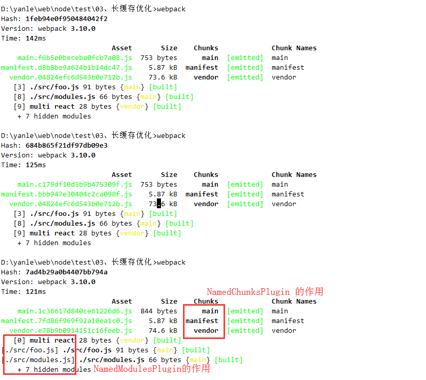

## <div id="class4">四、webpack实战场景</div>

### <div id="class4-item01">01、打包结果分析</div>
这个不重要， 略过，如果以后有需要这方面知识的时候，在回来补。


### <div id="class4-item02">02、打包速度优化</div>
影响webpack打包的速度的因素： 文件多、依赖多、页面多；                 

解决webpack打包速度慢的一些方法：                

方法一：                
分开业务代码和依赖第三方代码：分开vendor 和 app; 可以动过DllPlugin和DllReferencePlugin 这两个插件来解决。

方法二：                    
UglifyJsPlugin 压缩代码的时候是非常慢的。传递参数 parallel: true  和使用cache: true。                    

方法三：
使用HappyPack可以让所有的loader并行处理。 HappyPack.ThreadPool这个东西想用的时候还是可以去研究一下。                

方法四：                
babel-loader可以看起缓存，options.cacheDirectory: true, 还有就是尽量规定我们打包的范围include 和 exclude。

#### 其他影响打包速度的因素
减少resolve， 祛除Devtool: sourcemap。                    
cache-loader                    
升级node 和 升级webpack                      

#### 实际优化代码                         
实例代码以vue官方脚手架初始化的代码为例               
```javascript
const path = require('path');
const webpack = require('webpack');

module.exports = {
    entry: {
        vue: ['vue', 'vue-router'],
        ui: ['element-ui']
    },
    output: {
        path: path.join(__dirname, '../src/dll/'),
        filename: '[name].dll.js',
        library: ['name']
    },
    plugins: [
        new webpack.DllPlugin({
            path: path.join(__dirname, '../src/dll', '[name]-manifest.js'),
            name: '[name]'
        }),
        
        new webpack.optimize.UglifyJsPlugin()
    ]
};
```
打包出来会出来两个json, 这两个json文件就会告诉我也业务代码，怎么区分三方依赖和自己的业务代码。
接下来要在生产打包配置文件中做配置： webpack.prod.config.js                       
添加如下的plugins:   
```javascript
module.exports = {
    // ......
    plugins: [
        new webpack.DllReferencePlugin({
            manifest: require('../src/dll/vue-manifest.json')
        }),
        new webpack.DllReferencePlugin({
            manifest: require('../src/dll/ui-manifest.json')
        }),
    ]
}
```
然后在进行线上打包，应该会有明显的打包速度加快。原因是我们在开发打包过程中，已经把第三方的依赖包已经打包编译过一次了，我们打线上包的时候，其实只打的是我们src下面的业务代码，所以会有明显的速度加快。                        

#### 通过happyPack加快打包速度
这个实际上是一个loader, 可以让串行处理的loader变为并行处理。
这方面的研究直接去看github吧。。。。。。。。


### <div id="class4-item03">03、长缓存优化</div>
####什么是长缓存：                     
当我们输入url之后，从http中拉下来很多的资源，然后这些资源会被浏览器缓存。下次访问的时候，就直接拉取浏览器缓存的静态资源。
利用webpack长缓存优化，实际上是希望，我们更改的文件，重新拉取。但是我们没有改变的文件，就不希望从浏览器上重新去拉取下来。                    

#### 场景             
改变app代码，vendor没有变化。但是我们不希望更改第三方的代码重新更新版本。                 

解决办法：                   
提取vendor                    
hash->chunkhash                     
提取webpack runtime                   

#### 解决问题
我们初始化一个非常简单的页面， 目录结构如下                      

+-- src
|   +-- foo.js
+-- webpack.config.js

webpack.config.js:              
```javascript
const path = require('path');
const webpack = require('webpack');

module.exports = {
    entry: {
        main: './src/foo.js',
        vendor: ['react']
    },
    output: {
        path: path.resolve(__dirname, 'dist'),
        filename: '[name].[hash].js'
    }
};
```

foo.js              
```javascript
import react from 'react';
console.log('hello world');
```
直接运行打包命令，会发现main文件和vendor文件是一样的哈希版本号。这样就导致如果我更改foo.js的代码，vendor的hash也会跟着改变。                     

这个时候我们要把公用文件提取出来：                                    
```javascript
const path = require('path');
const webpack = require('webpack');

module.exports = {
    entry: {
        main: './src/foo.js',
        vendor: ['react']
    },
    output: {
        path: path.resolve(__dirname, 'dist'),
        filename: '[name].[chunkhash].js'
    },

    plugins: [
        // 区分业务代码和第三方依赖代码
        new webpack.optimize.CommonsChunkPlugin({
            name: 'vendor',
            minChunks: Infinity
        })
    ]
};
```
这样提取出来的vendor每次打包都有有不同的hash, 这个时候需要在再加一个提取第三方代码的
```javascript
const path = require('path');
const webpack = require('webpack');

module.exports = {
    // ......
    plugins: [
        // 区分业务代码和第三方依赖代码
        new webpack.optimize.CommonsChunkPlugin({
            name: 'vendor',
            minChunks: Infinity
        }),

        // 在提取出来一个runtime
        new webpack.optimize.CommonsChunkPlugin({
            name: 'manifest',   // 选中上面一个entry 没有的就可以了
        })
    ]
};
```
这个时候在打包，会发现vendor的哈希值是没有变化的了。

#### 第二个场景
如果引入一个新的模块，模块的引入顺序变化，也会引起哈希的变化。                 

**解决：**                     
NamedChunksPlugin                   
NamedModulesPlugin                  

```javascript
plugins: [
        new webpack.NamedChunksPlugin(),
        new webpack.NamedModulesPlugin(),

        // 区分业务代码和第三方依赖代码
        new webpack.optimize.CommonsChunkPlugin({
            name: 'vendor',
            minChunks: Infinity
        }),

        // 在提取出来一个runtime
        new webpack.optimize.CommonsChunkPlugin({
            name: 'manifest',   // 选中上面一个entry 没有的就可以了
        })
    ]
```
                     
这样配置好了之后，会发现vendor的哈希又不会变化了。                    


#### 第三个场景
如果模块是动态引入的，vendor的哈希还是会变化                       

比如我们在js中是这样引入的：             
```javascript
import('./async').then(function (a) {
    console.log(a)
});
```
执行打包命令之后，会发现如下的情况：              
                 
结果我们发现vendor还是没有发生变化，因为新版本webpack 其实已经解决的这个动态导入的问题


                              
