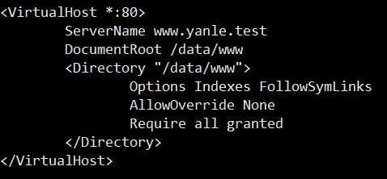

## 应用服务部分

### <div id="class02-01">01、Apache的安装</div>

说明 | 命令
:-|:-
安装 | yum install httpd
启动 | service httpd start
停止 | service httpd stop

启动之后可以坚挺进程： `ps -ef | grep httpd`                   
启动之后，就可以拿着公网IP 去访问，默认80端口。                  
可以查看网络状态： `netstat -anpl|grep 'http'`
如果开启服务之后还是无法访问页面，检查防火墙情况，这里可以选择直接关闭防火墙： service firewalld stop

在这个地方有一个很坑的地方，我的轻量云服务器默认是启动了nginx 的, 而且nginx 没有安装环境变量。所以必须要手动去停止nginx. `nginx -s stop`;

### <div id="class02-02">02、Apache的虚拟主机和伪静态资源操作</div>
#### 配置虚拟主机
配置虚拟主机的目的是为了一个服务器，可以部署多个网站

首先要进入的目录： /etc/httpd/conf
这个时候我们要修改目录下面的 httpd.conf 文件
全局搜索 virtual 关键字
搜索到了之后，在其后面添加内容：                                            
                        
然后保存退出之后重启服务器;

如果 data/www没有这个目录，我们可以自己新建这个目录，然后在随便扔一个index.html文件就可以了；                    
当然想访问这个域名，首先要配置一个host; 配置好了之后，访问域名，发现还是跟我们ip直接访问的是一模一样的。说明虚拟主机并没有生效。                    
这个时候，学学我们默认配置是怎么配置的了。 之后重启服务器，就可以通过域名或者ip访问了。

命令 | 说明
:-|:-
setenforce 0 | 可能服务器里面会有一些设置。

对于配置多个虚拟主机的话，直接把上面那一段复制粘贴重新配置一个就可以了。


#### 伪静态资源操作
配置伪静态资源操作的目录在于 /etc/httpd/modules/mod_rewrite.so

首先我们要在 httpd.conf 文件中配置加载这个模块， 进入文件之后可以直接搜索 LoadModule 来查找关键字：                  
                    

之后在进行如下的重写路由                    
                    

其他的自己慢慢研究吧。。。。。。


### <div id="class02-03">03、nginx基础</div>
#### nginx 基本操作

说明 | 命令
:-|:-
安装 | yum install nginx
启动 | service nginx start
停止 | service nginx stop
重载 | service nginx reload
先杀死进程再重载 | service nginx restart

nginx 的默认配置项目录是： `/etc/nginx/`


#### 配置虚拟主机
主要配置需要在 `conf.d/default.conf` 这个里面配置, 如果没有这个文件，就自己创建一个就OK了                                                  
也有一些nginx 的配置就在nginx 根目录下面                                      
需要查看目录结构也可以在 配置目录下面的 `nginx.conf` 文件里面查看                                                
**关于配置**
```
main                                # 全局配置
events {                            # nginx工作模式配置
}
http {                                # http设置
    ....
    server {                        # 服务器主机配置
        ....
        location {                    # 路由配置
            ....
        }

        location path {
            ....
        }
        location otherpath {
            ....
        }
    }
    server {
        ....

        location {
            ....
        }
    }
    upstream name {                    # 负载均衡配置
        ....
    }
}
```
1、全局块：配置影响nginx全局的指令。一般有运行nginx服务器的用户组，nginx进程pid存放路径，日志存放路径，配置文件引入，允许生成worker process数等。                                                                           
2、events块：配置影响nginx服务器或与用户的网络连接。有每个进程的最大连接数，选取哪种事件驱动模型处理连接请求，是否允许同时接受多个网路连接，开启多个网络连接序列化等。                                                                           
3、http块：可以嵌套多个server，配置代理，缓存，日志定义等绝大多数功能和第三方模块的配置。如文件引入，mime-type定义，日志自定义，是否使用sendfile传输文件，连接超时时间，单连接请求数等。                                                                          
4、server块：配置虚拟主机的相关参数，一个http中可以有多个server。                                                                           
5、location块：配置请求的路由，以及各种页面的处理情况。                                            

一个基本配置实例
```
########### 每个指令必须有分号结束。#################
#user administrator administrators;  #配置用户或者组，默认为nobody nobody。
#worker_processes 2;  #允许生成的进程数，默认为1
#pid /nginx/pid/nginx.pid;   #指定nginx进程运行文件存放地址
error_log log/error.log debug;  #制定日志路径，级别。这个设置可以放入全局块，http块，server块，级别以此为：debug|info|notice|warn|error|crit|alert|emerg
events {
    accept_mutex on;   #设置网路连接序列化，防止惊群现象发生，默认为on
    multi_accept on;  #设置一个进程是否同时接受多个网络连接，默认为off
    #use epoll;      #事件驱动模型，select|poll|kqueue|epoll|resig|/dev/poll|eventport
    worker_connections  1024;    #最大连接数，默认为512
}
http {
    include       mime.types;   #文件扩展名与文件类型映射表
    default_type  application/octet-stream; #默认文件类型，默认为text/plain
    #access_log off; #取消服务日志    
    log_format myFormat '$remote_addr–$remote_user [$time_local] $request $status $body_bytes_sent $http_referer $http_user_agent $http_x_forwarded_for'; #自定义格式
    access_log log/access.log myFormat;  #combined为日志格式的默认值
    sendfile on;   #允许sendfile方式传输文件，默认为off，可以在http块，server块，location块。
    sendfile_max_chunk 100k;  #每个进程每次调用传输数量不能大于设定的值，默认为0，即不设上限。
    keepalive_timeout 65;  #连接超时时间，默认为75s，可以在http，server，location块。

    upstream mysvr {   
      server 127.0.0.1:7878;
      server 192.168.10.121:3333 backup;  #热备
    }
    error_page 404 https://www.baidu.com; #错误页
    server {
        keepalive_requests 120; #单连接请求上限次数。
        listen       4545;   #监听端口
        server_name  127.0.0.1;   #监听地址       
        location  ~*^.+$ {       #请求的url过滤，正则匹配，~为区分大小写，~*为不区分大小写。
           #root path;  #根目录
           #index vv.txt;  #设置默认页
           proxy_pass  http://mysvr;  #请求转向mysvr 定义的服务器列表
           deny 127.0.0.1;  #拒绝的ip
           allow 172.18.5.54; #允许的ip           
        } 
    }
}
```

**添加新的虚拟主机**
如果我们把默认配置拷贝一份到 `conf.d/default.conf/` 文件目录下面， 然后再做修改， 如果这个文件目录下面有配置文件，优先读取我们的配置文件：                           
做一个最简单的配置
```
server {
    listen 80;
    server_name: www.yanle.com;
    root /data/www;
    index: index.html index.htm;
}
```

发现一个问题，这样配置了以后， 一点儿用都没有。 最后解决办法， 把主配置文件里面的nginx.conf 备份一个到conf.d 文件里面， 取一个名字叫default.conf


