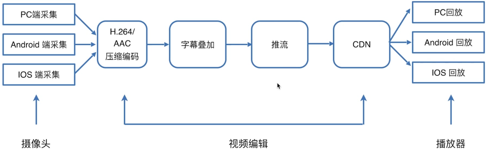

# h5视屏相关专题

## 1.视频直播的原理


常用的协议：                                          
HLS协议、RTMP协议、HTTP-FLV协议

常用的视频格式： mp4、webm、hls(对应ts 文件)、flv;  前两个多用于点播， 后两个多用于直播；                                 

### HLS协议(Safari)原理
```
                            |----> segment-1.ts
video <------>   M3U8 ------|----> segment-2.ts
                            |----> segment-3.ts
```
先发放一个M3U8文件， 文件有很多索引， 索引指向的， ts视频片段， 然后下载对应的ts 文件。                                        
当索引文件下载完毕之后， 在某个时间节点的时候video 就请求新的 M3U8文件， 然后又指向新的ts视频片段。                                         
还有的情况是， M3U8文件可以嵌套 M3U8文件， 嵌套的M3U8文件， 再去下载对应索引的ts文件。

有三个列表：                  
live playlist(动态列表)、vod playlist(全量列表 - 点播)

M3U8文件实际上就是一个纯文本文件， 通常各式如下：
// 这个地方要自己去查一下资料了哟。。。。。

TS文件的解析：                        
首先要照一个PAT包， 然后通过PAT包， 找到PMT包， 这两个包是找到区分视频和音频的关系， 然后再去找对应的TS文件， 找到对应的TS文件之后，
加上上面两个协议包， 然后组成了一个PES帧的包。

### RTMP协议
RTMP是Real Time Messaging Protocol（实时消息传输协议）的首字母缩写。
该协议基于TCP，是一个协议族，包括RTMP基本协议及RTMPT/RTMPS/RTMPE等多种变种。
RTMP是一种设计用来进行实时数据通信的网络协议，主要用来在Flash/AIR平台和支持RTMP协议的流媒体/交互服务器之间进行音视频和数据通信。
支持该协议的软件包括Adobe Media Server/Ultrant Media Server/red5等。

最后使用的文件格式还是flv 格式文件。

### HTTP-FLV协议

### 总结
- 协议之间的区别
- 掌握不同场景采用不同协议


## 2.video相关知识点儿
比如慕课网的视频， 他们用的是blob地址， 这个是一个虚拟地址， 是为了防止视频被下载的一种措施。                      

### 2.1.video属性和方法
```html
<video width="320" height="240" controls>
    <source src="movie.mp4" type="video/mp4">
    <source src="movie.ogg" type="video/ogg">
    您的浏览器不支持 video 标签。
</video>
```

#### 音频格式的 MIME 类型

格式	|MIME-type
:-|:-
MP4|	video/mp4
WebM|	video/webm
Ogg	|video/ogg

#### 可选属性

属性	|值|	描述
:-|:-|:-
autoplay |	autoplay|	如果出现该属性，则视频在就绪后马上播放。
controls |	controls|	如果出现该属性，则向用户显示控件，比如播放按钮。
height |	pixels|	设置视频播放器的高度。
loop |	loop|	如果出现该属性，则当媒介文件完成播放后再次开始播放。
muted	|muted|	如果出现该属性，视频的音频输出为静音。
**poster**	| URL |	规定视频正在下载时显示的图像，直到用户点击播放按钮。
preload |	auto\metadata\none	| 如果出现该属性，则视频在页面加载时进行加载，并预备播放。如果使用 "autoplay"，则忽略该属性。
srcNew	|URL|	要播放的视频的 URL。
widthNew	|pixels|	设置视频播放器的宽度。

#### 如果希望控制音量大小， 是必须要用js 来控制
```html
<script !src="">
    let video = document.getElementById('video');
    video.volume = 0.5;
</script>
```

#### 播放时间的控制
```html
<script >
    let video = document.getElementById('video');
    let currentTime = video.currentTime;            // 当前时间点， 秒
    video.currentTime = 60;
</script>
```

#### 播放地址切换
```html
<script >
    let video = document.getElementById('video');
    let src= video.src;
    setTimeout(function() {
        video.src = './test-2.mp4'
    }, 2000);
</script>
```

