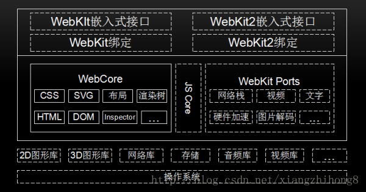
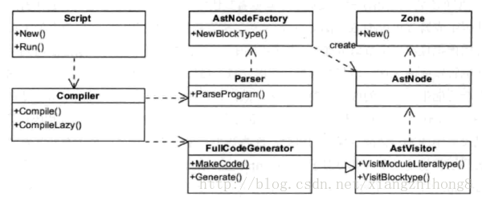
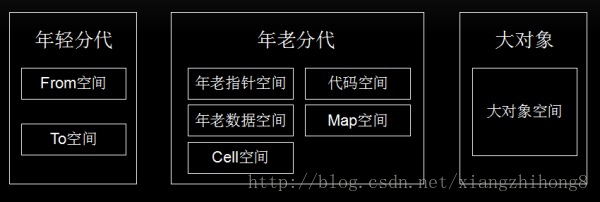

# V8引擎初步介绍

目录                  
- [渲染引擎与网页渲染](#渲染引擎与网页渲染)
    - [编程分类](#编程分类)
    - [渲染引擎](#渲染引擎)
    - [网页渲染流程简析](#网页渲染流程简析)
- [JavaScript引擎](#JavaScript引擎)
- [V8引擎](#V8引擎)
    - [数据解析](#数据解析)
    - [V8引擎渲染过程](#V8引擎渲染过程)
    - [JavaScript代码编译过程](#JavaScript代码编译过程)
    - [优化回滚](#优化回滚)
    - [内存管理](#内存管理)
    - [垃圾回收](#垃圾回收)
    - [快照](#快照)
    - [V8 VS JavaScriptCore](#V8-VS-JavaScriptCore)
- [功能扩展](#功能扩展)
    - [绑定](#绑定)
    - [Extension](#Extension)
- [总结](#总结)
    

## 渲染引擎与网页渲染
### 编程分类
编程语言分为 **编译型语言和解释型语** 言两类。                              
编译型语言在执行之前要先进行完全编译，而 **解释型语言一边编译一边执行**，
很明显解释型语言的执行速度是慢于编译型语言的，而JavaScript就是一种解释型脚本语言，
支持动态类型、弱类型、基于原型的语言，内置支持类型。

### 渲染引擎
就是将HTML/CSS/JavaScript等文本或图片等信息转换成浏览器上可见的可视化图像结果的转换程序。              
WebKit，一个由苹果发起的一个开源项目，如今它在移动端占据着垄断地位，更有基于WebKit的web操作系统不断涌现(如：Chrome OS、Web OS)。                        

WebKit内部结构大体如下                      
                                 

上图中实线框内模块是所有移植的共有部分，虚线框内不同的厂商可以自己实现。由上图可知，WebKit主要有操作系统、WebCore 、WebKit嵌入式接口和第三方库组成。

**操作系统**: 是管理和控制计算机硬件与软件资源的计算机程序。                           
**WebCore**: JavaScriptCore是WebKit的默认引擎，在谷歌系列产品中被替换为V8引擎。                           
**WebKit嵌入式接口**: 该接口主要供浏览器调用，与移植密切相关，不同的移植有不同的接口规范。
**第三方库**: 主要是诸如图形库、网络库、视频库、数据存储库等第三方库。

### 网页渲染流程简析
首先，系统将网页输入到HTML解析器，HTML解析器解析，然后构建DOM树，在这期间如果遇到JavaScript代码则交给JavaScript引擎处理；
如果遇到CSS样式信息，则构建一个内部绘图模型。该模型由布局模块计算模型内部各个元素的位置和大小信息，最后由绘图模块完成从该模型到图像的绘制。 

对于网页的绘制过程，大体可以分为3个阶段：                               

**1、从输入URL到生成DOM树**                             
在这个阶段中，主要会经历一下几个步骤：                                                                                      
地址栏输入URL，WebKit调用资源加载器加载相应资源；                                                               
加载器依赖网络模块建立连接，发送请求并接收答复；                                                                
WebKit接收各种网页或者资源数据，其中某些资源可能同步或异步获取；                                                             
网页交给HTML解析器转变为词语；                                                               
解释器根据词语构建节点，形成DOM树；                                                             
如果节点是JavaScript代码，调用JavaScript引擎解释并执行；                                                              
JavaScript代码可能会修改DOM树结构；                                                                
如果节点依赖其他资源，如图片、视频等，调用资源加载器加载它们，但这些是异步加载的，不会阻碍当前DOM树继续创建；如果是JavaScript资源URL（没有标记异步方式），则需要停止当前DOM树创建，直到JavaScript加载并被JavaScript引擎执行后才继续DOM树的创建。

**2、从DOM树到构建WebKit绘图上下文**                                                             
CSS文件被CSS解释器解释成内部表示；                                                                                
CSS解释器完成工作后，在DOM树上附加样式信息，生成RenderObject树；                                                                                                       
RenderObject节点在创建的同时，WebKit会根据网页层次结构构建RenderLayer树，同时构建一个虚拟绘图上下文。                                                                                                            

**3、绘图上下文内容并呈现图像内容**                                    
绘图上下文是一个与平台无关的抽象类，它将每个绘图操作桥接到不同的具体实现类，也就是绘图具体实现类；                                       
绘图实现类也可能有简单的实现，也可能有复杂的实现，软件渲染、硬件渲染、合成渲染等；                                       
绘图实现类将2D图形库或者3D图形库绘制结果保存，交给浏览器界面进行展示。                                       

[这一部分内容还可以看这里：渲染机制](/books/专题知识库/05、基础知识点专题/02_01、进阶知识部分1-10.md#no01-%E6%B8%B2%E6%9F%93%E6%9C%BA%E5%88%B6)                                        

## JavaScript引擎
JavaScript这种解释性语言来讲，如何提高解析速度就是当务之急。JavaScript引擎和渲染引擎的关系如下图所示                                                                  
                                         

为了提高性能，JavaScript引入了Java虚拟机和C++编译器中的众多技术。
而一个完整JavaScript引擎的执行过程大致流程如下：**源代码-→抽象语法树-→字节码-→JIT-→本地代码**。一个典型的抽象语法树如下图所示：                                    

题外话 关于 JIT:                 
JIT 编译 (JIT compilation)，运行时需要代码时。                      
JIT具体的做法是这样的:当载入一个类型时,CLR为该类型创建一个内部数据结构和相应的函数,当函数第一被调用时,JIT将该函数编译成机器语言.当再次遇到该函数时则直接从cache中执行已编译好的机器语言.                              

为了节约将抽象语法树通过JIT技术转换成本地代码的时间，V8放弃了生成字节码阶段的性能优化。而通过Profiler采集一些信息，来优化本地代码。                            
在2017年4月底，v8 发布了5.9 版本，在此版本中新增了一个 Ignition 字节码解释器，并默认开启。
做出这一改变的原因为：（主要动机）减轻机器码占用的内存空间，即牺牲时间换空间；
提高代码的启动速度；对 v8 的代码进行重构，降低 v8 的代码复杂度（[详细介绍请查阅：JS 引擎与字节码的不解之缘](https://cnodejs.org/topic/59084a9cbbaf2f3f569be482)）

## V8引擎
前面，我们介绍了V8引擎的一些历史，下面我们重点来看看V8项目一些知识。首先，V8项目的结构如下：                       
                         

### 数据解析
JavaScript作为一种无类型的语言，在编译时并不能准确知道变量的类型，只可以在运行时确定。因而JavaScript运行效率比C++或Java低。                                         
而对于JavaScript 来说，并不能像C++那样在执行时已经知道变量的类型和地址，所以在代码解析过程中，会产生很多的临时变量，而变量的存取是非常普遍和频繁的。                                       
在JavaScript中，除boolean，number，string，null，undefined这个五个简单变量外，其他的数据都是对象，V8使用一种特殊的方式来表示它们，进而优化JavaScript的内部表示问题。                                           

JavaScript对象在V8中的实现包含三个部分：隐藏类指针，这是v8为JavaScript对象创建的隐藏类；属性值表指针，指向该对象包含的属性值；元素表指针，指向该对象包含的属性。                                

在V8中，数据的内部表示由数据的实际内容和数据的句柄构成。数据的实际内容是变长的，类型也是不同的；句柄固定大小，包含指向数据的指针。
这种设计可以方便V8进行垃圾回收和移动数据内容，如果直接使用指针的话就会出问题或者需要更大的开销，
使用句柄的话，只需修改句柄中的指针即可，使用者使用的还是句柄，指针改动是对使用者透明的。

除少数数据(如整型数据)由handle本身存储外，其他内容限于句柄大小和变长等原因，都存储在堆中。
整数直接从value中取值，然后使用一个指针指向它，可以减少内存的占用并提高访问速度。
一个句柄对象的大小是4字节(32位设备)或者8字节(64位设备)，而在JavaScriptCore中，使用的8个字节表示句柄。
在堆中存放的对象都是4字节对齐的，所以它们指针的后两位是不需要的，V8用这两位表示数据的类型，00为整数，01为其他。

### V8引擎渲染过程
V8引擎在执行JavaScript的过程中，主要有两个阶段：编译和运行。                                        
在V8引擎中，源代码先被解析器转变为抽象语法树(AST)，然后使用JIT编译器的全代码生成器从AST直接生成本地可执行代码。                                      
但由于缺少了转换为字节码这一中间过程，也就减少了优化代码的机会。                                        

V8引擎编译本地代码时使用的主要类如下所示：                                              
**Script**：表示JavaScript代码，即包含源代码，又包含编译之后生成的本地代码，即是编译入口，又是运行入口；                                                          
**Compiler**：编译器类，辅组Script类来编译生成代码，调用解释器(Parser)来生成AST和全代码生成器，将AST转变为本地代码；                                                          
**AstNode**：抽象语法树节点类，是其他所有节点的基类，包含非常多的子类，后面会针对不同的子类生成不同的本地代码；                                                           
**FullCodeGenerator**：AstVisitor类的子类，通过遍历AST来为JavaScript生成本地可执行代码。                                                          


### JavaScript代码编译过程
Script类调用Compiler类的Compile函数为其生成本地代码；                                                   
Compile函数先使用Parser类生成AST，再使用FullCodeGenerator类来生成本地代码；                                                  
本地代码与具体的硬件平台密切相关，FullCodeGenerator使用多个后端来生成与平台相匹配的本地汇编代码。                                                   

大体的流程图如下所示：                                             
                                                     

在执行编译之前，V8会构建众多全局对象并加载一些内置的库（如math库），来构建一个运行环境。
但是，在JavaScript源代码中，并非所有的函数都被编译生成本地代码，而是采用在调用时才会编译的逻辑来动态编译。                                                      

由于V8缺少了生成中间字节码这一环节，为了提升性能，V8会在生成本地代码后，使用数据分析器(profiler)采集一些信息，
然后根据这些数据将本地代码进行优化，生成更高效的本地代码，这是一个逐步改进的过程。
当发现优化后代码的性能还不如未优化的代码，V8将退回原来的代码，也就是优化回滚。                                                                            

在这一阶段涉及的类主要有：                                   
Script：表示JavaScript代码，即包含源代码，又包含编译之后生成的本地代码，即是编译入口，又是运行入口；                                                                  
Execution：运行代码的辅组类，包含一些重要函数，如Call函数，它辅组进入和执行Script代码；                                                                   
JSFunction：需要执行的JavaScript函数表示类；                                                                    
Runtime：运行这些本地代码的辅组类，主要提供运行时所需的辅组函数，如：属性访问、类型转换、编译、算术、位操作、比较、正则表达式等；                                                                    
Heap：运行本地代码需要使用的内存堆类；                                                                   
MarkCompactCollector：垃圾回收机制的主要实现类，用来标记、清除和整理等基本的垃圾回收过程；                                                                 
SweeperThread：负责垃圾回收的线程。                                                                    

在V8中，函数是一个基本单位，当某个JavaScript函数被调用时，V8会查找该函数是否已经生成本地代码，如果已经生成，则直接调用该函数。
否则，V8引擎会生成属于该函数的本地代码。
这样，对于那些不用的代码就可以减少执行时间。再次借助Runtime类中的辅组函数，将不用的空间进行标记清除和垃圾回收。                                                 

### 优化回滚
因为V8是基于AST直接生成本地代码，没有经过中间表示层的优化，所以本地代码尚未经过很好的优化。
于是，在2010年，V8引入了新的编译器-Crankshaft，它主要针对热点函数进行优化，
基于JavaScript源代码开始分析而非本地代码，同时构建Hydroger图并基于此来进行优化分析。

Crankshaft编译器为了性能考虑，通常会做出比较乐观和大胆的预测—代码稳定且变量类型不变，所以可以生成高效的本地代码。
但是，鉴于JavaScript的一个弱类型的语言，变量类型也可能在执行的过程中进行改变，鉴于这种情况，V8会将该编译器做的想当然的优化进行回滚，称为优化回滚。                             

例如，下面的示例：
```javascript
var counter = 0;
function test(x, y) {
    counter++;
    if (counter < 1000000) {
        // do something
        return 'jeri';
    }
    var unknown = new Date();
    console.log(unknown);
}
``` 
该函数被调用多次之后，V8引擎可能会触发Crankshaft编译器对其进行优化，而优化代码认为示例代码的类型信息都已经被确定。
当程序执行到new Date()这个地方，并未获取unknown这个变量的类型，V8只得将该部分代码进行回滚。

优化回滚是一个很耗时的操作，在写代码过程中，尽量不要触发优化该操作。在最近发布的 V8 5.9 版本中，新增了一个 Ignition 字节码解释器，
TurboFan 和 Ignition 结合起来共同完成JavaScript的编译。
这个版本中消除 Cranshaft 这个旧的编译器，并让新的 Turbofan 直接从字节码来优化代码，
并当需要进行反优化的时候直接反优化到字节码，而不需要再考虑 JS 源代码。

### 内存管理
Node中通过JavaScript使用内存时就会发现只能使用部分内存（64位系统下约为1.4 GB，32位系统下约为0.7 GB），
其深层原因是 V8 垃圾回收机制的限制所致（如果可使用内存太大，V8在进行垃圾回收时需耗费更多的资源和时间，严重影响JS的执行效率）。下面对内存管理进行介绍。                         

内存的管理组要由分配和回收两个部分构成。V8的内存划分如下：                                              
**Zone**：管理小块内存。其先自己申请一块内存，然后管理和分配一些小内存，当一块小内存被分配之后，不能被Zone回收，
只能一次性回收Zone分配的所有小内存。当一个过程需要很多内存，Zone将需要分配大量的内存，却又不能及时回收，会导致内存不足情况。                                                                                                                
**堆**：管理JavaScript使用的数据、生成的代码、哈希表等。为方便实现垃圾回收，堆被分为三个部分(这和Java等的堆不一样)：                                                                                                               
    **年轻分代**：为新创建的对象分配内存空间，经常需要进行垃圾回收。
    为方便年轻分代中的内容回收，可再将年轻分代分为两半，一半用来分配，另一半在回收时负责将之前还需要保留的对象复制过来。                                                                                                              
    **年老分代**：根据需要将年老的对象、指针、代码等数据保存起来，较少地进行垃圾回收。                                                                                                               
    **大对象**：为那些需要使用较多内存对象分配内存，当然同样可能包含数据和代码等分配的内存，一个页面只分配一个对象。                                                                                                             

用一张图可以表示如下：                                             
                                                                             

### 垃圾回收                                            
V8 使用了分代和大数据的内存分配，在回收内存时使用精简整理的算法标记未引用的对象，然后消除没有标记的对象，最后整理和压缩那些还未保存的对象，即可完成垃圾回收。                            
在V8中，使用较多的是年轻分代和年老分代。年轻分代中的对象垃圾回收主要通过 **Scavenge** 算法进行垃圾回收。在Scavenge的具体实现中，主要采用了 **Cheney** 算法。                        

Cheney算法：通过复制的方式实现的垃圾回收算法。
它将堆内存分为两个 semispace（半空间），一个处于使用中（From空间），另一个处于闲置状态（To空间）。
当分配对象时，先是在From空间中进行分配。
当开始进行垃圾回收时，会检查From空间中的存活对象，这些存活对象将被复制到To空间中，而非存活对象占用的空间将会被释放。
完成复制后，From空间和To空间的角色发生对换。在垃圾回收的过程中，就是通过将存活对象在两个 semispace 空间之间进行复制。                                     

年轻分代中的对象有机会晋升为年老分代，条件主要有两个：一个是对象是否经历过Scavenge回收，一个是To空间的内存占用比超过限制。                                                  

对于年老分代中的对象，由于存活对象占较大比重，再采用上面的方式会有两个问题：
一个是存活对象较多，复制存活对象的效率将会很低；另一个问题依然是浪费一半空间的问题。
为此，V8在年老分代中主要采用了**Mark-Sweep（标记清除）标记清除和Mark-Compact（标记整理）** 相结合的方式进行垃圾回收。                           

### 快照                              
在V8引擎启动时，需要构建JavaScript运行环境，需要加载很多内置对象，
同时也需要建立内置的函数，如Array，String，Math等。为了使V8更加整洁，
加载对象和建立函数等任务都是使用JavaScript文件来实现的，V8引擎负责提供机制来支持，就是在编译和执行JavaScript前先加载这些文件。                      

V8引擎需要编译和执行这些内置的JavaScript代码，同时使用堆等来保存执行过程中创建的对象、代码等，这些都需要时间。
为此，V8引入了快照机制，将这些内置的对象和函数加载之后的内存保存并序列化。经过快照机制的启动时间可以缩减几毫秒。                           

## V8 VS JavaScriptCore
JavaScriptCore引擎是WebKit中默认的JavaScript引擎，也是苹果开源的一个项目，应用较为广泛。
最初，性能不是很好，从2008年开始了一系列的优化，重新实现了编译器和字节码解释器，使得引擎的性能有较大的提升。
随后内嵌缓存、基于正则表达式的JIT、简单的JIT及字节码解释器等技术引入进来，JavaScriptCore引擎也在不断的迭代和发展。                         

JavaScriptCore 的大致流程为：源代码-→抽象语法树-→字节码-→JIT-→本地代码。                                       
JavaScriptCore与V8有一些不同之处，其中最大的不同就是新增了字节码的中间表示，
并加入了多层JIT编译器（如：简单JIT编译器、DFG JIT编译器、LLVM等）优化性能，不停的对本地代码进行优化(在V8 的 5.9 版本中，新增了一个 Ignition 字节码解释器)。                                                                                

## 功能扩展                         
JavaScript引擎的主要功能是解析和执行JavaScript代码，往往不能满足使用者多样化的需要，
那么就可以增加扩展以提升它的能力。V8引擎有两种扩展机制：绑定和扩展。

### 绑定                  
使用IDL文件或接口文件生成绑定文件，将这些文件同V8引擎一起编译。
WebKit中使用IDL来定义JavaScript，但又与IDL有所不同，有一些改变。定义一个新的接口的步骤大致如下：                     
1.定义新的接口文件，可以在JavaScript代码进行调用，如mymodule.MyObj.myAttr：                      
```javascript
module mymodule {
    interface [
            InterfaceName = MyObject
    ] MyObj { 
        readonly attribute long myAttr;
        DOMString myMethod (DOMString myArg);
    };
}
``` 

2.按照引擎定义的标准接口为基础实现接口类，生成JavaScript引擎所需的绑定文件。
WebKit提供了工具帮助生成所需的绑定类，根据引擎不同和引擎开发语言的不同而有所差异。
V8引擎会为上述示例代码生成 v8MyObj.h (MyObj类具体的实现代码)和 V8MyObj.cpp (桥接代码，辅组注册桥接的函数到V8引擎)两个绑定文件。

JavaScript引擎绑定机制需要将扩展代码和JavaScript引擎一块编译和打包，
不能根据需要在引擎启动后再动态注入这些本地代码。
在实际WEB开发中，开发者都是基于现有浏览器的，根本不可能介入到JavaScript引擎的编译中，
绑定机制有很大的局限性，但其非常高效，适用于对性能要求较高的场景。

### Extension                       
通过V8的基类Extension进行能力扩展，无需和V8引擎一起编译，可以动态为引擎增加功能特性，具有很强的灵活性。                          
Extension机制的大致思路就是，V8提供一个基类Extension和一个全局注册函数，要想扩展JavaScript能力，需要经过以下步骤：                                    
```c++
class MYExtension : public v8::Extension {
    public:
        MYExtension() : v8::Extension("v8/My", "native function my();") {}
        virtual v8::Handle<v8::FunctionTemplate> GetNativeFunction (
        v8::Handle<v8::String> name) {
            // 可以根据name来返回不同的函数
            return v8::FunctionTemplate::New(MYExtention::MY);
        }
        static v8::Handle<v8::Value> MY(const v8::Arguments& args) {
            // Do sth here
            return v8::Undefined();
        }
};
MYExtension extension;
RegisterExtension(&extension);
```
1.基于Extension基类构建一个它的子类，并实现它的虚函数—GetNativeFunction，根据参数name来决定返回实函数；                            
2.创建一个该子类的对象，并通过注册函数将该对象注册到V8引擎，当JavaScript调用’my’函数时就可被调用到。
Extension机制是调用V8的接口注入新函数，动态扩展非常方便，但没有绑定机制高效，适用于对性能要求不高的场景。

## 总结                           
作为一个提高JavaScript渲染的高效引擎，学习V8引擎应该重点掌握以下几个概念：

- 类型。                                                                                                                                                                       
    对于函数，JavaScript是一种动态类型语言，JavaScriptCore和V8都使用隐藏类和内嵌缓存来提高性能，
    为了保证缓存命中率，一个函数应该使用较少的数据类型；
    对于数组，应尽量存放相同类型的数据，这样就可以通过偏移位置来访问。                       
- 数据表示。                     
    简单类型数据（如整型）直接保存在句柄中，可以减少寻址时间和内存占用，
    如果可以使用整数表示的，尽量不要用浮点类型。
- 内存。
    虽然JavaScript语言会自己进行垃圾回收，但我们也应尽量做到及时回收不用的内存，
    对不再使用的对象设置为null或使用delete方法来删除(使用delete方法删除会触发隐藏类新建，需要更多的额外操作)。
- 优化回滚。
    在执行多次之后，不要出现修改对象类型的语句，尽量不要触发优化回滚，否则会大幅度降低代码的性能。 
- 新机制。
    使用JavaScript引擎或者渲染引擎提供的新机制和新接口提高性能。


参考文章如下：                     
[Google V8 引擎【翻】](https://blog.csdn.net/xiangzhihong8/article/details/74996757)
