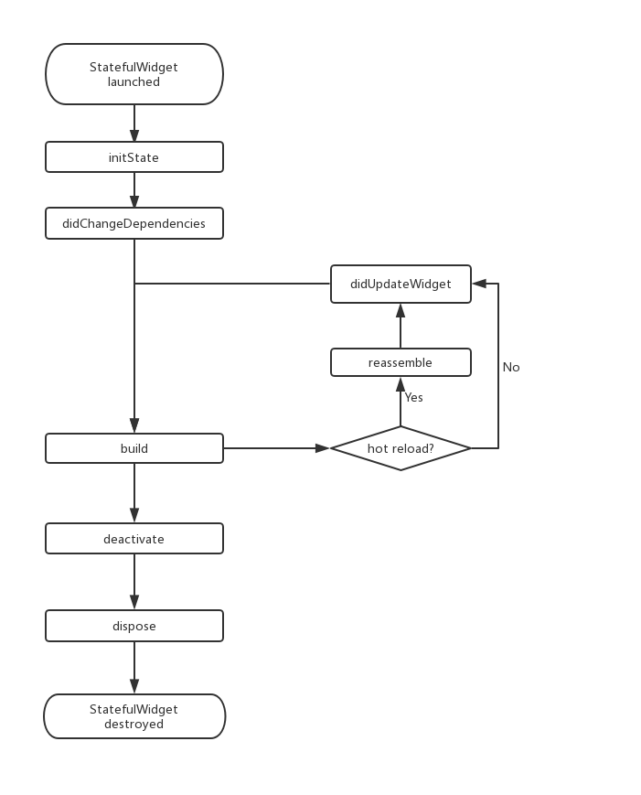

# 第一个 flutter 应用

<!-- toc -->

- [官方 demo 实例](#%E5%AE%98%E6%96%B9-demo-%E5%AE%9E%E4%BE%8B)
- [widget 简介](#widget-%E7%AE%80%E4%BB%8B)
  * [StatelessWidget](#statelesswidget)
  * [StatefulWidget](#statefulwidget)
  * [在 StatefulWidget 树中获取 State 对象](#%E5%9C%A8-statefulwidget-%E6%A0%91%E4%B8%AD%E8%8E%B7%E5%8F%96-state-%E5%AF%B9%E8%B1%A1)
  * [通过 RenderObject 自定义 Widget](#%E9%80%9A%E8%BF%87-renderobject-%E8%87%AA%E5%AE%9A%E4%B9%89-widget)
- [状态管理](#%E7%8A%B6%E6%80%81%E7%AE%A1%E7%90%86)
  * [自身状态管理](#%E8%87%AA%E8%BA%AB%E7%8A%B6%E6%80%81%E7%AE%A1%E7%90%86)
  * [父子组件状态管理](#%E7%88%B6%E5%AD%90%E7%BB%84%E4%BB%B6%E7%8A%B6%E6%80%81%E7%AE%A1%E7%90%86)
  * [混合状态管理](#%E6%B7%B7%E5%90%88%E7%8A%B6%E6%80%81%E7%AE%A1%E7%90%86)
  * [全局状态管理](#%E5%85%A8%E5%B1%80%E7%8A%B6%E6%80%81%E7%AE%A1%E7%90%86)
- [路由管理](#%E8%B7%AF%E7%94%B1%E7%AE%A1%E7%90%86)
  * [先来看一个简单的路由页面](#%E5%85%88%E6%9D%A5%E7%9C%8B%E4%B8%80%E4%B8%AA%E7%AE%80%E5%8D%95%E7%9A%84%E8%B7%AF%E7%94%B1%E9%A1%B5%E9%9D%A2)
  * [MaterialPageRoute](#materialpageroute)
  * [Navigator](#navigator)
  * [参数传递](#%E5%8F%82%E6%95%B0%E4%BC%A0%E9%80%92)
  * [命名路由](#%E5%91%BD%E5%90%8D%E8%B7%AF%E7%94%B1)
- [包管理](#%E5%8C%85%E7%AE%A1%E7%90%86)
- [资源管理](#%E8%B5%84%E6%BA%90%E7%AE%A1%E7%90%86)
  * [指定资源](#%E6%8C%87%E5%AE%9A%E8%B5%84%E6%BA%90)
  * [Asset 变体（variant）](#asset-%E5%8F%98%E4%BD%93variant)
  * [加载 assets](#%E5%8A%A0%E8%BD%BD-assets)
- [调试Flutter应用](#%E8%B0%83%E8%AF%95flutter%E5%BA%94%E7%94%A8)
- [Flutter异常捕获](#flutter%E5%BC%82%E5%B8%B8%E6%8D%95%E8%8E%B7)

<!-- tocstop -->

## 官方 demo 实例
可以参考这里: [demo](/books/专题知识库/20、flutter/01、flutter从零到实战/03、HelloWorld/readme.md)


## widget 简介

### StatelessWidget
申明可以使用快捷键 `stless`

StatelessWidget用于不需要维护状态的场景

context:                                
```dart
class YLContextRoute extends StatelessWidget {
  const YLContextRoute({Key? key}) : super(key: key);

  @override
  Widget build(BuildContext context) {
    return Scaffold(
      appBar: AppBar(title: const Text("Context 测试")),
      body: Builder(builder: (context) {
        // 在 widget 树中向上查找最近的父级`Scaffold`  widget
        Scaffold scaffold = context.findAncestorWidgetOfExactType() as Scaffold;
        // 直接返回 AppBar的title， 此处实际上是Text("Context测试")
        return (scaffold.appBar as AppBar).title as Widget;
      }),
    );
  }
}
```


### StatefulWidget
申明可以使用快捷键： `stful`                      
```dart
class CounterWidget extends StatefulWidget {
  const CounterWidget({Key? key, this.initValue = 0});

  final int initValue;

  @override
  _CounterWidgetState createState() => _CounterWidgetState();
}
```

**State**                       
一个 StatefulWidget 类会对应一个 State 类，State表示与其对应的 StatefulWidget 要维护的状态；

State 中的保存的状态信息可以：                  
- 生命周期信息
- 构建时可以被同步读取

State 中有两个常用属性：                 
- widget，它表示与该 State 实例关联的 widget 实例，由Flutter 框架动态设置。
- context。StatefulWidget对应的 BuildContext，作用同StatelessWidget 的BuildContext。

**State 生命周期**
```dart
class CounterWidget extends StatefulWidget {
  const CounterWidget({Key? key, this.initValue = 0});

  final int initValue;

  @override
  _CounterWidgetState createState() => _CounterWidgetState();
}

class _CounterWidgetState extends State<CounterWidget> {
  int _counter = 0;

  @override
  void initState() {
    super.initState();
    //初始化状态
    _counter = widget.initValue;
    print("initState");
  }

  @override
  Widget build(BuildContext context) {
    print("build");
    return Scaffold(
      body: Center(
        child: TextButton(
          child: Text('$_counter'),
          //点击后计数器自增
          onPressed: () => setState(
                () => ++_counter,
          ),
        ),
      ),
    );
  }

  @override
  void didUpdateWidget(CounterWidget oldWidget) {
    super.didUpdateWidget(oldWidget);
    print("didUpdateWidget ");
  }

  @override
  void deactivate() {
    super.deactivate();
    print("deactivate");
  }

  @override
  void dispose() {
    super.dispose();
    print("dispose");
  }

  @override
  void reassemble() {
    super.reassemble();
    print("reassemble");
  }

  @override
  void didChangeDependencies() {
    super.didChangeDependencies();
    print("didChangeDependencies");
  }
}
```
生命周期图可以看这个：                     


可以参考文档： https://book.flutterchina.club/chapter2/flutter_widget_intro.html#_2-2-6-state


### 在 StatefulWidget 树中获取 State 对象
主要办法有两个： context、GlobalKey       

总结一下：
```
方式1：
ScaffoldState _state = context.findAncestorStateOfType<ScaffoldState>()!;
_state.openDrawer();

方式2:
ScaffoldState state = Scaffold.of(context);
state.openDrawer();

方式3：
ScaffoldMessenger.of(context).showSnackBar(
  const SnackBar(content: Text("我是 snack bar"))
);

方式4：
// todo ...
static final GlobalKey<ScaffoldState> _globalKey = GlobalKey();
// todo ...

return Scaffold(
  key: _globalKey,
  //....
);

// todo ...
onPressed: () => _globalKey.currentState?.openDrawer(),
```

具体实例如下：
```dart
import 'package:flutter/material.dart';

class YLGetStateObjectRoute extends StatefulWidget {
  const YLGetStateObjectRoute({Key? key}) : super(key: key);

  @override
  State<YLGetStateObjectRoute> createState() => _YLGetStateObjectRouteState();
}

/// 在 Flutter 开发中便有了一个默认的约定：
///   如果 StatefulWidget 的状态是希望暴露出的，应当在 StatefulWidget 中提供一个of 静态方法来获取其 State 对象，
///   开发者便可直接通过该方法来获取；
///   如果 State不希望暴露，则不提供of方法。
///
/// 疑问： 如何界定 state 是否希望对外暴露？
class _YLGetStateObjectRouteState extends State<YLGetStateObjectRoute> {
  static final GlobalKey<ScaffoldState> _globalKey = GlobalKey();

  @override
  Widget build(BuildContext context) {
    return Scaffold(
      key: _globalKey,
      appBar: AppBar(title: const Text("子树中获取State对象")),
      body: Center(
        child: Column(
          children: [
            Builder(builder: (context) {
              return ElevatedButton(
                onPressed: () {
                  ScaffoldState _state =
                      context.findAncestorStateOfType<ScaffoldState>()!;
                  _state.openDrawer();
                },
                child: const Text("打开抽屉菜单1"),
              );
            }),
            Builder(builder: (context) {
              return ElevatedButton(
                onPressed: () {
                  ScaffoldState state = Scaffold.of(context);
                  state.openDrawer();
                },
                child: const Text("打开抽屉菜单2"),
              );
            }),
            Builder(builder: (context) {
              return ElevatedButton(
                onPressed: () {
                  ScaffoldMessenger.of(context).showSnackBar(
                      const SnackBar(content: Text("我是 snack bar")));
                },
                child: const Text("显示 snack bar"),
              );
            }),
            ElevatedButton(
                onPressed: () => _globalKey.currentState?.openDrawer(),
                child: const Text("打开抽屉菜单4"))
          ],
        ),
      ),
      drawer: const Drawer(),
    );
  }
}
```

### 通过 RenderObject 自定义 Widget
StatelessWidget 和 StatefulWidget 都是用于组合其它组件的，它们本身没有对应的 RenderObject。

Flutter 组件库中的很多基础组件都不是通过StatelessWidget 和 StatefulWidget 来实现的，
比如 Text 、Column、Align等，
就好比搭积木，StatelessWidget 和 StatefulWidget 可以将积木搭成不同的样子，
但前提是得有积木，而这些积木都是通过自定义 RenderObject 来实现的。

示例：
```dart
class CustomWidget extends LeafRenderObjectWidget{
  @override
  RenderObject createRenderObject(BuildContext context) {
    // 创建 RenderObject
    return RenderCustomObject();
  }
  @override
  void updateRenderObject(BuildContext context, RenderCustomObject  renderObject) {
    // 更新 RenderObject
    super.updateRenderObject(context, renderObject);
  }
}

class RenderCustomObject extends RenderBox{

  @override
  void performLayout() {
    // 实现布局逻辑
  }

  @override
  void paint(PaintingContext context, Offset offset) {
    // 实现绘制
  }
}
```

## 状态管理

### 自身状态管理
这个感觉没啥好说的.... 直接上 demo 吧
```dart
/// 状态自管理案例
class YLTapBoxA extends StatefulWidget {
  const YLTapBoxA({Key? key}) : super(key: key);

  @override
  State<YLTapBoxA> createState() => _YLTapBoxAState();
}

class _YLTapBoxAState extends State<YLTapBoxA> {
  bool _active = false;

  void _handleTap() {
    setState(() {
      _active = !_active;
    });
  }

  @override
  Widget build(BuildContext context) {
    return GestureDetector(
      onTap: _handleTap,
      child: Container(
        width: 300,
        height: 300,
        decoration: BoxDecoration(
            color: _active ? Colors.lightGreen[700] : Colors.green[600]),
        child: Center(
          child: Text(
            _active ? "Active" : "Inactive",
            style: const TextStyle(fontSize: 32, color: Colors.white),
          ),
        ),
      ),
    );
  }
}
```


### 父子组件状态管理
```dart
import 'package:flutter/material.dart';

/// 父Widget管理子Widget的状态
class YLParentWidget extends StatefulWidget {
  const YLParentWidget({Key? key}) : super(key: key);

  @override
  State<YLParentWidget> createState() => _YLParentWidgetState();
}

class _YLParentWidgetState extends State<YLParentWidget> {
  bool _active = false;

  void _handleTapBoxChanged(bool newValue) {
    setState(() {
      _active = newValue;
    });
  }

  @override
  Widget build(BuildContext context) {
    return _TapBoxB(
      active: _active,
      onChanged: _handleTapBoxChanged,
    );
  }
}

class _TapBoxB extends StatelessWidget {
  final bool active;
  final ValueChanged<bool> onChanged;

  const _TapBoxB({
    Key? key,
    this.active = false,
    required this.onChanged,
  }) : super(key: key);

  void _handleTap() {
    onChanged(!active);
  }

  @override
  Widget build(BuildContext context) {
    return GestureDetector(
      onTap: _handleTap,
      child: Container(
        width: 300,
        height: 300,
        decoration: BoxDecoration(
          color: active ? Colors.lightGreen[700] : Colors.green[600],
        ),
        child: Center(
          child: Text(
            active ? "Active" : "Inactive",
            style: const TextStyle(fontSize: 32, color: Colors.white),
          ),
        ),
      ),
    );
  }
}
```

### 混合状态管理
```dart
import 'package:flutter/material.dart';

//------------------------ ParentWidget ------------------------
/// StatefulWidget 是个 @immutable 类， 所以不可更改
/// 如果想具备状态， 必须要使用 state 作为状态管理
class YLParentWidgetC extends StatefulWidget {
  const YLParentWidgetC({Key? key}) : super(key: key);

  @override
  State<YLParentWidgetC> createState() => _YLParentWidgetCState();
}

/// 在 state 定义的状态和方法， 可以直接传递到子 StatefulWidget TapBoxC
class _YLParentWidgetCState extends State<YLParentWidgetC> {
  bool _active = false;

  void _handleTapBoxChanged(bool newValue) {
    setState(() {
      _active = newValue;
    });
  }

  @override
  Widget build(BuildContext context) {
    return TapBoxC(
      onChanged: _handleTapBoxChanged,
      active: _active,
    );
  }
}

//------------------------ TapBoxC ------------------------
/// 这个类的作用只是作为一个转接
/// 把 parent state 的属性和方法， 转接到自己的 state 里面去
/// 自己的 state 可以通过 widget 方法调用到 StatefulWidget 转接过来的属性和方法
class TapBoxC extends StatefulWidget {
  final bool active;
  final ValueChanged<bool> onChanged;

  const TapBoxC({
    Key? key,
    this.active = false,
    required this.onChanged,
  }) : super(key: key);

  @override
  State<TapBoxC> createState() => _TapBoxCState();
}

class _TapBoxCState extends State<TapBoxC> {
  bool _highlight = false;

  void _handleTapDown(TapDownDetails details) {
    setState(() {
      _highlight = true;
    });
  }

  void _handleTapUp(TapUpDetails details) {
    setState(() {
      _highlight = false;
    });
  }

  void _handleTapCancel() {
    setState(() {
      _highlight = false;
    });
  }

  void _handleTap() {
    // 可以通过 widget 获取 StatefulWidget 属性
    widget.onChanged(!widget.active);
  }

  @override
  Widget build(BuildContext context) {
    return GestureDetector(
      onTapDown: _handleTapDown,
      onTapUp: _handleTapUp,
      onTap: _handleTap,
      onTapCancel: _handleTapCancel,
      child: Container(
        width: 300,
        height: 300,
        decoration: BoxDecoration(
            color: widget.active ? Colors.lightGreen[700] : Colors.grey[600],
            border: _highlight
                ? Border.all(
                    color: const Color(0xFF4DB6AC),
                    width: 10,
                  )
                : null),
        child: Center(
          child: Text(
            widget.active ? "yanle" : "lele",
            style: const TextStyle(fontSize: 32, color: Colors.white),
          ),
        ),
      ),
    );
  }
}
```


### 全局状态管理
基本上实现办法有两个：               
1. 事件订阅
2. 全局注册状态管理（如 Provider、Redux 可以在 pub 上查看其详细信息）


## 路由管理
路由（Route）在移动开发中通常指页面（Page），这跟 Web 开发中单页应用的 Route 概念意义是相同的，
Route 在 Android中 通常指一个 Activity，在 iOS 中指一个 ViewController。

关键总结：
```
// 进入页面
Navigator.push(BuildContext context, Route route)

// 退出页面
Navigator.pop(BuildContext context, [ result ])
```


### 先来看一个简单的路由页面
比如我们有一个路由页面为， 名字为 `newRoute`                    
```dart
class NewRoute extends StatelessWidget {
  @override
  Widget build(BuildContext context) {
    return Scaffold(
      appBar: AppBar(
        title: Text("New route"),
      ),
      body: Center(
        child: Text("This is new route"),
      ),
    );
  }
}
```

比如说， 我们要从 A 页面跳转到 `newRoute` 页面             
通过点击， 就可跳转到新的页面了
```
TextButton(
  child: Text("open new route"),
  onPressed: () {
    //导航到新路由   
    Navigator.push( 
      context,
      MaterialPageRoute(builder: (context) {
        return NewRoute();
      }),
    );
  },
),
```

### MaterialPageRoute
MaterialPageRoute 继承自 PageRoute类；
MaterialPageRoute 是 Material组件库提供的组件，它可以针对不同平台，实现与平台页面切换动画风格一致的路由切换动画。

MaterialPageRoute 构造函数的各个参数的意义：
```
MaterialPageRoute({
  WidgetBuilder builder,
  RouteSettings settings,
  bool maintainState = true,
  bool fullscreenDialog = false,
})
```
参数含义：           
- builder 是一个WidgetBuilder类型的回调函数，它的作用是构建路由页面的具体内容，返回值是一个widget。我们通常要实现此回调，返回新路由的实例。
- settings 包含路由的配置信息，如路由名称、是否初始路由（首页）。
- maintainState：默认情况下，当入栈一个新路由时，原来的路由仍然会被保存在内存中，如果想在路由没用的时候释放其所占用的所有资源，可以设置maintainState为 false。
- fullscreenDialog表示新的路由页面是否是一个全屏的模态对话框，在 iOS 中，如果fullscreenDialog为true，新页面将会从屏幕底部滑入（而不是水平方向）。


### Navigator
Navigator 是一个路由管理的组件，它提供了打开和退出路由页方法。
Navigator 通过一个栈来管理活动路由集合。通常当前屏幕显示的页面就是栈顶的路由。

1. Future push(BuildContext context, Route route)                 
将给定的路由入栈（即打开新的页面），返回值是一个Future对象，用以接收新路由出栈（即关闭）时的返回数据。

2. bool pop(BuildContext context, [ result ])                       
将栈顶路由出栈，result 为页面关闭时返回给上一个页面的数据。

Navigator 还有很多其它方法，如Navigator.replace、Navigator.popUntil等

Navigator类中第一个参数为context的静态方法都对应一个Navigator的实例方法， 比如：
`Navigator.push(BuildContext context, Route route)`等价于 `Navigator.of(context).push(Route route)`。

### 参数传递
可以理解为组件之间的值传递；              
实际上后退传值这种写法，感觉并不好， 可以考虑做全局的状态管理即可；
如果不使用按钮触发返回上一个页面， 而是使用手机左右滑动，或者使用导航栏的的箭头返回， 这个时候参数是传递不回去的；

A 页面
```
onPressed: () async {
  // 打开`B`，并等待返回结果
  var result = await Navigator.push(
    context,
    MaterialPageRoute(
      builder: (context) {
        return B(
          // 跳转到 B 页面 路由参数 text
          text: "我是提示xxxx",
        );
      },
    ),
  );
  //输出`B`路由返回结果
  print("路由返回值: $result");
},
```

B 页面
```
children: <Widget>[
  Text(text), // 这个 text 就是A 组件传递过来的值
  ElevatedButton(
    onPressed: () => Navigator.pop(context, "我是返回值"), // 这个就是返回的时候， 要给 A 页面的信息
    child: Text("返回"),
  )
],
```


### 命名路由
所谓“命名路由”（Named Route）即有名字的路由，我们可以先给路由起一个名字，
然后就可以通过路由名字直接打开新的路由了，这为路由管理带来了一种直观、简单的方式。

**路由表的定义如下**                           
`Map<String, WidgetBuilder> routes;`


**注册路由表**
```dart
MaterialApp(
  title: 'Flutter Demo',
  theme: ThemeData(
    primarySwatch: Colors.blue,
  ),
  //注册路由表
  routes: {
   "new_page":(context) => NewRoute(),
    "/":(context) => MyHomePage(title: 'Flutter Demo Home Page'), //注册首页路由
    ... // 省略其它路由注册信息
  }
);
```


**使用路由打开页面**              
```
Navigator.pushNamed(BuildContext context, String routeName, {Object arguments});

// 也可以这样打开页面
Navigator.of(context).pushNamed(routeName, arguments: args);
```

**命名路由参数传递**              
在路由页通过RouteSetting对象获取路由参数：             
```dart
//获取路由参数  
var args = ModalRoute.of(context).settings.arguments;
```

**适配**                
适配是指比如路由页面 A 就必须使用一个参数才能打开， 这个时候注册的时候如何注册呢？
```dart
MaterialApp(
  ... //省略无关代码
  routes: {
   "tip2": (context){
     return TipRoute(text: ModalRoute.of(context)!.settings.arguments);
   },
 }, 
);
```


**动态路由**    
MaterialApp有一个 `onGenerateRoute` 属性                 
是因为当调用Navigator.pushNamed(...)打开命名路由时，如果指定的路由名在路由表中已注册，
则会调用路由表中的builder函数来生成路由组件；
如果路由表中没有注册，才会调用 `onGenerateRoute` 来生成路由。

函数签名：`Route<dynamic> Function(RouteSettings settings)`              

使用如下：           
```dart
MaterialApp(
  ... //省略无关代码
  onGenerateRoute:(RouteSettings settings){
	  return MaterialPageRoute(builder: (context){
		   String routeName = settings.name;
       // 如果访问的路由页需要登录，但当前未登录，则直接返回登录页路由，
       // 引导用户登录；其它情况则正常打开路由。
     }
   );
  }
);
```


## 包管理
这个没啥好说的， 直接看文档： https://book.flutterchina.club/chapter2/flutter_package_mgr.html#_2-5-1-%E7%AE%80%E4%BB%8B


## 资源管理
参考文档： https://book.flutterchina.club/chapter2/flutter_assets_mgr.html#_2-6-1-%E6%8C%87%E5%AE%9A-assets

### 指定资源
基本指定资源方式              
```yaml
flutter:
  assets:
    - assets/my_icon.png
    - assets/background.png
```

### Asset 变体（variant）                          
比如有以下文件
```
…/pubspec.yaml
…/graphics/my_icon.png
…/graphics/background.png
…/graphics/dark/background.png
…etc.
```
申请资源
```yaml
flutter:
  assets:
    - graphics/background.png
```
那么这两个graphics/background.png和graphics/dark/background.png 都将包含在您的 asset bundle中。


### 加载 assets

**加载文本assets**：           
```dart
import 'dart:async' show Future;
import 'package:flutter/services.dart' show rootBundle;

Future<String> loadAsset() async {
  return await rootBundle.loadString('assets/config.json');
}
```

**加载图片**:           
```
AssetImage('graphics/background.png');
AssetImage('icons/heart.png', package: 'my_icons');

Image.asset('graphics/background.png');
Image.asset('icons/heart.png', package: 'my_icons');
```

## 调试Flutter应用
参考文档: https://book.flutterchina.club/chapter2/flutter_app_debug.html#_2-7-1-%E6%97%A5%E5%BF%97%E4%B8%8E%E6%96%AD%E7%82%B9


## Flutter异常捕获
参考文档: https://book.flutterchina.club/chapter2/thread_model_and_error_report.html#_2-8-1-dart%E5%8D%95%E7%BA%BF%E7%A8%8B%E6%A8%A1%E5%9E%8B
