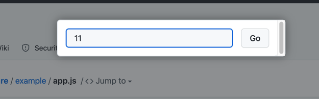
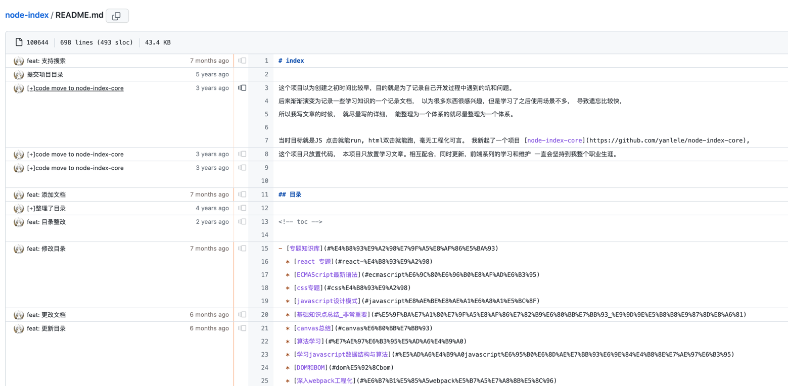
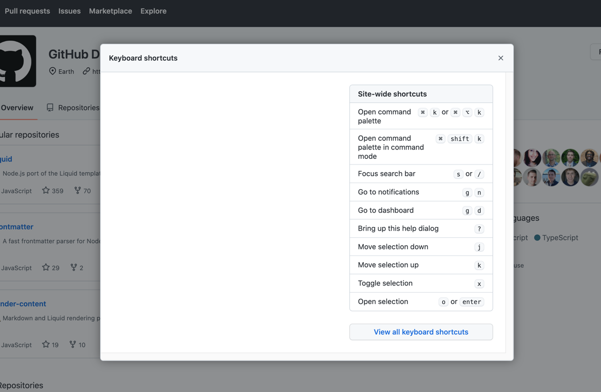
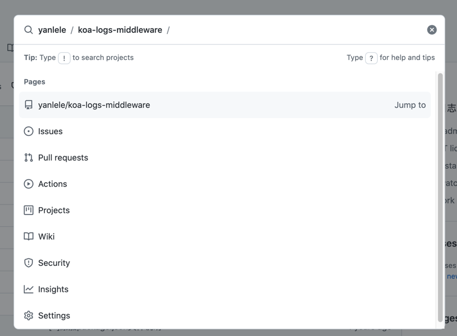
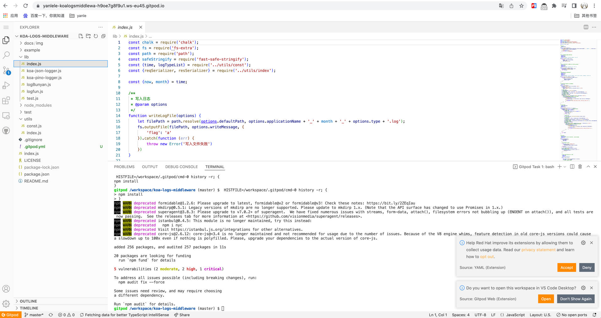
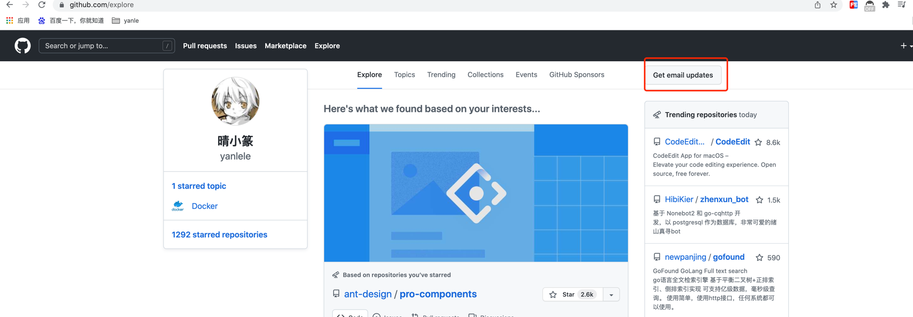

## github 使用技巧

github 帮助文档:  https://docs.github.com/cn                     
github get started:  https://docs.github.com/cn/get-started

### 搜索代码
可以使用下面这个链接： https://github.com/search                       
然后进入到高级搜索 --> https://github.com/search/advanced

### 超级适用的快捷键
进入项目 repo 之后， 直接按下「t」就可以直接搜索文件                          

在具体的文件之中， 可以按下 「l」键快速查看行数                               

在具体文件之后， 可以按下 「b」键， 查看最近文件更改                            

查看该页面可用的快捷键有那些？「shift + /」                              

快速操作功能： 「command + k」                                   

其余快捷键： https://docs.github.com/cn/get-started/using-github/keyboard-shortcuts

### 阅读代码技巧
直接在项目 repo 界面按下「。」, 会在一个网页版本的 vs code 打开整个项目代码，基本上具备完备的 vs code 的功能， 支持插件安装等。                                       

### 代码运行技巧
在项目链接上加上 gitpod.io 前缀， 就可以得到一个编辑器， 可以自动安装依赖包， 
可以在控制台运行命令行， 能运行项目， 查看运行效果， 还能直接打包为 docker 镜像；                                                
例如我的项目地址是： https://github.com/yanlele/koa-logs-middleware 直接改为 -->
https://gitpod.io/github.com/yanlele/koa-logs-middleware 即可

### 项目推送
github.com 首页 --> explore --> Get email updates                         
可以根据自己喜好， 让 github 定期推送优质项目到自己的邮箱， 持续学习

